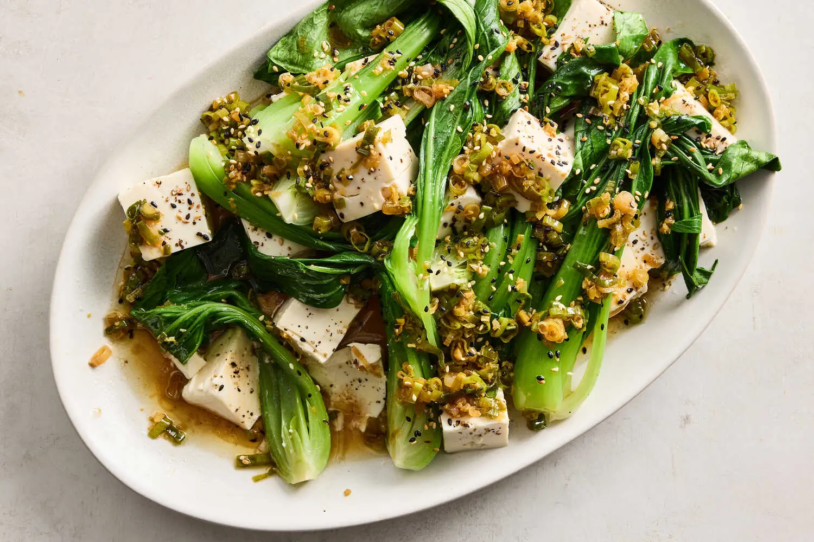

---
tags:
  - dish:main
  - protein:tofu
  - ingredient:bokchoy
  - cuisine:chinese
  - difficulty:easy
---
<!-- Tags can have colon, but no space around it -->

# Ginger-Scallion Tofu and Greens

<!-- Serves has to be a single number, no dashes, but text is allowed after the
number (e.g., 24 cookies) -->
- Serves: 4
{ #serves }
<!-- Time is not parsed, so anything can be input here, and additional
values can be added (e.g., "active time", "cooking time", etc) -->
- Time: 10 minutes
- Date added: 2024-10-22

## Description
A classic Chinese condiment, ginger-scallion oil is most commonly served with poached chicken but is incredibly versatile — and shines here, applied to cold silken tofu and blanched greens. Most Chinese families will have their own version of the aromatic oil, each with their own ideal ratio of ginger to scallions. There are no hard rules here, so feel free to adjust the amount of ginger and scallions to your preferences. Thinly slicing both will give you a robust sauce, but you may chop them until minced for a smoother sauce. This oil is a great one to make in bulk, as it keeps, refrigerated, up to one month, so you can add it to rice, roasted veggies, pan-fried tofu, cold noodles or eggs, invigorating your everyday cooking.
## Ingredients { #ingredients }

<!-- Decimals are allowed, fractions are not. For ranges, use only a single dash
and no spaces between the numbers. -->
- Salt
- 4 baby bok choy (about 12 ounces), each trimmed and quartered lengthwise
- 4 scallions, trimmed, white and green parts thinly sliced and separated
- 2 tablespoons soy sauce or tamari
- 1 tablespoon sesame oil
- 2 teaspoons rice vinegar
- 1 (2-inch piece) fresh ginger, peeled and finely chopped (about ¼ cup)
- .25 cup neutral oil
- 2 (fourteen- to sixteen-ounce) blocks silken tofu, cold
- Toasted white or black sesame seeds, for serving
- White rice (optional), to serve
## Directions

<!-- If you have a direction that refers to a number of some ingredient, wrap
the number in asterisks and add `{.ingredient-num}` afterwards. For example,
write `Add 2 Tbsp oil to pan` as `Add *2*{.ingredient-num} to pan`. This allows
us to properly change the number when changing the serves value. -->
1. Bring a pot of salted water to a boil. Add the baby bok choy and cook until the stems are just tender and the leaves are bright green, 1½ to 2 minutes. Rinse under cold water until thoroughly cooled, then drain well.
2. Place the green parts of the scallions into a heatproof bowl and add the soy sauce, sesame oil and rice vinegar.
3. Place the ginger, white parts of the scallions and the neutral oil into a small pot and place on medium-high heat. Stir until the ginger and scallions start to sizzle and become aromatic (watch closely so that they don’t burn), 2 to 3 minutes. Remove from the heat and immediately — and carefully — pour this over the green scallion mixture. Stir to combine. Taste and season with salt; it should be quite salty to balance the neutral flavor of the tofu.
4. Carefully drain the liquid from each package of tofu, and gently tip the blocks onto a clean kitchen towel. (Try to keep each block in one piece, but don’t worry if it falls apart.) Pat with another clean kitchen towel, removing as much liquid as possible. Transfer the blocks to one large plate or two smaller plates and cut into 1-inch blocks. Season with salt and pepper.
5. Add the bok choy on top and around the tofu and spoon over the ginger-scallion oil. To serve, top with sesame seeds and eat as is or serve with rice.

## Source

[NYTimes](https://cooking.nytimes.com/recipes/1025700-ginger-scallion-tofu-and-greens)

## Comments
