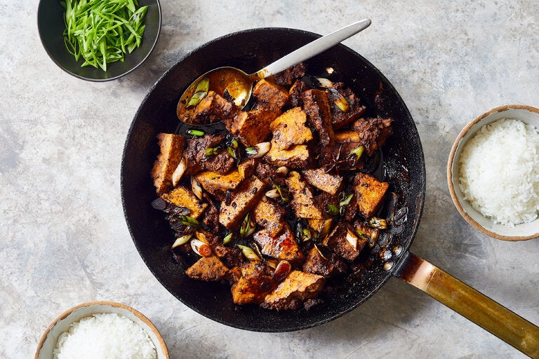

---
tags:
  - dish:main
  - protein:tofu
  - cuisine:chinese
  - difficulty:easy
---
<!-- Tags can have colon, but no space around it -->

# Glazed Tofu With Chile and Star Anise

<!-- Serves has to be a single number, no dashes, but text is allowed after the
number (e.g., 24 cookies) -->
- Serves: 4
{ #serves }
<!-- Time is not parsed, so anything can be input here, and additional
values can be added (e.g., "active time", "cooking time", etc) -->
- Time: 30
- Date added: 2024-01-03

## Description

This sauce — a dark, star anise-spiced caramel intermingled with rice wine, soy sauce, ginger and scallions — builds sweet, acidic and umami notes as it coats and infuses tofu. Sichuan hui guo rou, or twice-cooked pork, inspired the technique used here with tofu: The blocks are first seared whole, then torn into bite-size pieces and returned to the pan, where the craggy edges absorb the sauce. Additions from your pantry, such as a spoonful of doubanjiang, or fermented broad bean paste, fermented black beans or chile oil can invite deeper, more complex flavors. Serve warm with steamed rice and stir-fried greens.

## Ingredients { #ingredients }

<!-- Decimals are allowed, fractions are not. For ranges, use only a single dash
and no spaces between the numbers. -->

- 2 (14-ounce) packages firm tofu, drained
- 2 tablespoons neutral oil, such as canola or grapeseed
- K osher salt
- .25 cup granulated sugar
- 1 whole star anise
- 1 cup vegetable broth or stock
- .25 cup Shaoxing wine
- .25 cup dark soy sauce (see Tip)
- 2 garlic cloves, thinly sliced
- 1 (½-inch) piece fresh ginger, scrubbed and thinly sliced
- 1 small hot dried chile
- 6 scallions, whites cut into ½-inch pieces, greens thinly sliced
- Steamed rice, for serving

## Directions

<!-- If you have a direction that refers to a number of some ingredient, wrap
the number in asterisks and add `{.ingredient-num}` afterwards. For example,
write `Add 2 Tbsp oil to pan` as `Add *2*{.ingredient-num} to pan`. This allows
us to properly change the number when changing the serves value. -->

1. Place the tofu blocks between paper towels and press gently to remove excess liquid.
2. In a large skillet or cast-iron pan, warm the oil over medium-high heat until shimmering. Season both sides of the tofu with salt and place in the pan; sear without moving until the contact side is browned, about 4 minutes. Turn the pieces over and sear the other side until browned, about 3 minutes. Transfer the tofu to a plate.
3. Carefully add ½ cup water, the sugar and star anise to the pan. (The mixture will sputter and steam.) Cook, stirring, until the syrup is reduced and turns deep amber, 4 to 5 minutes. Pour in the stock carefully (again being mindful of sputtering), along with the Shaoxing wine, soy sauce, garlic, ginger and chile, and cook, stirring frequently, until reduced, syrupy and glossy, 5 to 7 minutes.
4. Use your fingers to break the tofu into ½-inch pieces, return to the pan and add the scallion whites. Toss to coat with the sauce and cook until warmed through, 2 to 3 minutes. Remove and discard the star anise and dried chile. Garnish with scallion greens and serve immediately with steamed rice.

## Source

[NYTimes](https://cooking.nytimes.com/recipes/1022167-glazed-tofu-with-chile-and-star-anise)

## Comments

- 2024-01-03: I really liked this! I put 2-3x as much star anise and chile. Anna thought it had too much anise flavor, which she didn't love. I do think it would be good with doubanjiang or fermented black beans added, as well as some vegetables. Maybe mushrooms? Or leeks?
