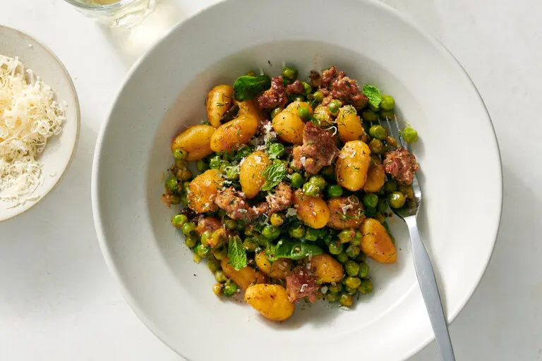

---
tags:
  - dish:main
  - protein:sausage
  - ingredient:gnocchi
  - difficulty:easy
---
<!-- Tags can have colon, but no space around it -->

# Crisp Gnocchi With Sausage and Peas

<!-- Serves has to be a single number, no dashes, but text is allowed after the
number (e.g., 24 cookies) -->
- Serves: 4
{ #serves }
<!-- Time is not parsed, so anything can be input here, and additional
values can be added (e.g., "active time", "cooking time", etc) -->
- Time: 25 min
- Date added: 2024-06-05

## Description

This quick skillet dinner combines crisp gnocchi and brawny sausage with sweet pops of peas and herbs. It tastes like spring, but it can be prepared perennially — and without any chopping or waiting for water to boil. (That’s right, you don’t need to boil the gnocchi before searing.) Draped in a combination of mustard and melted Parmesan, the dish is creamy, with a salty bite like cacio e pepe. However, if plush Alfredo is what you’re craving, you could add a splash of heavy cream along with the browned gnocchi in Step 4.

## Ingredients { #ingredients }

<!-- Decimals are allowed, fractions are not. For ranges, use only a single dash
and no spaces between the numbers. -->
- 3 tablespoons extra-virgin olive oil, plus more as needed
- 1 (12- to 18-ounce) package shelf-stable potato gnocchi
- 1 pound hot or sweet Italian sausage, casings removed
- 2 cups/10 ounces frozen peas (no need to thaw)
- 1 tablespoon Dijon mustard
- .5 cup/1 ounce grated Parmesan, plus more for serving
- Salt and pepper
- .5 cup torn dill, mint or basil leaves, plus more for serving

## Directions

<!-- If you have a direction that refers to a number of some ingredient, wrap
the number in asterisks and add `{.ingredient-num}` afterwards. For example,
write `Add 2 Tbsp oil to pan` as `Add *2*{.ingredient-num} to pan`. This allows
us to properly change the number when changing the serves value. -->
1. In a large (12-inch) nonstick or well-seasoned cast-iron skillet, heat 1 tablespoon oil over medium-high. Break up any stuck-together gnocchi and add to the skillet in an even layer. Cover and cook, undisturbed, until the gnocchi are golden brown underneath and unstuck from skillet, 2 to 4 minutes. Cook, stirring, until crisp on both sides, 2 to 3 minutes. If the gnocchi are burning instead of browning or the skillet looks dry, add more oil. Transfer to a bowl or plate.
2. Add the remaining 2 tablespoons oil to the skillet, still over medium-high. Add the sausage and break into small pieces. Cook, undisturbed, until sausage is browned, 2 to 4 minutes. Stir and cook until the sausage is cooked through, another 2 to 4 minutes.
3. Stir in the peas, mustard and *.5*{.ingredient-num} cup water and scrape up the browned bits on the skillet. (It may not look like a lot of liquid, but the peas will release some as they cook.) Simmer until the peas are cooked through, 2 to 4 minutes.
4. Add the browned gnocchi and the Parmesan; stir until the cheese has melted. Season to taste with salt and pepper, then stir in the herbs. Serve topped with more herbs, Parmesan and black pepper as desired.

## Source

[NYTimes](https://cooking.nytimes.com/recipes/1024164-crisp-gnocchi-with-sausage-and-peas)

## Comments

- 2024-06-05: this was really good! I used cevapi, and it probably didn't need the full pound (maybe half or three-quarters). I also replaced the Parmesan with 3 Tbsp nutritional yeast, the water with .5 cup bean cooking broth + 1 Tbsp dry vermouth, added 3 scallions. some comments suggested garlic and pepper flakes, would probably be good.
- 2025-05-01: made this with some nettles (instead of the herbs) and it worked great
