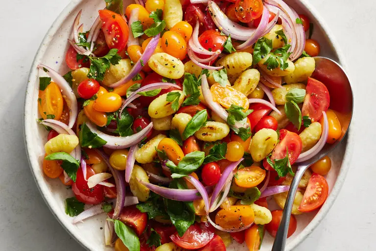

---
tags:
  - dish:main
  - ingredient:gnocchi
  - ingredient:tomato
  - difficulty:easy
---
<!-- Tags can have colon, but no space around it -->

# Crispy Gnocchi With Tomato and Red Onion

<!-- Serves has to be a single number, no dashes, but text is allowed after the
number (e.g., 24 cookies) -->
- Serves: 4
{ #serves }
<!-- Time is not parsed, so anything can be input here, and additional
values can be added (e.g., "active time", "cooking time", etc) -->
- Time: 20 minutes
- Date added: 2024-07-05

## Description

Inspired by panzanella, the beloved Tuscan bread salad, this dish swaps out stale bread for pan-fried gnocchi. The plump, crusty dumplings do a surprisingly good job at soaking up the summery combination of tomatoes, balsamic vinegar and olive oil, while still maintaining their crisp edge. Shelf-stable gnocchi work best, as they are sturdier and crisp up well, but you could use frozen gnocchi, taking extra care not to move them around too much in the pan so they don’t break apart. Top with a sharp cheese such as Parmesan, pecorino or ricotta salata, for a hit of saltiness, if you like. This meal is best eaten immediately while the gnocchi remains crispy, but it can sit for up to 30 minutes, giving the flavors time to mingle. (However, don’t let it sit too long, as the gnocchi will turn mushy.) 

## Ingredients { #ingredients }

<!-- Decimals are allowed, fractions are not. For ranges, use only a single dash
and no spaces between the numbers. -->
- 5 to 6 tablespoons extra-virgin olive oil
- 1 (17-ounce) package shelf-stable (or frozen) potato gnocchi
- 1.5 pounds tomatoes (any variety)
- .5 red onion, thinly sliced
- 1 tablespoon balsamic vinegar
- Kosher salt (such as Diamond Crystal) and black pepper
- 1 Handful of chopped parsley, plus more for serving
- 1 Handful of torn basil, plus more for serving

## Directions

<!-- If you have a direction that refers to a number of some ingredient, wrap
the number in asterisks and add `{.ingredient-num}` afterwards. For example,
write `Add 2 Tbsp oil to pan` as `Add *2*{.ingredient-num} to pan`. This allows
us to properly change the number when changing the serves value. -->

1. Heat a large (about 12-inch), well-seasoned cast-iron or nonstick skillet over medium-high; add 2 tablespoons of olive oil. Add the gnocchi to the pan, breaking up any that are stuck together. Cook for 8 to 10 minutes, tossing every 1 ½ to 2 minutes so they get golden and crispy all over.
2. Meanwhile, prepare your tomatoes: If you are using small ones like cherry or grape varieties, simply slice them in half. For larger tomatoes, quarter them or slice into bite-size chunks. (It is good to have a mix of shapes and sizes.) Place the tomatoes and onions in a large serving bowl. Add the balsamic vinegar and 1 teaspoon salt; season with pepper and gently toss.
3. When the gnocchi are golden and crispy, add them to the tomatoes, along with 3 to 4 tablespoons of olive oil and a handful each of parsley and basil. Toss and taste, adding more salt or pepper as needed.
4. Top with more parsley and basil, and eat immediately or at room temperature.

## Source

[NYTimes](https://cooking.nytimes.com/recipes/1023260-crispy-gnocchi-with-tomato-and-red-onion)

## Comments
