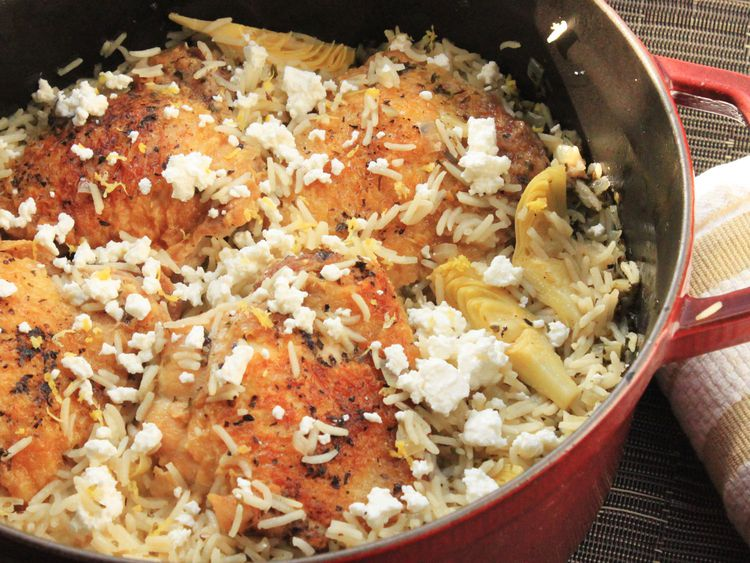

---
tags:
  - dish:main
  - protein:chicken
  - ingredient:rice
---
<!-- Tags can have colon, but no space around it -->

# Greek-Style Rice Pilaf With Chicken Thighs Recipe

<!-- Serves has to be a single number, no dashes, but text is allowed after the
number (e.g., 24 cookies) -->
- Serves: 4
{ #serves }
<!-- Time is not parsed, so anything can be input here, and additional
values can be added (e.g., "active time", "cooking time", etc) -->
- Time: 45 min
- Date added: 2025-01-05

## Description
As a lover of quick and easy dishes, pilafs—simple dishes of rice cooked in broth—come up in my repertoire all the time. They're an insanely easy way to produce a flavor-packed meal in a single pan with minimum fuss.This version combines chicken and rice with Greek flavors like lemon, oregano, and feta cheese in an easy one-pot dish.

### Why this recipe works:

- We build layers of flavor by browning chicken, scraping up the browned bits, and sweating them with aromatics like onions, garlic, and oregano. Bright flavors of lemon and feta cheese added right at the end lighten the whole thing up.
- Cooking the chicken and rice together promotes an exchange of aromas, giving you rice that's deeply infused with chicken aroma.

## Ingredients { #ingredients }

<!-- Decimals are allowed, fractions are not. For ranges, use only a single dash
and no spaces between the numbers. -->

- 1 pound skin-on chicken thighs
- Kosher salt and freshly ground black pepper
- 2 tablespoons chopped fresh oregano leaves, divided (see note)
- 2 tablespoons olive oil
- 1 medium onion, finely chopped (about 1 cup)
- 2 medium cloves garlic, minced or grated with a microplane (about 2 teaspoons)
- 1.5 cups basmati or long-grain rice
- 2.75 cups  homemade or store-bought low-sodium chicken stock
- 15 ounces can artichoke hearts
- 2 tablespoons fresh juice and 2 teaspoons zest from 1 lemon
- 3 ounces crumbled feta cheese

## Directions

<!-- If you have a direction that refers to a number of some ingredient, wrap
the number in asterisks and add `{.ingredient-num}` afterwards. For example,
write `Add 2 Tbsp oil to pan` as `Add *2*{.ingredient-num} to pan`. This allows
us to properly change the number when changing the serves value. -->

1. Season the chicken well with salt, pepper, and half of the oregano. Heat the oil in a pot or 12-inch skillet over medium-high heat until lightly smoking. Add the chicken, skin-side down and cook until well browned, 6 to 10 minutes, flip and then brown the other side, 3 to 4 minutes more. Remove to a plate and set aside.
2. Discard all but 1 tablespoon fat from skillet and heat the fat over medium heat until shimmering. Add the onion and a pinch of salt and cook, stirring, until softened, about 3 minutes. Add the remaining oregano and garlic and cook until fragrant, about 30 seconds.
3. Add the rice, stirring until fragrant and lightly toasted, about 1 minute, then add the stock and artichoke hearts and stir together. Nestle the chicken thighs on top, skin-side up, adjust the heat to maintain a simmer. Cover and cook until the chicken and rice are done 15 to 20 minutes more. Sprinkle with lemon zest, lemon juice, and feta. Serve immediately. 

## Notes

<!-- Delete section if no additional notes -->
Dried oregano can be substituted for fresh. If using dried oregano, reduce total amount to 2 teaspoons. 
## Source

[Serious Eats](https://www.seriouseats.com/greek-style-pila-chicken-thighs-recipe)

## Comments

- 2024-01-05: I doubled this recipe, which didn't work super great, it threw off the timing and I ended up having to add in additional liquid at the end to continue steaming the thighs.
