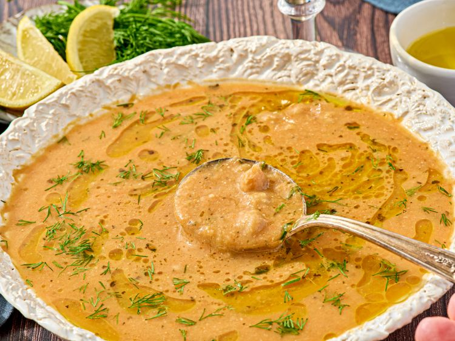

---
tags:
  - dish:soup
  - protein:chickpeas
  - cuisine:greek
  - difficulty:easy
---
<!-- Tags can have colon, but no space around it -->

# Revithia

<!-- Serves has to be a single number, no dashes, but text is allowed after the
number (e.g., 24 cookies) -->
- Serves: 4
{ #serves }
<!-- Time is not parsed, so anything can be input here, and additional
values can be added (e.g., "active time", "cooking time", etc) -->
- Time: 80 min
- Date added: 2026-02-18

## Description
Revithia refers to chickpeas in Greek and commonly describes a wide range of chickpea-based dishes—from whole, slow-cooked beans simmered in their own cooking liquid to thick, spoonable soups and stews. What makes this revithia stew special—and often surprising—is the depth of flavor it achieves with so few ingredients. In many ways, it epitomizes Greek cooking at its best: simple, rustic components transformed through time-tested technique into something far more complex than they first appear. 

I love revithia in all its forms, and I think of this version as a liberal interpretation. It leans firmly into stew territory, even if some traditionalists might prefer more intact chickpeas. This approach has proven incredibly popular, largely because it strikes that rare balance of being deeply satisfying and exceptionally easy to prepare. It's also vegan, freezes well, and makes excellent leftovers. While lovely on its own, I often top mine with a dollop of Greek yogurt and fresh herbs or serve it alongside rice. 

### Why It Works

- Blending and reincorporating a portion of the partially cooked stew thickens the final dish without added starches.
- A small amount of miso paste adds savory depth and complexity without overpowering the stew.

## Ingredients { #ingredients }

<!-- Decimals are allowed, fractions are not. For ranges, use only a single dash
and no spaces between the numbers. -->

- 1 small yellow onion (about 4 ounces; 113 g total), halved and thinly sliced
- 2 medium carrots (12 ounces; 340 g total), roughly chopped into 1-inch pieces
- 2 medium cloves garlic, chopped
- 4 tablespoons (60 ml) extra-virgin olive oil, divided, plus more for serving
- 2 teaspoons Diamond Crystal kosher salt; for table salt, use half as much by volume
- 2 (15.5-ounce) cans chickpeas (or 1.75 cup or 266 g dry beans, soaked and cooked until al dente)
- 2 heaping tablespoons (45 g) miso paste, whisked into 1 cup warm water
- 2 teaspoons dried oregano, optional
- 1 tablespoon minced fresh dill, optional
- Lemon wedges for serving, optional

## Directions

<!-- If you have a direction that refers to a number of some ingredient, wrap
the number in asterisks and add `{.ingredient-num}` afterwards. For example,
write `Add 2 Tbsp oil to pan` as `Add *2*{.ingredient-num} to pan`. This allows
us to properly change the number when changing the serves value. -->

1. In a large saucepan, heat 3 tablespoons oil over medium-high heat until shimmering. Add onion and 1 teaspoon salt and cook until onion is soft and translucent, about 7 minutes. Add carrots, garlic, oregano (if using), and remaining 1 tablespoon olive oil and cook, stirring frequently until fragrant, 2 minutes.
2. Add chickpeas, miso-water, and remaining 1 teaspoon salt and stir to combine. Add enough water to cover ingredients by approximately 1 inch. Reduce heat to medium-low and simmer with lid ajar until flavors meld and carrots are softened, about 30 minutes. Season with salt to taste.
3. Using a ladle, add approximately half of stew to blender. Cover blender, remove center vent, and cover with a clean kitchen towel. Starting at low speed and slowly progressing to high speed, blend until smooth, then stir back into stew. Simmer on medium-low heat, uncovered, until thickened to a bisque-like texture, 20 to 30 minutes; be sure to stir occasionally to prevent sticking at bottom of pot.
4. Serve with lemon wedges and a generous drizzle of olive oil.

## Notes
- The soup can be refrigerated in an airtight container for up to 4 days or frozen for up to 2 months.

## Source

[Serious Eats](https://www.seriouseats.com/5-ingredient-chickpea-revithia-stew-recipe-11875647)

## Comments
