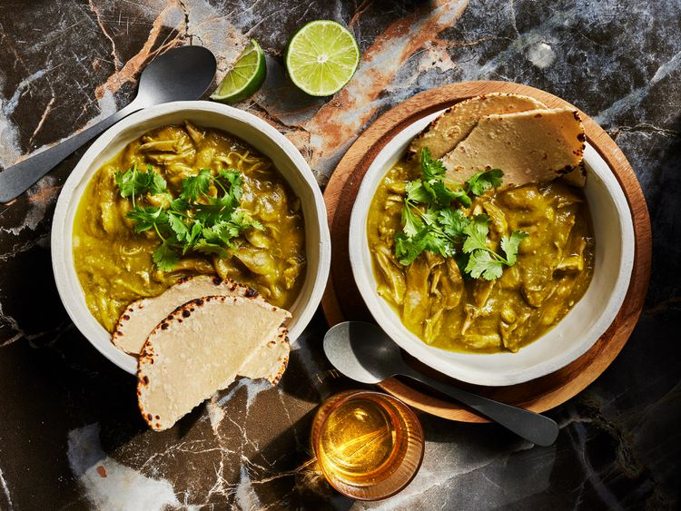

---
tags:
  - dish:main
  - protein:chicken
  - cuisine:mexican
---
<!-- Tags can have colon, but no space around it -->

# Green Chili Chicken Pressure Cooker Recipe

<!-- Serves has to be a single number, no dashes, but text is allowed after the
number (e.g., 24 cookies) -->
- Serves: 4
{ #serves }
<!-- Time is not parsed, so anything can be input here, and additional
values can be added (e.g., "active time", "cooking time", etc) -->
- Time: 40 min
- Date added: 2025-09-07

## Description
A fast and easy weeknight meal loaded with peppers, onions, and chunks of tender chicken.

### Why It Works

- Adding all the ingredients to the pressure cooker with no added liquid makes for an intensely flavored stew that cooks in its own juices.
- Fish sauce adds umami depth to the dish once it's cooked.

## Ingredients { #ingredients }

<!-- Decimals are allowed, fractions are not. For ranges, use only a single dash
and no spaces between the numbers. -->

- 3 pounds bone-in, skin-on chicken thighs and drumsticks
- 1 pound poblano peppers, roughly chopped, seeds and stems discarded (about 3 peppers)
- 12 ounces tomatillos, husks discarded, quartered (about 4 tomatillos)
- 10 ounces white onion, roughly chopped (about 1 medium)
- 6 ounces Anaheim or Cubanelle peppers, roughly chopped, seeds and stems discarded (about 2 peppers)
- 2 Serrano or jalapeño peppers, roughly chopped, stems discarded
- 6 medium cloves garlic, peeled
- 1 tablespoon whole cumin seeds, toasted and ground
- Kosher salt
- .5 cup loosely packed fresh cilantro leaves and fine stems, plus more for garnish
- 1 tablespoon Asian fish sauce, such as Red Boat
- Fresh corn tortillas and lime wedges, for serving

## Directions

<!-- If you have a direction that refers to a number of some ingredient, wrap
the number in asterisks and add `{.ingredient-num}` afterwards. For example,
write `Add 2 Tbsp oil to pan` as `Add *2*{.ingredient-num} to pan`. This allows
us to properly change the number when changing the serves value. -->

1. Combine chicken, poblano peppers, tomatillos, onion, Anaheim peppers, Serrano peppers, garlic, cumin, and a big pinch of salt in a pressure cooker. Heat over high heat until gently sizzling, then seal pressure cooker, bring to high pressure, and cook for 15 minutes. Release pressure.
2. Using tongs, transfer chicken pieces to a bowl and set aside. Add cilantro and fish sauce to remaining contents of pressure cooker. Blend with an immersion blender or in a countertop blender and season to taste with salt. Return chicken to sauce, discarding skin and bones and shredding if desired.
3. Transfer to a serving platter, garnish with chopped cilantro, and serve immediately with tortillas and lime wedges. ## Notes

## Source

[Serious Eats](https://www.seriouseats.com/pressure-cooker-fast-and-easy-chicken-chile-verde-recipe)

## Comments
