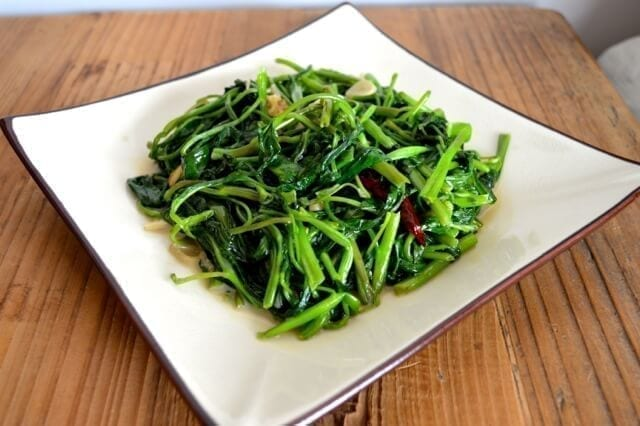

---
tags:
  - dish:sides
  - ingredient:greens
  - cuisine:chinese
  - difficulty:easy
---
<!-- Tags can have colon, but no space around it -->

# Stir Fried Water Spinach with Fermented Tofu

<!-- Serves has to be a single number, no dashes, but text is allowed after the
number (e.g., 24 cookies) -->
- Serves: 2
{ #serves }
<!-- Time is not parsed, so anything can be input here, and additional
values can be added (e.g., "active time", "cooking time", etc) -->
- Time: 20 minutes
- Date added: 2024-04-18

## Description

Stir-Fried water spinach with fermented tofu is a popular vegetable side dish at the Chinese dinner table. Garlic, ginger and white fermented tofu are all key ingredients for a good stir fried water spinach.

## Ingredients { #ingredients }

<!-- Decimals are allowed, fractions are not. For ranges, use only a single dash
and no spaces between the numbers. -->

- 1 bunch Chinese water spinach (about 10 ounces/300g)
- 2 tablespoons canola oil
- 3 to 4 thin slices ginger (julienned)
- 4 to 5 dried chili peppers (optional)
- 1 to 4 cloves garlic (sliced)
- 2 squares white fermented tofu (about ½ tablespoon)
- .125 teaspoon sugar
- .5 teaspoon salt
- .125 teaspoon white pepper
- 2 tablespoons shaoxing wine

## Directions

<!-- If you have a direction that refers to a number of some ingredient, wrap
the number in asterisks and add `{.ingredient-num}` afterwards. For example,
write `Add 2 Tbsp oil to pan` as `Add *2*{.ingredient-num} to pan`. This allows
us to properly change the number when changing the serves value. -->
1. Remove the larger, tough stems from the vegetables. You can leave the thinner, tender stems. Wash the vegetables thoroughly in water (a couple soaks and rinses should work) and transfer to a colander to let the excess water drain.
2. Heat oil in a wok over high heat and add the ginger. Stir for about 10 seconds and then add the dried chilies, garlic, fermented tofu, sugar, salt, and white pepper.
3. Stir fry the mixture, keeping the heat on high, and add the greens. Stir-fry, moving the vegetables around the bottom of the wok so nothing burns. Use a folding motion, stir fry the mixture so all of the vegetables get seared evenly. After about a minute of this, move the vegetables into a mound in the middle of the wok. This technique is to allow the sides of the wok to reheat to get the “wok hay” flavor in there.
4. After about 30 seconds of high heat, add the wine around the perimeter of the wok and quickly spread your vegetable mound in a circular motion around the wok to get that searing “wok hay” effect for another 15-30 seconds.
5. Plate and serve immediately.
## Source

[Woks of Life](https://thewoksoflife.com/water-spinach-garlic-ginger-fermented-tofu/)

## Comments

- 2024-04-18: made this with watercress, which was delicious. would work with any tender green
