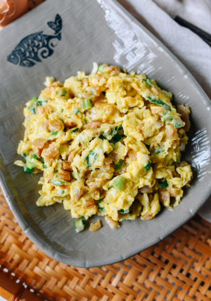

---
tags:
  - dish:main
  - protein:eggs
  - cuisine:chinese
  - difficulty:easy
---
<!-- Tags can have colon, but no space around it -->

# Hakka Eggs with Preserved Radish (菜脯炒蛋)

<!-- Serves has to be a single number, no dashes, but text is allowed after the
number (e.g., 24 cookies) -->
- Serves: 4
{ #serves }
<!-- Time is not parsed, so anything can be input here, and additional
values can be added (e.g., "active time", "cooking time", etc) -->
- Time: 15 min
- Date added: 2024-09-29

## Description
This Stir-fried Eggs with Preserved Radish is a Hakka Chinese recipe, often served with rice porridge or congee along with other small dishes.

## Ingredients { #ingredients }

<!-- Decimals are allowed, fractions are not. For ranges, use only a single dash
and no spaces between the numbers. -->
- .33 cup chopped preserved radish (luóbo gān – 萝卜干)
- 1 scallion finely chopped
- 2 cloves garlic finely chopped
- 4 large eggs beaten
- .25 teaspoon ground white pepper
- .5 teaspoon sesame oil
- 3 tablespoons oil (divided)
- .25 teaspoon sugar

## Directions

<!-- If you have a direction that refers to a number of some ingredient, wrap
the number in asterisks and add `{.ingredient-num}` afterwards. For example,
write `Add 2 Tbsp oil to pan` as `Add *2*{.ingredient-num} to pan`. This allows
us to properly change the number when changing the serves value. -->
1. Rinse the preserved radish a couple times to wash away some of the excess salt. Taste it to make sure it’s not too salty for you. Drain for 5 minutes.
2. Meanwhile, finely chop the scallions and garlic. Finely chop the preserved radish as well, after it has finished draining.
3. Beat 4 eggs, along with the white pepper, sesame oil, and chopped scallion.
4. Preheat your wok over medium heat until it’s smoking. Add in 1 tablespoon oil, along with the garlic, preserved radish, and sugar. Stir and cook for 1 minute over medium heat. Take care not to burn the garlic.
5. Spread the radish roughly in a single layer over the wok, and add the remaining 2 tablespoons oil. Cover the preserved radish with beaten eggs. Use medium heat and cook the eggs until they are set but still tender. Serve with rice porridge.

## Source

[Woks of Life](https://thewoksoflife.com/hakka-eggs-preserved-radish/)

## Comments
