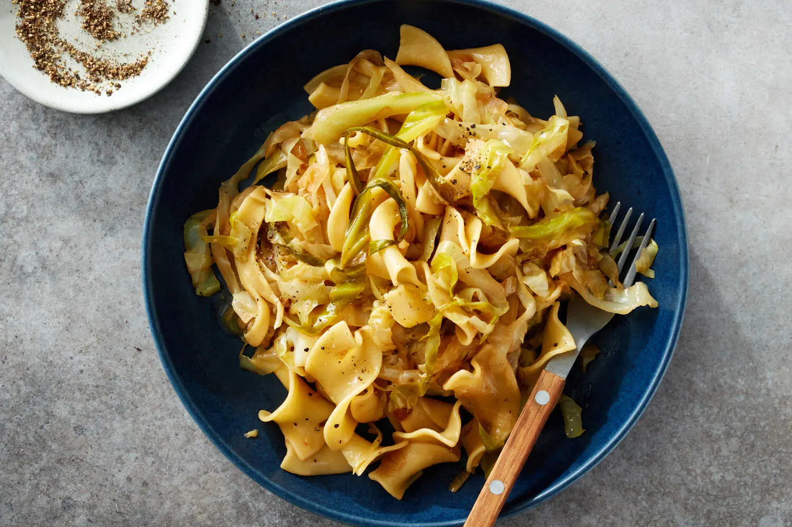

---
tags:
  - dish:main
  - ingredient:cabbage
  - ingredient:pasta
  - difficulty:easy
---
<!-- Tags can have colon, but no space around it -->

# Haluski (Buttery Cabbage and Noodles)

<!-- Serves has to be a single number, no dashes, but text is allowed after the
number (e.g., 24 cookies) -->
- Serves: 4
{ #serves }
<!-- Time is not parsed, so anything can be input here, and additional
values can be added (e.g., "active time", "cooking time", etc) -->
- Time: 1 hour
- Date added: 2025-02-08

## Description
If you ask 100 people about haluski, there will be many different answers — and some might know it by another name. Simple to prepare, economical and more than the sum of its parts, haluski typically refers to a Central and Eastern European dish of sweet, buttery cabbage and onions tossed with dumplings or noodles. In the United States, haluski is often made with store-bought egg noodles, which are more convenient but no less lovable than homemade. The strands of caramelized cabbage become happily tangled in the noodle’s twirls. This version includes a final step of tossing the cooked cabbage and pasta with some pasta water and a final pat of butter, so each bite is as comforting as can be.
## Ingredients { #ingredients }

<!-- Decimals are allowed, fractions are not. For ranges, use only a single dash
and no spaces between the numbers. -->
- 6 tablespoons unsalted butter
- 1 yellow onion, thinly sliced
- S alt and pepper
- 2 pounds green cabbage (about 1 small), core chopped and leaves thinly sliced
- 12 ounces wide egg noodles

## Directions

<!-- If you have a direction that refers to a number of some ingredient, wrap
the number in asterisks and add `{.ingredient-num}` afterwards. For example,
write `Add 2 Tbsp oil to pan` as `Add *2*{.ingredient-num} to pan`. This allows
us to properly change the number when changing the serves value. -->
1. In a large Dutch oven, melt 5 tablespoons of the butter over medium-high. Add the onion, season with salt and pepper, and cook, stirring often, until softened and lightly browned, 3 to 6 minutes. Add the cabbage, season generously with salt and pepper, and stir to combine. Reduce heat to medium-low, cover the pot and cook, stirring occasionally, until the cabbage is tender but not mushy, 35 to 40 minutes. (Browning is welcome, but if you see burning, reduce the heat and add a tablespoon or two of water.)
2. Meanwhile, bring a large pot of salted water to a boil. When the cabbage is done, remove from heat and keep covered. Add the noodles to the boiling water and cook according to package directions. Reserve ½ cup pasta water, then drain the noodles.
3. Add the noodles, reserved pasta water and remaining 1 tablespoon butter to the cabbage. Stir over medium-high heat until the noodles are saucy and glossed with melted butter, 1 to 2 minutes. Season to taste with salt and pepper.

## Source

[NYTimes](https://cooking.nytimes.com/recipes/1023980-haluski-buttery-cabbage-and-noodles)

## Comments

- 2025-02-08: really good! following some comments, I browned the cabbage first, and added some caraway
