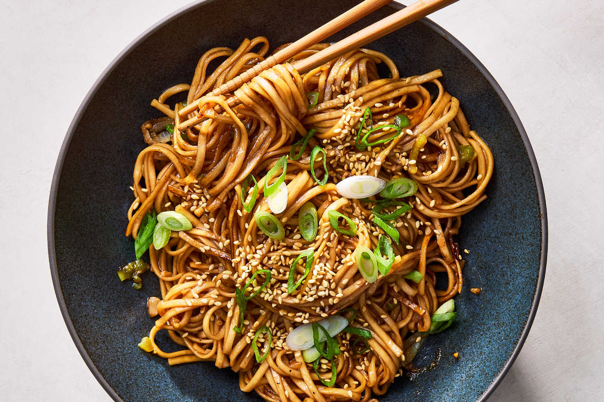

---
tags:
  - ingredient:pasta
  - cuisine:chinese
  - difficulty:easy
---
<!-- Tags can have colon, but no space around it -->

# Hoisin Garlic Noodles

<!-- Serves has to be a single number, no dashes, but text is allowed after the
number (e.g., 24 cookies) -->
- Serves: 4
{ #serves }
<!-- Time is not parsed, so anything can be input here, and additional
values can be added (e.g., "active time", "cooking time", etc) -->
- Time: 25 min
- Date added: 2026-01-11

## Description
Fans of garlic noodles and soy sauce noodles rejoice: Here is a new, weeknight-friendly noodle dish for your repertoire. A staple Cantonese ingredient, thick and fragrant hoisin sauce is often used as a glaze for meat, but also serves as a robust, sweet and salty seasoning for these noodles. The garlic is bloomed briefly in oil, which tames its pungency and unlocks a rich, nutty flavor. Allow the noodles to cook undisturbed for a few minutes to crisp underneath, adding texture and a hint of smokiness. This recipe calls for dried wheat or egg noodles, but if you don’t have Asian-style noodles on hand, you could substitute with spaghetti or linguine. Bulk up the noodles with tofu, eggs or whatever vegetables you have on hand; these noodles welcome toppings.

## Ingredients { #ingredients }

<!-- Decimals are allowed, fractions are not. For ranges, use only a single dash
and no spaces between the numbers. -->
- S alt and pepper
- 14 ounces dried wheat or egg noodles
- .25 cup hoisin sauce
- 2 tablespoons soy sauce 
- 1 tablespoon toasted sesame oil
- 1.5 Tbsp Chinese black vinegar
- 1 - 4 Tbsp Shaoxing wine
- Vegetable oil
- 6 medium garlic cloves, finely chopped
- 6 scallions, white and green parts separated, thinly sliced
- 4 tablespoons toasted white sesame seeds

## Directions

<!-- If you have a direction that refers to a number of some ingredient, wrap
the number in asterisks and add `{.ingredient-num}` afterwards. For example,
write `Add 2 Tbsp oil to pan` as `Add *2*{.ingredient-num} to pan`. This allows
us to properly change the number when changing the serves value. -->
1. Bring a large pot of salted water to a boil. Add the noodles and cook according to package instructions until al dente. Drain and rinse until the noodles are cool.
2. Meanwhile, in a small bowl, combine hoisin sauce, soy sauce, sesame oil, vinegar and wine; set aside.
3. Heat a large 12-inch skillet on medium-high for 2 minutes. Add 1 to 2 tablespoons of oil along with the garlic and white parts of the scallions. Stir until fragrant, about 30 seconds (but don’t let the garlic burn!). Immediately add the sauce and then the noodles, and toss well until the noodles are evenly coated.
4. Leave the noodles to cook, undisturbed, until they start sticking to the pan and the bottom looks crispy, 2 to 3 minutes. Taste and season with salt (if needed) and pepper.
5. To serve, transfer to bowls and top with the sesame seeds and the green parts of the scallions.

## Source

[NYTimes](https://cooking.nytimes.com/recipes/1026260-hoisin-garlic-noodles)

## Comments

- 2026-01-11: following comments, made some changes, which are reflected above. used soba, which worked well. cooked a plain omelet, chopped it up and mixed it in, which worked well.
