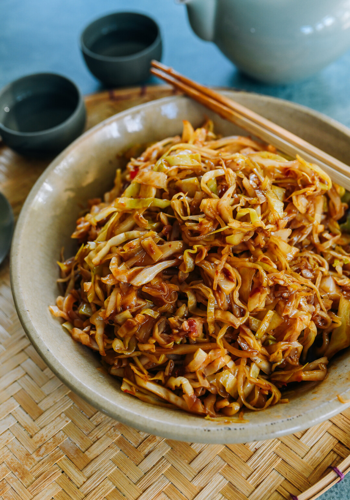

---
tags:
  - dish:sides
  - ingredient:cabbage
  - cuisine:chinese
---
<!-- Tags can have colon, but no space around it -->

# Recipe title

<!-- Serves has to be a single number, no dashes, but text is allowed after the
number (e.g., 24 cookies) -->
- Serves: 4
{ #serves }
<!-- Time is not parsed, so anything can be input here, and additional
values can be added (e.g., "active time", "cooking time", etc) -->
- Time: 10 min
- Date added: 2024-12-04

## Description
This easy Hot & Sour Cabbage stir-fry shines with thin slices of cabbage that cook down to almost noodle-like perfection, all coated in a hot & sour sauce. It’s our new favorite way to cook cabbage!

## Ingredients { #ingredients }

<!-- Decimals are allowed, fractions are not. For ranges, use only a single dash
and no spaces between the numbers. -->
- 3 tablespoons neutral oil (such as canola, vegetable, or avocado oil)
- 4 cloves garlic (finely chopped)
- 1.5 doubanjiang (spicy bean sauce)
- 2 pounds Taiwanese cabbage (washed and thinly sliced; about 1 medium-sized cabbage)
- 1 tablespoon Chinese black vinegar
- 1.5 soy sauce
- .5 sesame oil
- .25 teaspoon white pepper
- .25 teaspoon sugar
- .25 cup water
- 1.5 teaspoons cornstarch (mixed into a slurry with 2 tablespoons water)
- salt (to taste) 

## Directions

<!-- If you have a direction that refers to a number of some ingredient, wrap
the number in asterisks and add `{.ingredient-num}` afterwards. For example,
write `Add 2 Tbsp oil to pan` as `Add *2*{.ingredient-num} to pan`. This allows
us to properly change the number when changing the serves value. -->
1. Heat a wok over medium-high heat until it’s just starting to smoke. Reduce the heat to medium if it’s smoking heavily. Add the oil, followed by the garlic. Let the garlic cook briefly—15 to 20 seconds. You don’t want it to brown.
2. Add the doubanjiang, and let it fry in the oil for about 30 seconds to a minute. The oil will turn red and fragrant.
3. Add the cabbage and stir-fry to distribute the doubanjiang. Add the Chinese black vinegar, soy sauce, sesame oil, white pepper, and sugar.
4. Stir-fry to combine the ingredients, and add ¼ cup of water. Keep stir-frying until the cabbage is crisp tender.
5. To add the cornstarch slurry, stir it up, as it has a tendency to settle. Push the cabbage aside, exposing the little pool of sauce, and pour it directly in. You don’t want to pour cornstarch slurry on the hot sides of the wok, or it will cook and clump up. Stir-fry, allowing the sauce to thicken and coat the cabbage. Add salt to taste, but doubanjiang is very salty so you may not need very much if any at all.
6. Serve as a side with a few other dishes, and make sure there’s rice, because this is absolutely delicious with a bowl of steamed rice!

## Source

[Woks of Life](https://thewoksoflife.com/hot-sour-cabbage/)

## Comments

- 2024-12-04: made this in the enameled Dutch oven, which made it hard to evaporate a lot of the water. I think it would've been better in the wok, but Anna still liked it.
