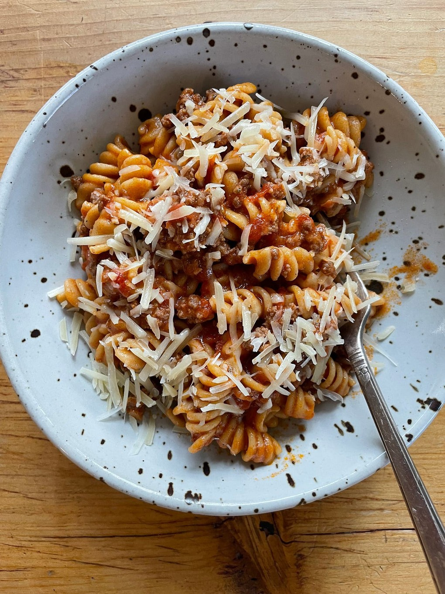

---
tags:
pasta
 - italian
 - easy
 - instant pot
 - template
---

# Instant Pot Bolognese

- Serves: 4 servings
{ #serves }
- Working time: 10
- Waiting time: 20

## Description

## Ingredients { #ingredients }

- 2.0 tablespoons olive oil 
- 1.0 pound lean ground meat (beef, turkey, chicken, pork, lamb, any sausage out of it casing, plant-based ground meat— whatever!)
- 2.0 teaspoons garlic powder 
- 2.0 tsp dried oregano 
- 2.0 tsp kosher salt 
- 3.0 cups tomato sauce (or 1 24-oz jar (e.g., Rao's))
- 1.0 pound whole wheat pasta (any short type like penne or ziti works great)
- 0.25 cup sour cream 
- 3.0 cups boiling water 
- Grated parmesan or pecorino (for serving)

## Directions

Put your Instant Pot on 'sauté' and add the olive oil, ground meat, garlic powder, dried oregano, and salt. Cook, stirring to break up the meat, until the meat has just lost its rawness, about 5 minutes. Stir in the tomato sauce and boiling water (you can just use the empty jar as a measuring cup but be sure to use a towel or oven mitt to pick it up because it will be HOT!). Add the pasta and stir everything well to combine.

Securely attach the Instant Pot lid, make sure it's on 'seal,' and set it for 5 minutes on high pressure. After that is done, let it naturally release for 5 minutes. Then vent whatever steam/pressure remains and unlock the lid. Stir in the sour cream. Serve immediately with lots of grated cheese on top.

### Thoughts on meat

- As I mention in the ingredient list, any type of ground meat works here_beef, turkey, chicken, pork, lamb, any sausage out of it casing, plant-based ground meat— whatever!
- Sausage out of its casing invites a lot of potential for flavor_I’m thinking spicy Italian sausage, or even fresh chorizo, or lamb merguez_.
- Vegetarian or vegan? Try a plant-based ground meat (a few people in my class did this and I got a lot of thumbs up). You could also substitute cooked lentils or beans in place of the ground meat. Or just leave out the ground meat!!! If you’re vegan, just skip the sour cream (or use vegan sour cream).
- If you want to do lentils or beans instead of ground meat and want to cook them from dry in your IP, I would cook them first just in water or stock, then drain them and continue with the recipe as written. Here’s a great guide to lentils/beans/etc. in the IP.

### Thoughts on veggies

- Feel free to add some diced vegetables to the ground meat during the sauté part of cooking. I’m thinking diced onions, carrots, celery, fennel, squash, mushrooms, peppers, zucchini, a bag of frozen spinach_whatever! Clean out your fridge! Season vegetables with extra salt.

### Thoughts on seasonings / cheese

- Garlic powder, dried oregano + salt is one of my favorite combinations because it gives everything a pizza vibe. You can of course use fresh minced garlic instead of, or in addition to, the garlic powder.
- Make this spicy by adding a big pinch of dried red chile flakes to the meat along with the garlic powder + dried oregano (or more than a pinch, whatever you want).
- Have fun with the spices! If you’re doing lamb merguez, for example, maybe instead of the dried oregano, do a pinch each of ground coriander and ground cinnamon and serve the pasta sprinkled with feta instead of parmesan. Or if you’re doing ground chorizo, in addition the the dried oregano + garlic powder, add
- Grated Parm or pecorino is perfect here and doesn’t need to be messed with. But a scoop of ricotta is also great on top.

### Thoughts on sauce/liquid

- Use whatever type of tomato sauce you want— Rao’s is my fave. Or my homemade roasted tomato sauce!!!
- Boiling water will help your IP get to pressure faster since it’s already hot. If you’re water is not boiling, the recipe still works! It just will take a little longer.
- I’ve gotten questions about stock instead of water_sure, that’s fine. But I don’t think you need to do that!
- A splash of wine (red or white) on the ground meat after it’s browned would be lovely. Let it boil for a minute before continuing with the recipe.

### Thoughts on pasta

- If you’re using regular pasta (not whole wheat), then do high pressure for 5 minutes as described, but then immediately do a quick release and vent the steam right when the timer goes off. Skip the 5 minute natural release (even faster!)
- I did try this with spaghetti and found that it cooked unevenly. Maybe you’ve had better luck? I think best to stick with short shapes like penne, rigatoni, ziti, fusilli, etc.
- I have not tried this recipe with gluten-free pasta, but some folks in class who are GF say it’s a bit of a disaster in the Instant Pot. Someone did recommend this article if it helps! If you’re GF, my sense is that it’s best to use your IP to make the sauce (follow the recipe as described, but skip the extra boiling water), and cook your favorite GF pasta separately and then combine the two. Or serve the sauce over rice or creamy polenta!!

## Source

[Julia Turshen newsletter](https://juliaturshen.substack.com/p/my-favorite-instant-pot-recipe-so)

## Comments
