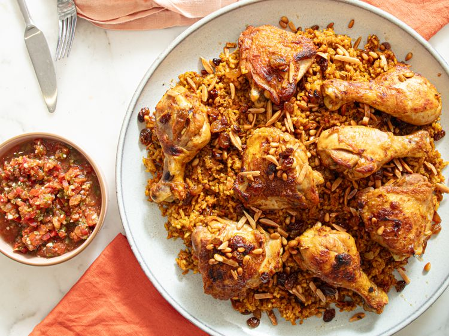

---
tags:
  - dish:main
  - protein:chicken
  - cuisine:middle eastern
  - context:entertaining
---
<!-- Tags can have colon, but no space around it -->

# Kabsa (Spiced Chicken and Rice)

<!-- Serves has to be a single number, no dashes, but text is allowed after the
number (e.g., 24 cookies) -->
- Serves:
{ #serves }
<!-- Time is not parsed, so anything can be input here, and additional
values can be added (e.g., "active time", "cooking time", etc) -->
- Time: 
- Date added: 

## Description
There's a reason almost every corner of the world has its own version of chicken and rice. Few meals promise as much comfort for as little effort. Tender, juicy chicken nestled in fluffy, spice-scented grains that drink up every drop of flavor—what could be better? Across the Arabian Peninsula, that promise takes the form of kabsa, a dish built on layered spices, fragrant rice, and tender meat that's deeply aromatic and meant to be shared. 

### Why It Works
- Searing the chicken skin-side down renders its fat, providing a savory base for the aromatics.
- Cooking down the tomatoes and carrots concentrates their flavor and reduces excess liquid, preventing the rice from becoming soggy.
- Using a 1:1.25 rice-to-water ratio provides enough liquid for the grains to fully hydrate without becoming waterlogged.
- Toasting the nuts and raisins in stages—almonds first, followed by pine nuts and then raisins—ensures each ingredient browns evenly and keeps the pine nuts and raisins from burning.

## Ingredients { #ingredients }

<!-- Decimals are allowed, fractions are not. For ranges, use only a single dash
and no spaces between the numbers. -->

### For the Chicken and Rice:
- 4 bone-in, skin-on chicken thighs and 4 bone-in, skin-on drumsticks (about 2 1/2 pounds total)
- 5 teaspoons Diamond Crystal kosher salt, divided; for table salt, use half as much by volume or same weight
- 4 teaspoons ghee or extra-virgin olive or vegetable oil
- 1 large yellow onion (10 ounces; 283 g), finely chopped
- 5 cloves garlic, minced
- 2 1/4 teaspoons finely grated fresh ginger
- 3 tablespoons (45 ml) tomato paste
- 1 tablespoon ground cumin
- 2 1/4 teaspoons ground cinnamon
- 2 teaspoons ground coriander
- 1 1/4 teaspoons ground turmeric
- 1 1/4 teaspoons ground allspice
- 1 teaspoon freshly ground black pepper
- 1/8 teaspoon ground cloves
- 4 cardamom pods
- 2 medium tomatoes (about 9 ounces; 255 g), finely chopped
- 1 large carrot (6 ounces, 170 g), peeled, cut in half crosswise, and shredded on the large holes of a box grater
- 2 bay leaves
- 1 loomi lime or 1 (3-inch) strip lime peel (see notes)
- 1 teaspoon orange zest (from 1 orange)
- 2 cups (400 g) basmati rice, rinsed until water runs clear (see notes)
- 2 1/2 cups (600 ml) water

### For the Raisin-Nut Topping:
- 2 tablespoons (30 ml) extra-virgin olive oil
- 1/4 cup (45 g) golden raisins
- 3 tablespoons (35 g) slivered almonds
- 2 tablespoons (25 g) pine nuts
- 1/8 teaspoon Diamond Crystal kosher salt; for table salt, use half as much by volume or same weight
- [Daqoos](./daqoos.md), optional
- Plain whole-milk yogurt, optional

## Directions

<!-- If you have a direction that refers to a number of some ingredient, wrap
the number in asterisks and add `{.ingredient-num}` afterwards. For example,
write `Add 2 Tbsp oil to pan` as `Add *2*{.ingredient-num} to pan`. This allows
us to properly change the number when changing the serves value. -->

1. For the Chicken and Rice: Pat chicken thighs and drumsticks dry with paper towels. In a large bowl or plate, combine chicken with 2 1/2 teaspoons kosher salt. Mix well to combine. For better salt penetration, let chicken sit at room temperature for 30 minutes or uncovered in the refrigerator for up to 8 hours, if desired.
2. In a large Dutch oven, heat ghee or oil over medium-high heat until shimmering. Working in two batches, add chicken thighs and drumsticks, skin-side down, and cook until skin-side is golden brown, 5 to 7 minutes, lowering heat as needed if Dutch oven starts to get smoky. Transfer chicken to a large plate and set aside.
3. In now-empty Dutch oven, add onions and cook over medium heat, stirring occasionally, until lightly golden, about 5 minutes. Add garlic, ginger, tomato paste, cumin, cinnamon, coriander, turmeric, allspice, black pepper, cloves, and cardamom. Cook, stirring occasionally, until very fragrant, about 1 minute.
4. Stir in tomatoes, carrots, bay leaves, loomi lime or lime peel, and orange zest. Cook, scraping bottom of Dutch oven to loosen browned bits, until tomato mixture is jammy and starts to stick to the bottom of the pot, about 4 minutes. Add rice and cook, stirring occasionally, until edges of rice begin to turn translucent, about 2 minutes. Add water and remaining 2 1/2 teaspoons kosher salt. Nestle chicken into water, along with any accumulated liquid, skin-side up, and bring to a boil over medium-high heat. Reduce heat to a simmer and cook, covered, over medium-low heat, until rice is tender, liquid is mostly absorbed, and bottom of rice forms a golden crust, 25 to 28 minutes, adjusting heat as needed to maintain gentle simmer. Let rice rest off-heat until remaining liquid is absorbed, about 10 minutes.
5. Gently fluff with two forks or wooden spoons, removing cardamom pods, bay leaves, and loomi lime or lime peel, if desired. Keep covered until ready to serve. If desired, while rice rests, adjust oven rack 6 inches from broiler element and heat broiler on high for at least 5 minutes. Transfer chicken to wire-rack-lined rimmed baking sheet, and broil chicken until spotty brown, 2 to 3 minutes.
6. For the Raisin-Nut Topping: While rice cooks, in a small skillet, heat oil over medium heat until shimmering. Add slivered almonds and cook, stirring constantly, until almonds turn very lightly golden, about 1 minute. Add pine nuts and cook, stirring constantly, until pine nuts turn lightly golden, about 1 minute. Add raisins and cook until almonds and pine nuts turn golden and raisins plump, about 1 minute. Immediately transfer to a plate or bowl to prevent further darkening. Season with salt; set aside.
7. To Serve: Transfer rice to a large serving platter and top with chicken. Pour raisin-nut mixture, along with the oil, over rice and chicken. Serve with daqoos and yogurt on the side, if desired. 

## Notes

To prevent clumpy rice, it's imperative to rinse the rice well until the water runs clear. 

## Source

[Serious Eats](https://www.seriouseats.com/kabsa-chicken-rice-recipe-11836443)

## Comments
