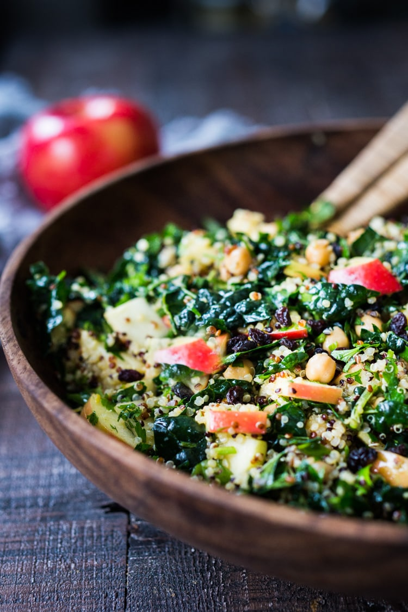

---
tags:
  - dish:salad
  - protein:quinoa
  - protein:chickpeas
  - ingredient:kale
---
<!-- Tags can have colon, but no space around it -->

# Kale Quinoa Salad

<!-- Serves has to be a single number, no dashes, but text is allowed after the
number (e.g., 24 cookies) -->
- Serves: 6 (6.5 cups)
{ #serves }
<!-- Time is not parsed, so anything can be input here, and additional
values can be added (e.g., "active time", "cooking time", etc) -->
- Time: 40 min
- Date added: 2026-03-04

## Description

This Kale Quinoa Salad with chickpeas and apples is like happiness in a bowl. A vegan salad, packed full of protein, nutrients and flavor.

Makes delicious leftovers.  Fantastic to make ahead and refrigerate, giving flavors a chance to fully develop. If making ahead, taste right before serving and add more vinegar/ and or salt if necessary.

## Ingredients { #ingredients }

<!-- Decimals are allowed, fractions are not. For ranges, use only a single dash
and no spaces between the numbers. -->

- 3 cups cooked Quinoa ( 1 1/4 cup dry)
- 1 tablespoon fennel seeds
- 1 tablespoon coriander seeds
- 1 bunch Lacinato Kale, de-stemmed, cut into one inch pieces
- 2 teaspoons olive oil
- pinch of salt
- 1 bunch flat leaf Italian parsley, rinse and finely chop
- 1 large apple, chopped into small bite sized pieces.
- 2 scallions, chopped
- 1.5 cups chickpeas, (15 ounce can, drained and rinsed, if using canned)
- .33 cup dried currants
- 1.5 teaspoons lemon zest ( about 1 medium lemon)
- 2 Tbsp lemon juice
- 2 Tbsp apple cider vinegar, plus more to taste
- 1 tablespoon honey (sub maple syrup for vegan)
- 1 teaspoon miso paste (adds depth, richness & probiotics!) white, red or brown
- .25 teaspoon smoked paprika
- 1 teaspoon salt
- .25 teaspoon black pepper
- 2 Tbsp extra virgin olive oil

## Directions

<!-- If you have a direction that refers to a number of some ingredient, wrap
the number in asterisks and add `{.ingredient-num}` afterwards. For example,
write `Add 2 Tbsp oil to pan` as `Add *2*{.ingredient-num} to pan`. This allows
us to properly change the number when changing the serves value. -->

1. Get quinoa cooking and cool to room temperate.  (Quinoa can also be made ahead of time and refrigerated until ready to use.)
2. Make the vinaigrette: whisk all ingredients together, except the oil, in a small bowl, then slowly drizzle in the  olive oil while whisking.
3. Toast fennel and coriander seeds in a cast iron skillet (or any pan will do) and give them a few stirs until they just start to give off their lovely fragrance, about 30 seconds. Grind with mortar and pestle or spice grinder.
4. Rinse and pat dry kale leaves and remove ribs and stems. Place in a large bowl and add the 2 teaspoons olive oil and a pinch salt. Rub the salt and oil in the leaves with your hands to tenderize the kale.
5. Add the cooled quinoa, parsley, apple, scallions, chickpeas, currants, lemon zest and ground spices to the bowl with the kale and toss gently with the vinaigrette.
6. Taste and adjust salt and vinegar, adding more to taste.

Options for a heartier salad: top with feta and/or toasted walnuts when serving.

## Source

[Feasting at Home](https://www.feastingathome.com/kale-and-quinoa-salad-with-apples/)

## Comments
