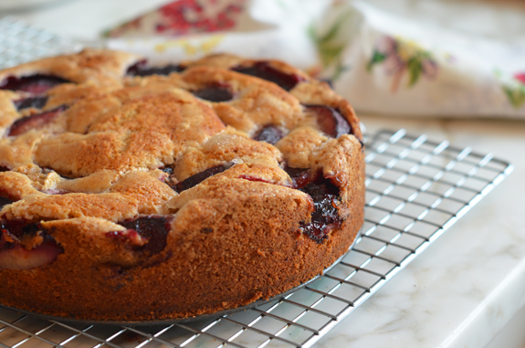

---
tags:
  - dish:dessert
---

# Late Summer Plum Cake

- Serves: 1 cake
{ #serves }
<!-- Time is not parsed, so anything can be input here, and additional
values can be added (e.g., "active time", "cooking time", etc) -->
- Time: 1 hr 20 min
- Date added: 2024-08-04

## Description

Gently spiced, this jammy plum cake celebrates the summer-into-fall season. Serve it as a brunch cake or for dessert topped with vanilla ice cream or whipped cream.

Freezer-Friendly Directions: The cake can be frozen for up to 3 months. After it is completely cooled, double-wrap it securely with aluminum foil or plastic freezer wrap, or place it in heavy-duty freezer bag. Thaw overnight on the countertop before serving.

## Ingredients { #ingredients }

- 1.5 cups all-purpose flour, spooned into measuring cup and leveled-off
- 1.5 teaspoons baking powder
- 1 teaspoon cinnamon
- .25 teaspoon nutmeg
- .125 teaspoon cardamom
- .5 teaspoon salt
- 8 tablespoons (.5 cup) unsalted butter, softened, plus more for greasing the pan
- 1 cup plus 2 tablespoons sugar, divided
- 1 large egg
- 1 teaspoon vanilla extract
- .5 cup milk (low fat is fine)
- 1 pound plums, pitted and quartered

## Directions

1. Preheat oven to 350°F and set an oven rack in the middle position. Grease a 9-inch springform pan. (Alternatively, the cake may be made in a 9-inch cake pan or pie pan and served directly from the pan.)
2. In a large bowl, whisk together the flour, baking powder, cinnamon, nutmeg, cardamom, and salt.
3. In the bowl of an electric mixer fitted with the paddle attachment or beaters, cream the butter and 1 cup of the sugar until pale and fluffy, about 3 minutes. Add the egg and vanilla and beat on low speed until well combined. Gradually add the flour mixture, alternating with the milk, and beat on low speed until smooth. (Note: the batter will be quite thick.)
4. Transfer the batter to the prepared pan and smooth the top with an offset spatula. Arrange the plums on top, skin side up, in a circular pattern so that they mostly cover the batter. Sprinkle the remaining 2 tablespoons of sugar over the plums.
5. Bake for 60 to 70 minutes, until golden on top and set in the center.
6. When the cake is hot out of the oven, run a knife around the edges of the pan and then remove the springform edge, leaving the base in place (if using a springform pan). Let the cake cool on a rack completely. Slice and serve with ice cream or whipped cream, if desired.

## Source

[Once Upon a Chef](https://www.onceuponachef.com/recipes/late-summer-plum-cake.html)

## Note

This cake keeps well, loosely covered at room temperature, for several days.

## Comments

- 2024-08-04: this is delicious and very easy!
