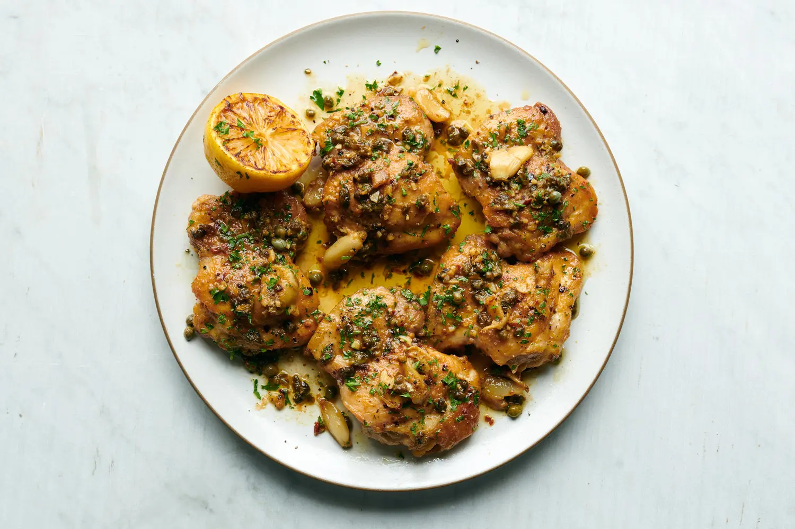

---
tags:
  - dish:main
  - protein:chicken
  - difficulty:easy
---
<!-- Tags can have colon, but no space around it -->

# Garlicky Chicken With Lemon-Anchovy Sauce

<!-- Serves has to be a single number, no dashes, but text is allowed after the
number (e.g., 24 cookies) -->
- Serves: 4
{ #serves }
<!-- Time is not parsed, so anything can be input here, and additional
values can be added (e.g., "active time", "cooking time", etc) -->
- Time: 25 min
- Date added: 2024-11-02

## Description

There’s nothing wrong with a dinner of pan-seared chicken seasoned with salt and pepper. But there’s everything right about the same chicken when you add anchovies, capers, garlic and plenty of lemon to the pan. What was once timid and a little dull turns vibrant, tangy and impossible to stop eating. And the only real extra work is chopping the garlic and a little parsley for garnish. In this dish, the cut of chicken is less important than the pungent pan sauce. Most people will probably want to use the workhorse of all poultry dinners, the boneless, skinless breasts. But the thighs cook nearly as quickly, and have a greater margin of error in terms of doneness. Overcook your breasts by even a minute, and you’ll get dry, tough meat. Thighs are more forgiving. However, if your family insists on white meat, you can substitute breasts and subtract about 3 minutes from the cooking time. There is no need to mention the anchovies until after people have complimented you on the meal.

## Ingredients { #ingredients }

<!-- Decimals are allowed, fractions are not. For ranges, use only a single dash
and no spaces between the numbers. -->
- 1.25 pounds boneless, skinless chicken thighs (4 to 5 thighs)
- 1 teaspoon coarse kosher salt
- Freshly ground black pepper
- 6 garlic cloves, smashed and peeled
- .25 cup extra-virgin olive oil
- 5 anchovy fillets
- 2 tablespoons drained capers, patted dry
- 1 large pinch chile flakes
- 1 lemon, halved
- Fresh chopped parsley, for serving

## Directions

<!-- If you have a direction that refers to a number of some ingredient, wrap
the number in asterisks and add `{.ingredient-num}` afterwards. For example,
write `Add 2 Tbsp oil to pan` as `Add *2*{.ingredient-num} to pan`. This allows
us to properly change the number when changing the serves value. -->
1. Heat oven to 350 degrees. Season the chicken thighs with salt and pepper and let rest while you prepare the anchovy-garlic oil. Mince one of the garlic cloves and set it aside for later. In a large, ovenproof skillet over medium-high heat, add the oil. When the oil is hot, add the 5 smashed whole garlic cloves, the anchovies, capers and chile. Let cook, stirring with a wooden spoon to break up the anchovies, until the garlic browns around the edges and the anchovies dissolve, 3 to 5 minutes.
2. Add the chicken thighs and cook until nicely browned on one side, 5 to 7 minutes. Flip the thighs, place the pan in the oven and cook another 5 to 10 minutes, until the chicken is cooked through.
3. When chicken is done, transfer thighs to a plate (be careful, as the pan handle will be hot). Place skillet back on the heat and add minced garlic and the juice of one lemon half. Cook for about 30 seconds, scraping up the browned bits on the bottom of the pan. Return chicken to the pan and cook it in the sauce for another 15 to 30 seconds.
4. Transfer everything to a serving platter. Squeeze the remaining lemon half over the chicken and garnish with chopped parsley. Serve.

## Source

[NYTimes](https://cooking.nytimes.com/recipes/1015290-garlicky-chicken-with-lemon-anchovy-sauce?smid=ck-recipe-android-share)

## Comments

- 2024-11-02: I made this with bone-in, skin-no thighs, browning the chicken first before adding things. but then cooking took longer, because the chicken had cooled down.
