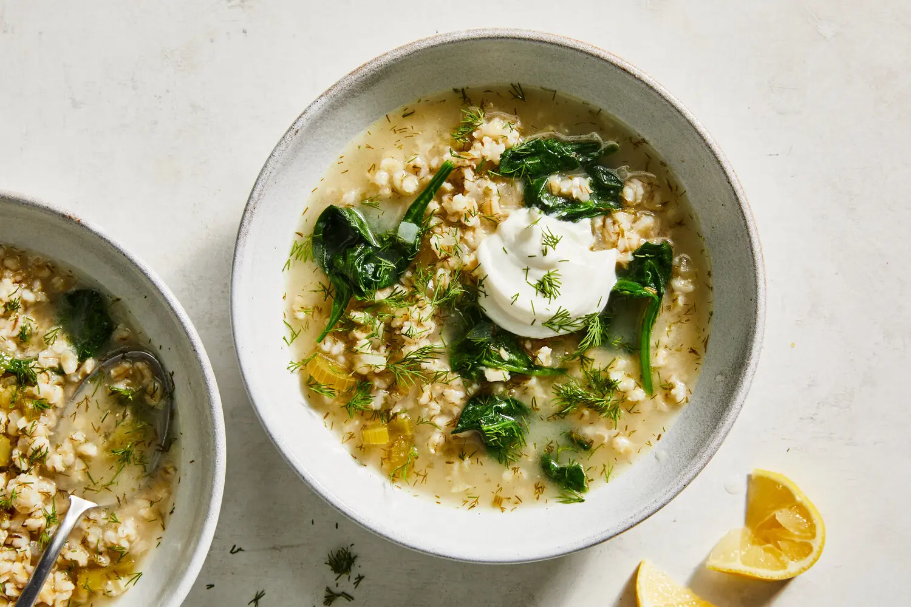

---
tags:
  - dish:soup
  - difficulty:easy
---
<!-- Tags can have colon, but no space around it -->

# Lemony Pearl Barley Soup

<!-- Serves has to be a single number, no dashes, but text is allowed after the
number (e.g., 24 cookies) -->
- Serves: 4
{ #serves }
<!-- Time is not parsed, so anything can be input here, and additional
values can be added (e.g., "active time", "cooking time", etc) -->
- Time: 45 min
- Date added: 2025-01-15

## Description
High in comfort, low in fuss, this pearl barley soup answers the question of what to cook when one doesn’t feel like cooking. Made with pantry staples, this simple soup beams with vibrancy. Lemon transforms this hearty soup into a dish that also feels light and restorative, while dill, used generously, reinforces the citrus flavor while bringing an assertive herbaceous edge. Other herbs could step in for dill; consider parsley, cilantro or chives. Spinach is added right at the end, after the heat is turned off, which ensures that the greens maintain a little bite and stay bright. The soup will thicken over time, so if you are making it ahead or have leftovers, simply loosen it up with more stock or water when reheating.

## Ingredients { #ingredients }

<!-- Decimals are allowed, fractions are not. For ranges, use only a single dash
and no spaces between the numbers. -->
- Extra-virgin olive oil
- 1 yellow onion, finely diced
- 2 garlic cloves, finely chopped
- 2 celery stalks, thinly sliced
- 1 cup chopped fresh dill leaves and stalks
- Salt (preferably sea salt) and black pepper
- 1 cup/6 ounces pearl barley
- 6 cups vegetable stock
- 3 to 4 tablespoons lemon juice (from 1 large lemon), plus extra wedges to serve
- 2 ounces baby spinach
- Greek yogurt, coconut yogurt or crème fraîche, to serve
## Directions

<!-- If you have a direction that refers to a number of some ingredient, wrap
the number in asterisks and add `{.ingredient-num}` afterwards. For example,
write `Add 2 Tbsp oil to pan` as `Add *2*{.ingredient-num} to pan`. This allows
us to properly change the number when changing the serves value. -->
1. Heat a large pot over medium-high. Add 1 to 2 tablespoons of olive oil along with the onion and cook, stirring, until softened, 2 to 3 minutes. Add the garlic, celery, half the dill and ½ teaspoon salt and stir until fragrant, 1 to 2 minutes.
2. Add the pearl barley and stock and bring to the boil. Cover, reduce heat to medium and cook, stirring occasionally, until the barley is swollen and tender, 25 to 30 minutes.
3. Turn off the heat. Add the lemon juice, and season with salt and pepper. Taste and make sure the seasonings are to your liking, adjusting salt and lemon as needed.
4. Stir in the spinach, allowing the residual heat to wilt the leaves.
5. Ladle the soup into bowls. Top with a dollop of yogurt and the remaining dill and drizzle generously with olive oil.

## Source

[NYTimes](https://cooking.nytimes.com/recipes/1025017-lemony-pearl-barley-soup)

## Comments
