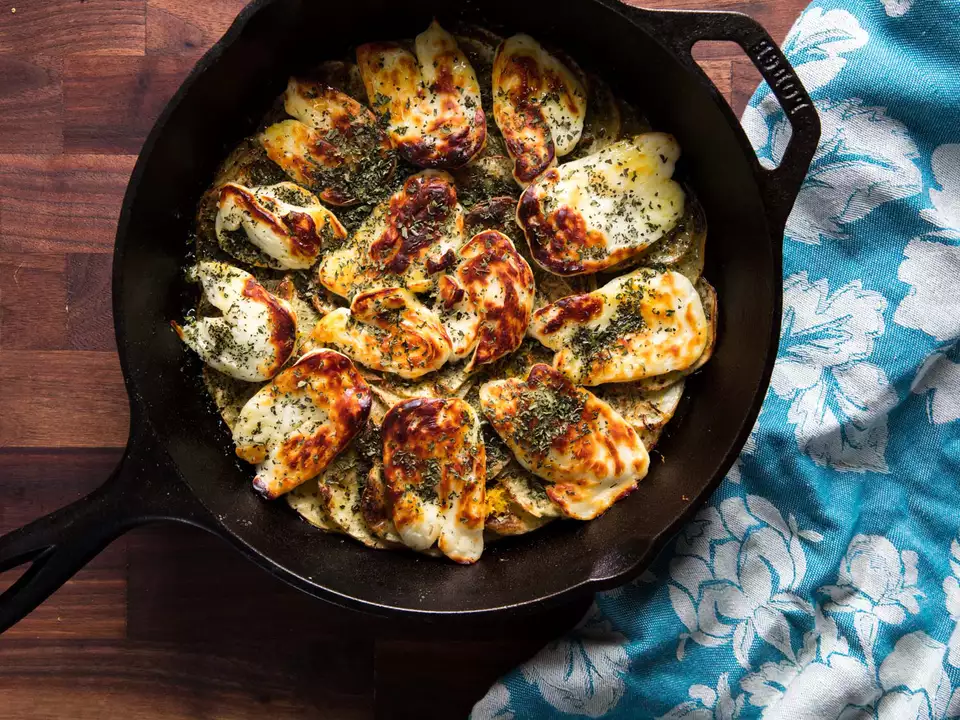

---
tags:
  - dish:sides
  - ingredient:potato
  - ingredient:halloumi
  - difficulty:easy
---
# Lemony broiled potatoes with halloumi

- - Serves: 2
{ #serves }
- Active time: 30 mins
- Total time: 30 mins
- Date added: 2024-01-10

## Description

This easy one-skillet side dish—perfect with roasted meats—combines the best of several worlds. It takes inspiration from slow-roasted Greek potatoes, rich with lemon, olive oil, and oregano; presents them in potato-gratin form, as a layer of thin, shingled slices; and is topped off with browned and melty halloumi cheese, reminiscent of saganaki (minus the pyrotechnics).

### Why it works:

- The lemon juice not only adds flavor but also steams the potatoes from below, giving them a creamy texture.
- Slicing the potatoes thinly and leaving them in a single shingled layer ensures they cook through in a short time under the broiler.

## Ingredients { #ingredients }

- 2 tablespoons (30ml) extra-virgin olive oil
- 1 pound (450g) Yukon Gold potatoes, sliced .125 inch thick
- Kosher or sea salt
- Freshly ground black pepper
- .25 cup (60ml) fresh lemon juice, from about 1 lemon, plus zest of 1 lemon
- 8 ounces (225g) halloumi cheese, thinly sliced
- 2 teaspoons dried oregano

## Directions

1. Preheat broiler and set top oven rack about 6 inches from broiler element. Add olive oil to a 12-inch cast iron skillet and spread evenly all over.
2. Add potatoes, shingling the slices around the pan in a single circular layer. Season with salt and pepper.
3. Broil until the potatoes have puffed up slightly, mostly cooked through, and browned on top, about 7 minutes.
4. Pour lemon juice all over potatoes and sprinkle zest on top. Add halloumi cheese in an even layer on top and broil until cheese is golden brown all over and potatoes are fully cooked through, about 4 minutes.
5. Sprinkle oregano on top and serve. 

## Source

[Serious Eats](https://www.seriouseats.com/broiled-lemony-potatoes-with-halloumi-recipe)

## Comments

- Bill Broderick, Oct 21, 2021 at 8:34 PM: I did it in a 10 inch pan, so it was a bit over crowded -- ended up doing like 15 or 17 minutes before the cheese (and still didn't really been) and 10 minutes after (the cheese did brown)

