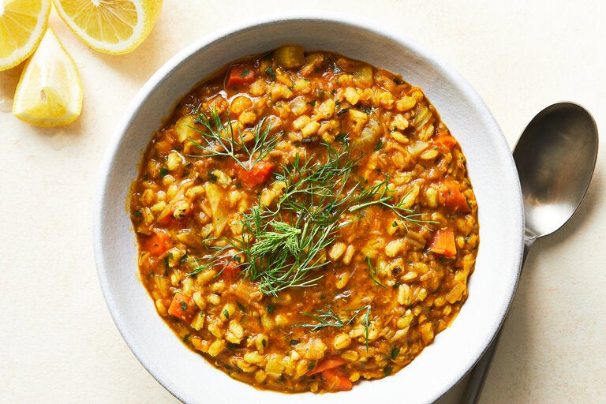

---
tags:
  - dish:main
  - protein:lentils
  - ingredient:barley
---
<!-- Tags can have colon, but no space around it -->

# Red lentil barley stew

<!-- Serves has to be a single number, no dashes, but text is allowed after the
number (e.g., 24 cookies) -->
- Serves: 8
{ #serves }
<!-- Time is not parsed, so anything can be input here, and additional
values can be added (e.g., "active time", "cooking time", etc) -->
- Time: 2 hours
- Date added: 2024-03-15

## Description

Warm spices, fennel and leeks give this rib-sticking stew a deep, complex character. Feel free to adjust the liquid to taste. Adding a little more makes it brothier and more souplike, suitable for eating with a spoon. Or let it rest a bit. As it sits, the barley will absorb all of the liquid, making it easily forkable. Be sure to serve this with lemon wedges on the side, since the lentils and barley benefit greatly from a bright jolt right at the end.

## Ingredients { #ingredients }

<!-- Decimals are allowed, fractions are not. For ranges, use only a single dash
and no spaces between the numbers. -->

- 3 tablespoons extra-virgin olive oil, more for drizzling
- 2 leeks, white and light green parts, sliced into half-moons, or 1 cup sliced onion
- 3 carrots, diced
- 1 cup chopped fennel, fronds reserved
- 1 bunch cilantro, leaves and stems mostly separated and chopped (don’t worry too much about leaves and stems mingling)
- 3 garlic cloves, minced
- 1.5 teaspoons fine sea or table salt, more to taste
- 2 tablespoons tomato paste
- 1 tablespoon baharat or garam masala
- .5 teaspoon ground turmeric
- 1 cinnamon stick
- 2 quarts vegetable or chicken broth
- 1 cup pearled barley
- 1 cup red lentils
- 1-2 tablespoons fresh lemon juice, plus lemon wedges for serving

## Directions

<!-- If you have a direction that refers to a number of some ingredient, wrap
the number in asterisks and add `{.ingredient-num}` afterwards. For example,
write `Add 2 Tbsp oil to pan` as `Add *2*{.ingredient-num} to pan`. This allows
us to properly change the number when changing the serves value. -->

1. In a large Dutch oven or soup pot, heat oil over medium-high. Add leeks and cook, stirring often, until tender and beginning to brown, about 10 minutes.
2. Stir in carrots, fennel, cilantro stems, garlic and salt. Cook until the garlic is fragrant, about 2 minutes. Stir in tomato paste, baharat, turmeric and cinnamon stick, and cook until the tomato paste begins to caramelize, about 2 minutes.
3. Add the broth, barley and red lentils, and bring to a boil. Lower heat and simmer for 1 hour to 1 ½ hours, stirring occasionally, until the barley and lentils are tender. (Add some water if the pot starts to look dry; this can be as thick or soupy as you like.)
4. Stir in a tablespoon of lemon juice and the chopped cilantro leaves. Taste stew and add salt and lemon juice if needed (you might need a lot more salt if you started with unsalted broth). Serve in bowls drizzled with olive oil and garnished with chopped fennel fronds.

## Source

[NYTimes](https://cooking.nytimes.com/recipes/1025128-red-lentil-barley-stew)

## Comments
