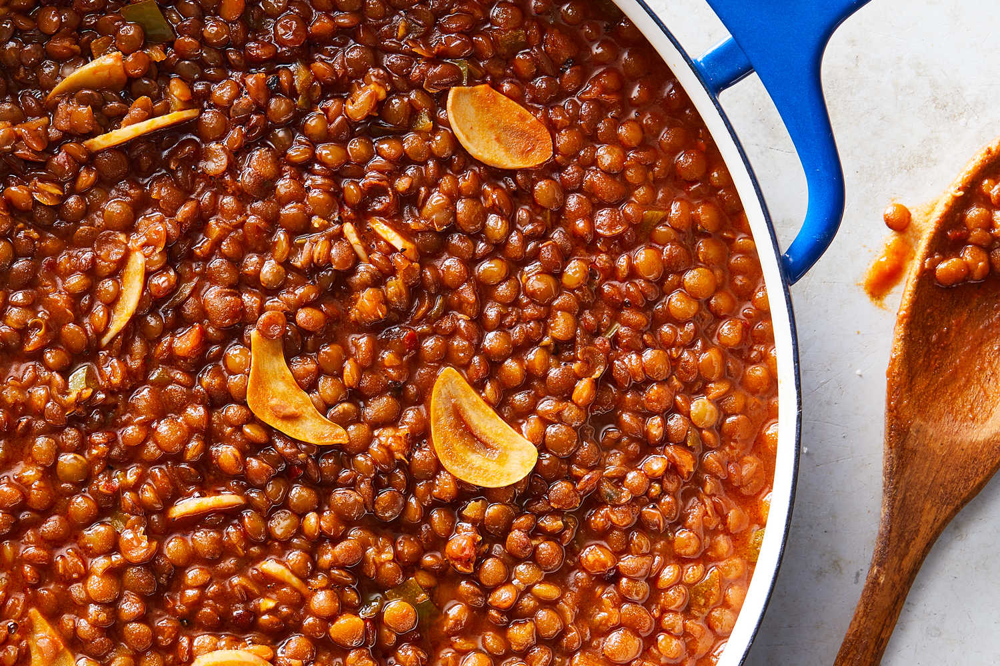

---
tags:
  - dish:main
  - protein:lentils
  - difficulty:easy
---
<!-- Tags can have colon, but no space around it -->

# Lentils Diavolo

<!-- Serves has to be a single number, no dashes, but text is allowed after the
number (e.g., 24 cookies) -->
- Serves: 4
{ #serves }
<!-- Time is not parsed, so anything can be input here, and additional
values can be added (e.g., "active time", "cooking time", etc) -->
- Time: 45 min
- Date added: 2025-02-08

## Description
Lentils, like beans, soak up whatever flavors they’re cooked in. Here, it’s a chile oil made with both dried and fresh chiles, so it’s devilishly spiced — not just spicy. Simmer the lentils in the potent oil and some tomato paste until they’re glossy and tender, rich and spicy as you’d expect from a diavolo-style sauce. (Add more water if you’re after more of a quasi-chili.) Eat the lentils with a spray of lemon juice, parsley and-or bread crumbs on toast, grains, pasta, a sweet potato, bitter greens or all on their own. The lentils will keep for up to 4 days in the fridge; reheat over low heat or in the microwave loosened with a little water.
## Ingredients { #ingredients }

<!-- Decimals are allowed, fractions are not. For ranges, use only a single dash
and no spaces between the numbers. -->
- 4 tablespoons extra-virgin olive oil
- 1 jalapeño, halved, seeded if desired, and finely chopped
- 6 garlic cloves, thinly sliced
- 1 tablespoon smoked paprika
- 1 teaspoon black pepper
- .5 teaspoon red-pepper flakes
- .25 cup tomato paste
- 1.5 cups brown or green lentils
- 1 teaspoon kosher salt

## Directions

<!-- If you have a direction that refers to a number of some ingredient, wrap
the number in asterisks and add `{.ingredient-num}` afterwards. For example,
write `Add 2 Tbsp oil to pan` as `Add *2*{.ingredient-num} to pan`. This allows
us to properly change the number when changing the serves value. -->
1. Heat the oil in a medium saucepan or Dutch oven over medium heat. Add the jalapeño, garlic, paprika, black pepper and red-pepper flakes and cook, stirring occasionally, until the vegetables are softened, about 3 minutes. Add the tomato paste and cook, stirring constantly, for 30 seconds.
2. Add the lentils, and cover with 1½ inches of water. Bring to a simmer over medium-high heat, then lower to a gentle simmer and cook until the lentils are soft and the water has mostly evaporated, 30 to 35 minutes. If they are looking dry at any point, add a little hot water. Season with the salt and serve.

## Source

[NYTimes](https://cooking.nytimes.com/recipes/1019915-lentils-diavolo)

## Comments

- 2025-02-08: delicious, with a nice amount of spice: 
  - I used broth instead of water, following the lentil instructions for the amount to add, though needed to add a bit more before finished cooking.
  - Didn't have any smoked paprika, so used about 1 tsp each regular paprika, gochugaru, aleppo pepper and urfa biber (for smoked paprika and red-pepper flakes).
