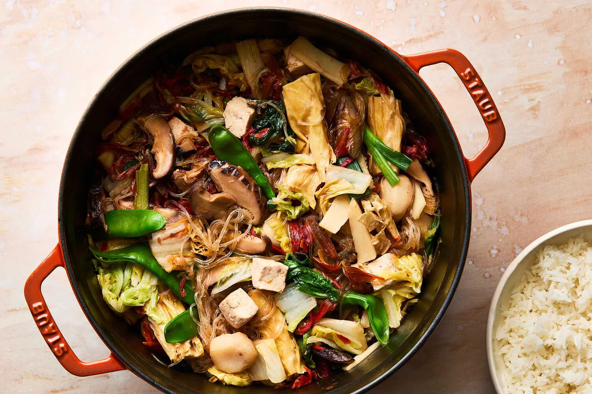

---
tags:
  - dish:main
  - protein:tofu
  - cuisine:chinese
---
<!-- Tags can have colon, but no space around it -->

# Lo Han Jai (Buddha's Delight)

<!-- Serves has to be a single number, no dashes, but text is allowed after the
number (e.g., 24 cookies) -->
- Serves: 4
{ #serves }
<!-- Time is not parsed, so anything can be input here, and additional
values can be added (e.g., "active time", "cooking time", etc) -->
- Time: 1 hr
- Date added: 2025-03-16

## Description
On Lunar New Year’s Day, many Cantonese families will make a pot of lo han jai, also known as Buddha’s delight. The vegan dish is rooted in Buddhist tradition, which prescribes that a meat-free diet be observed during the new year as a form of self-purification and to welcome good luck. Delicious any time of year, Lo han jai has transcended Lunar New Year and is nowadays enjoyed as an everyday dinner dish. There is no single recipe for lo han jai — families are likely to have their own versions — but the key is to create a textural dish by bringing together dried and fresh vegetables. Swap out any of the ingredients you cannot find and consider substituting with other vegetables such as carrot, sugar snap peas, lotus root, baby corn or cauliflower.
## Ingredients { #ingredients }

<!-- Decimals are allowed, fractions are not. For ranges, use only a single dash
and no spaces between the numbers. -->
- 2 ounces dried Chinese shiitake mushrooms, soaked in 2½ cups just-boiled water for 30 minutes
- 2 ounces dried bean curd sticks, soaked in just-boiled water for 30 minutes
- 1 ounce dried lily flowers (optional), soaked in just-boiled water for 30 minutes
- 3 ounces mung bean vermicelli noodles, soaked in warm water for 10 minutes
- 1 tablespoon vegetable oil or other neutral oil
- 1 (1-inch) piece fresh ginger, peeled and thinly sliced 
- 2 garlic cloves, smashed 
- 4 scallions, white and green parts separated and cut into 1-inch pieces
- .5 teaspoon granulated sugar
- 1 pound Napa cabbage, cored and cut into 2-inch chunks (5 to 6 cups)
- 8 ounces extra-firm tofu, cut into ½-inch pieces
- 2 to 3 tablespoons red or white fermented tofu (see Tip)
- 2 tablespoons soy sauce or tamari
- 1 (5-ounce) can sliced bamboo shoots, drained
- 1 (5-ounce) can sliced or whole water chestnuts, drained
- 2 ounces snow peas, trimmed
- 1 tablespoon sesame oil
- Salt and pepper
- Cooked white or brown rice, to serve 

## Directions

<!-- If you have a direction that refers to a number of some ingredient, wrap
the number in asterisks and add `{.ingredient-num}` afterwards. For example,
write `Add 2 Tbsp oil to pan` as `Add *2*{.ingredient-num} to pan`. This allows
us to properly change the number when changing the serves value. -->
1. Squeeze out the liquid from the soaked mushrooms, slice them and trim off the stem, if needed. (Keep 2 cups mushroom soaking water for later.) Drain the soaked bean curd sticks, and cut them into 2-inch pieces. Drain the lily flowers (if using) and the mung bean vermicelli.
2. Heat a large Dutch oven or wide pot for 2 minutes over medium. When hot, add the oil, ginger, garlic and white part of the scallions and stir until fragrant, about 1 minute. Add the mushrooms, lily buds and sugar, and stir for 1 minute.
3. Next, add the cabbage, bean curd sticks and extra-firm tofu, and toss to combine. Add the fermented tofu, soy sauce and the mushroom soaking water and combine well, making sure to break up the fermented tofu. Cover and cook until the cabbage has wilted, 7 to 8 minutes.
4. Add the mung bean vermicelli, along with the bamboo shoots, water chestnuts, snow peas and green parts of the scallions; stir to combine. Cover and cook until the snow peas are bright green and crisp-tender and the vermicelli has soaked up most of the liquid, 3 to 4 minutes.
5. Drizzle with the sesame oil and taste, seasoning with salt, if required, and pepper. Remove from heat immediately. Serve hot, with rice. This recipe makes enough to feed a family, and leftovers can be stored in an airtight container for up to 5 days.

## Notes

<!-- Delete section if no additional notes -->

## Source

[NYTimes](https://cooking.nytimes.com/recipes/1026265-lo-han-jai-buddhas-delight)

## Comments

- 2025-03-16: delicious, would add more of the furu
