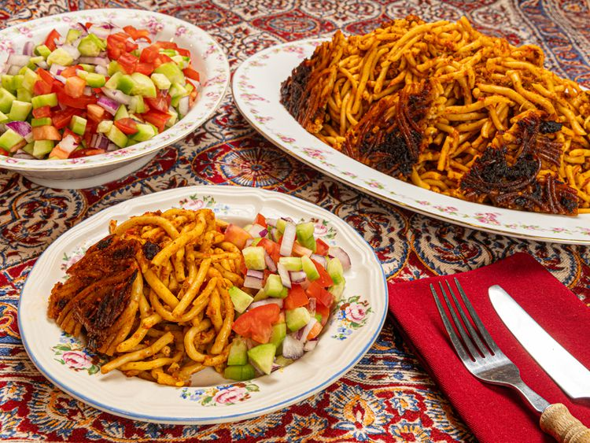

---
tags:
  - dish:main
  - protein:beef
  - ingredient:pasta
  - cuisine:iranian
---
<!-- Tags can have colon, but no space around it -->

# Iranian makaroni

<!-- Serves has to be a single number, no dashes, but text is allowed after the
number (e.g., 24 cookies) -->
- Serves: 6
{ #serves }
<!-- Time is not parsed, so anything can be input here, and additional
values can be added (e.g., "active time", "cooking time", etc) -->
- Time: 110 min
- Date added: 2025-06-08

## Description

This Persian baked pasta combines bucatini, a savory tomato-meat sauce, and a crispy crust for a deeply comforting one-pot meal.

### Why it works
- Tossing the pasta with tomato sauce, then steaming it in a covered pot, helps the sauce deeply infuse the pasta.
- Using a heat diffuser, a heavy pot, or rotating every 5 minutes ensures an evenly browned, deep orange pasta tahdig.
- Setting the pot in an inch of cold water or on a wet towel right after cooking makes it easier to release the crispy pasta tahdig.

## Ingredients { #ingredients }

<!-- Decimals are allowed, fractions are not. For ranges, use only a single dash
and no spaces between the numbers. -->

- 8 tablespoons (120 ml) olive oil, neutral oil, or ghee, divided
- 1 pound (450 g) ground lamb, ground beef (any fat percent is fine for both), or a combination
- 3 tablespoons Diamond Crystal Kosher salt, divided; for table salt use half as much by volume
- .5 teaspoon crushed red pepper
- .5 teaspoon cumin seeds
- 1 medium white or yellow onion (about 8 ounces; 226 g), peeled and cut into 1/4-inch dice
- 4 cloves of garlic (20 g), minced
- .5 teaspoon ground turmeric
- 6 ounces (170 g) tomato paste
- 1 pound (450 g) bucatini pasta, each strand broken into four pieces

## Directions

<!-- If you have a direction that refers to a number of some ingredient, wrap
the number in asterisks and add `{.ingredient-num}` afterwards. For example,
write `Add 2 Tbsp oil to pan` as `Add *2*{.ingredient-num} to pan`. This allows
us to properly change the number when changing the serves value. -->

1. In a large Dutch oven or pot, heat 2 tablespoons (30 ml) oil or ghee over medium-high heat until shimmering. Add ground meat with 1 tablespoon salt and cook, stirring and breaking up with a wooden spoon into small pieces, until meat is browned, about 10 minutes. With a slotted spoon, transfer meat to a plate and set aside.
2. Heat remaining rendered fat and 2 tablespoons oil in pot over medium heat until shimmering. Add red pepper flakes and cumin seeds, and cook, stirring constantly until fragrant, for 30 seconds.
3. Add onion and cook, stirring occasionally, until onions soften and just begin to turn golden brown, 7 to 10 minutes.
4. Add garlic and turmeric, and cook until fragrant, stirring constantly, for 30 seconds.
5. Add tomato paste and cook, stirring to combine until tomato paste has darkened to a deeper red about 2 minutes.
6. Return browned ground meat to pot and add 2 cups (480 ml) water. Stir to combine and bring to boil. Reduce heat to medium-low, cover and simmer, stirring every 10 minutes, until mixture is thickened and flavors well developed, about 45 minutes.
7. In a separate large pot or Dutch oven, bring 4 quarts water and remaining 2 tablespoons of salt to a boil over high heat.
8. Cook broken bucatini pasta in the boiling water until fully tender and slightly past the al dente stage, about 10 minutes.
9. Drain the pasta well. Transfer drained pasta to a large bowl. Add prepared tomato sauce and toss to combine thoroughly.
10. Return pot to the stovetop. (See note) Add remaining 4 tablespoons oil to Dutch oven. Pour sauced pasta into pot. Wrap the lid of pot in a clean, thick kitchen towel. Cover pot tightly with the towel-wrapped lid. This helps prevent steam from escaping and keeps condensation from dripping onto pasta. Set Dutch oven over medium-low heat and cook, rotating pot for even heating every 5 to 10 minutes, until pasta develops a dark golden crust on the bottom, for 45 minutes (or longer if you prefer your pasta tahdig darker with a higher degree of singeing.
11. Fill your sink with 1-inch cold water. Without taking the lid off the pot, set the pot immediately in the water-filled sink (alternatively, set the pot on top of a thoroughly wet kitchen towel); this will help in getting the tahdig out. Let sit 4 minutes. Move pot to your kitchen counter and carefully remove the lid (avoid any hot steam that might come out and also make sure not to let any condensed water drip down onto the pasta).
12. If using a nonstick pot, invert a round serving platter (slightly wider than the diameter of the pot) over the pot. Firmly grasp both the platter and the pot and carefully but quickly flip them over together. Lift off the pot. The tahdig should be beautifully displayed atop a cake-like mound of pasta. If using a standard pot, the tahdig may not release easily. Run a thin, flexible silicone spatula around the edges of the tahdig to loosen it from the bottom and sides of the pot. Repeat this a few times, gently working the spatula a bit further underneath each time. If the tahdig releases completely, use the same flipping technique as with a nonstick pot. If not, gently spoon the pasta onto a serving platter. Then, using a spoon or flat spatula, carefully scrape the tahdig up, trying to keep it in as large pieces as possible, and arrange them around the pasta. 

## Notes

- Mushrooms are a popular addition to the meat-based tomato sauce. For best results, sauté 8 ounces of your preferred mushrooms until deeply brown before adding them to the sauce. This prevents the sauce from becoming watery and enhances the flavor.
- While ground lamb or beef are traditional, crumbled sausage, ground pork, or ground poultry also work well in the sauce.
- For a vegetarian version, use your favorite meatless tomato sauce. Enhance the flavor with other add-ins as desired.
- Persian home cooks often use the bottom of the pot as a canvas for innovative tahdig creations. The possibilities are endless! Popular options include lining the pot with potato slices or a layer of flatbread, such as lavash or pita. 
- More elaborate tahdig variations include creating a lattice with tortillas, arranging edible leaves, or forming circular patterns with long strands of boiled pasta.
- The tomato sauce can be refrigerated for up to 7 days in advance or frozen for up to 3 months. Thaw frozen sauce in the refrigerator for at least 12 hours before reheating. Reheat refrigerated sauce on the stovetop or in the microwave.
- Leftover mākāroni is excellent. Refrigerate it in an airtight container for up to 7 days or freeze it for up to 3 months. Thaw frozen mākāroni before reheating. Reheat leftovers in the microwave, adding a few tablespoons of water as needed.

## Source

[Serious Eats](https://www.seriouseats.com/persian-makaroni-recipe-11740864)

## Comments

- 2025-06-08: delicious, and it came out of the enameled cast iron easily. I also added some mushrooms, browned separately, as suggested.
