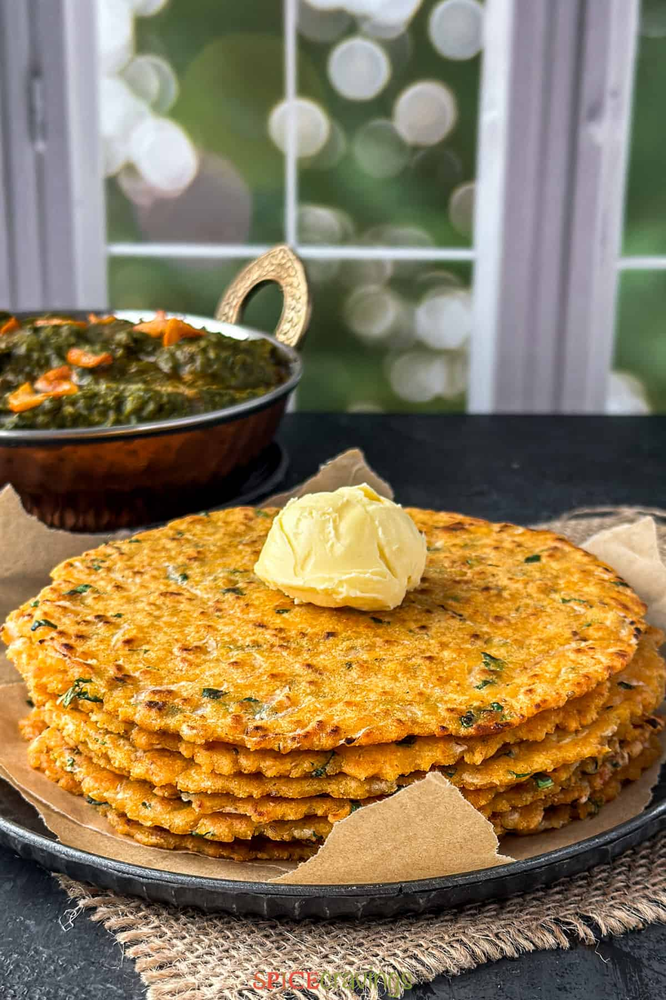

---
tags:
  - dish:sides
  - ingredient:cornflour
  - cuisine:indian
---
<!-- Tags can have colon, but no space around it -->

# Makki ki roti

<!-- Serves has to be a single number, no dashes, but text is allowed after the
number (e.g., 24 cookies) -->
- Serves: 8 rotis
{ #serves }
<!-- Time is not parsed, so anything can be input here, and additional
values can be added (e.g., "active time", "cooking time", etc) -->
- Time: 30 min
- Date added: 2024-09-22

## Description
Failproof recipe for Makki ki Roti, a traditional Punjabi flatbread made from maize flour featuring a delightful rustic texture and an earthy sweetness. It pairs beautifully with Sarson Ka Saag.

## Ingredients { #ingredients }

<!-- Decimals are allowed, fractions are not. For ranges, use only a single dash
and no spaces between the numbers. -->
- 2 cups maize flour (makki ka atta)
- 1 teaspoon salt
- .5 teaspoon carom (ajwain) seeds
- .5 teaspoon red chili powder
- 1 cup grated diakon radish : optional
- .25 cup chopped daikon greens or cilantro/ fenugreek / spinach
- 3 tablespoons ghee for cooking
- 1 cup warm water start with ¾ cup

## Directions

<!-- If you have a direction that refers to a number of some ingredient, wrap
the number in asterisks and add `{.ingredient-num}` afterwards. For example,
write `Add 2 Tbsp oil to pan` as `Add *2*{.ingredient-num} to pan`. This allows
us to properly change the number when changing the serves value. -->
1. Combine maize flour (makki ka atta), salt, carom seeds, and red chili powder in a mixing bowl. Add grated daikon and chopped greens and mix with a fork.
2. Add water as needed and knead the mixture into a soft dough. Add a teaspoon of ghee and incorporate that into the dough. The dough should hold together without being too sticky.
3. Divide the dough into *8*{.ingredient-num} equal portions and roll each into a round disc.
4. Place a parchment sheet onto the tortilla press. Place a dough ball in the center and top that with another sheet of parchment. Now press down the tortilla press handle to flatten the dough. You may need to press 1-3 times to reach a ¼-inch thick roti. Repeat to flatten all rotis.
5. Heat a skillet on medium-high heat. Carefully transfer the roti to your hand, then place it in the skillet. Cook for about 30 seconds, till it turns a shade darker.
6. Flip it. Brush a little ghee on the other side and flip after 30 seconds. Repeat the process on the other side and cook till the flatbread turns golden in color.

## Notes

<!-- Delete section if no additional notes -->
- Flour Texture: Maize flour has a superfine consistency which works great for this recipe. If using cornmeal, grind it to a superfine texture before using. 
- Handle with Care: Maize flour lacks gluten, making the dough delicate and sticky. Handle it gently to prevent breakage while shaping the rotis.
- Consistency is Key: Aim for a dough that's soft and pliable but not too sticky. Adjust the water quantity accordingly to achieve the perfect consistency.
- Cooking Time: Cooking the rotis on a medium-high flame ensures they cook evenly without burning, resulting in a beautiful golden hue.

## Source

[Spice cravings](https://spicecravings.com/makki-ki-roti-seasoned-cornmeal-flatbread)

## Comments
