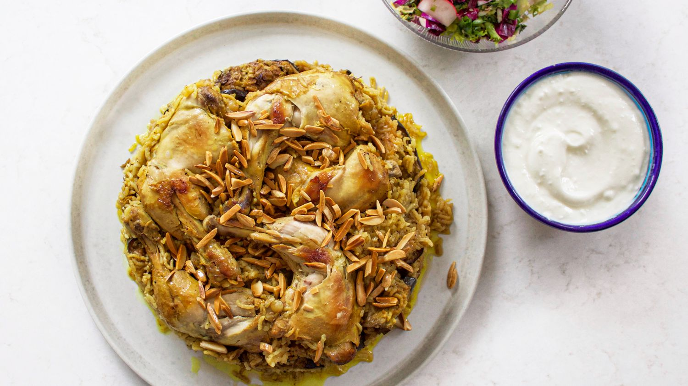

---
tags:
 - dish:main
 - protein:chicken
 - cuisine:middle eastern
 - context:holiday
---

# Maqlubeh

- Serves: 1
{ #serves }
- Working time: 100
- Waiting time: 20
- Date added: 2023-12-07

## Description

Layers of meat, fried vegetables, and spiced rice flipped over to reveal a complete and festive meal.

## Ingredients { #ingredients }

### For the Broth: 
- 2.0 tablespoons (30ml) extra-virgin olive oil 
- 4.0 whole chicken legs (about 2 pounds; 900g total) (or a mix of drumsticks and thighs)
- 10.0 allspice berries 
- 10.0 whole black peppercorns 
- 5.0 whole cloves 
- 4.0 green cardamom pods (4-5)
- 2.0 bay leaves 
- 2.0 cinnamon sticks 
- 1.0 teaspoon (5g) tomato paste 
- 1.0 teaspoon turmeric 
- 1.0 medium yellow onion (about 8 ounces; 225g) (peeled and left whole)
- 2.5 tablespoons (23g) Diamond Crystal kosher salt; for table salt (use half as much by volume or the same weight)
### For the Maqlubeh: 
- 1.0 pound 10.5 ounces (750g; about 3 .5 generous cups) jasmine rice (see note)
- 2.0 medium eggplants (about 2 pounds; 910g total) (sliced crosswise into .75 inch thick rounds)
- 1.0 medium cauliflower (about 1 .5 pounds; 700g) (cut into florets)
- Vegetable oil (for frying)
- 2.0 tablespoons (30ml) extra-virgin olive oil 
- 1.0 teaspoon turmeric 
- 1.5 teaspoons ground allspice 
- 0.5 teaspoon ground cinnamon 
- 0.5 teaspoon freshly ground black pepper 
- 4.5 teaspoons ​​(14g) Diamond Crystal kosher salt; for table salt (use about half as much by volume or the same weight)
- 1.0 tablespoon (15g) ghee or clarified butter 
### For the Almonds: 
- 1.0 cup slivered almonds (about 4 ounces; 115g)
- Olive oil or vegetable oil (for frying)
### To Serve: 
- Palestinian salad 
- Plain or Greek whole milk yogurt 

## Directions

1. For the Broth: In a heavy-bottomed stock pot, heat olive oil over medium-high heat until shimmering. Add chicken, skin side down, and sear until the chicken is golden-brown all over and releases easily from the pot, about 5 minutes per side.
2. Add the allspice, black peppercorns, cloves, cardamom, bay leaves, cinnamon sticks, tomato paste, and turmeric and stir to coat the chicken. Add the whole onion along with *10.5*{.ingredient-num} cups water and the salt, and bring to a boil. Let boil for 5 minutes, skimming any scum that rises to the surface, then reduce heat to medium-low and simmer until the chicken is cooked through but not falling apart, about 1 hour. Using tongs, transfer chicken to a plate or platter and set aside.
3. Allow broth to cool slightly, then strain through a fine-mesh strainer set through a large heatproof bowl. Discard solids and set broth aside.
4. Meanwhile, for the Maqlubeh: While the broth is simmering, set rice in a large mixing bowl and wash in several changes of cold water, swishing well with your hand each time, until the water is clear. Cover rice with fresh cold water and let soak for 25 minutes.
5. Fill a Dutch oven, wok, or large sauté pan, with about 1 inch of vegetable oil. Heat oil over high heat to 375°F (190°C). Working in batches to avoid crowding the oil, fry eggplant slices in a single layer, turning once halfway through, until golden-brown on both sides, about 5 minutes. Carefully transfer fried eggplant to a paper towel–lined platter or baking sheet. Once all the eggplant has been fried, repeat with cauliflower, frying florets until golden brown all over.
6. Drain rice well, return to mixing bowl, then stir in the olive oil, turmeric, allspice, cinnamon, black pepper, and salt until thoroughly combined.
7. To assemble the maqlubeh, grease the interior of a large nonstick pot (approximately 10-inches wide and 5-inches high) with ghee; if you do not have a nonstick pot, then line the bottom of a Dutch oven or stainless steel pot with a round piece of parchment paper and then grease with ghee.
8. Arrange the cooked chicken, skin side down, in the pot. Spread one third of the rice on top in as even a layer as possible. Layer the fried eggplant and cauliflower on top as evenly as possible; you can arrange them in two separate stacked layers, as a single layer split down the middle with cauliflower on one side and eggplant on the other, or freely mixed together. Top with the remaining rice, spreading it in an even layer; you should not see the vegetables through the rice, or, at most, see only some edges popping through.
9. Set an inverted heatproof plate, slightly smaller than the circumference of the pot, over the rice. This weighs down the maqlubeh, helping it retain its distinctive layers.
10. Ladle broth on top until it reaches approximately .75 inch (2cm) above the rice and other ingredients. Cover, set on medium heat and bring to a boil, then reduce heat to maintain a strong simmer and cook for 10 minutes. Lower the heat to a very gentle simmer and cook until all the liquid has been absorbed, 10 to 15 minutes longer. Remove from heat.
11. Using tongs and an oven mitt or kitchen towel, carefully remove the inverted plate. Set a well-fitting lid on the pot, sandwiching a clean tea towel or paper towels between the pot and the lid. Set aside to steam for 15 to 20 minutes. For crispier rice, see note at end.
12. For the Almonds: In a small skillet, pour in enough olive oil to thinly coat the bottom (about 1 to 2 tablespoons). Add the almonds and cook over medium heat, stirring continuously, until almonds are a light golden color, about 5 minutes. Remove from the heat and drain on a plate lined with paper towels. Alternatively, place the almonds on a small sheet pan and toast in a 350°F (175°C) oven until golden, about 5 minutes.
13. To Serve: Remove the lid and place a large, inverted serving platter on top of the pot. Using both hands, quickly but carefully flip the pot over. Slowly lift the pot to reveal the dish.
14. Give the serving platter a gentle shake back and forth to help disperse the rice grains. Sprinkle with toasted almonds and serve alongside Palestinian salad and fresh yogurt.

## Source

[Serious Eats](https://www.seriouseats.com/maqlubeh-recipe-5704126)

## Comments
