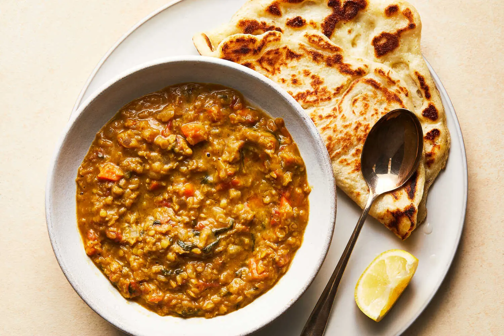

---
tags:
  - dish:soup
  - protein:lentils
---
<!-- Tags can have colon, but no space around it -->

# Maraq misir

<!-- Serves has to be a single number, no dashes, but text is allowed after the
number (e.g., 24 cookies) -->
- Serves: 4
{ #serves }
<!-- Time is not parsed, so anything can be input here, and additional
values can be added (e.g., "active time", "cooking time", etc) -->
- Time: 55 min
- Date added: 2024-11-13

## Description
Maraq misir, also known as shurbo cadas, is a hearty red lentil soup found in Somali cuisine. This soup is great year round but is often in heavy rotation during Ramadan, when it makes for a light and nourishing option for breaking one’s fast. Alongside a foundation of quick-cooking red lentils, this soup gets its body from tomatoes, onions and carrots, and deep flavor from a layered blend of spices and fresh cilantro leaves. While many lentil soup variations exist, the warmth of the xawaash spices builds with each sip and makes this a uniquely Somali interpretation. The texture can suit your preference: Serve it as is, with some bite, blend it until smooth and creamy, or opt for a partly blended, half-chunky soup. 
## Ingredients { #ingredients }

<!-- Decimals are allowed, fractions are not. For ranges, use only a single dash
and no spaces between the numbers. -->
- 2 tablespoons olive oil
- 1 large white onion, peeled and finely diced
- 3 medium Roma tomatoes, diced
- 1 cup red lentils, rinsed
- 1 small carrot, peeled and finely diced
- .5 cup cilantro leaves, rinsed
- 5-6 garlic cloves, minced
- 4 teaspoons xawaash (see Tip)
- 1.5 teaspoons fine sea salt
- Muufo or cooked white rice (optional), for serving

## Directions

<!-- If you have a direction that refers to a number of some ingredient, wrap
the number in asterisks and add `{.ingredient-num}` afterwards. For example,
write `Add 2 Tbsp oil to pan` as `Add *2*{.ingredient-num} to pan`. This allows
us to properly change the number when changing the serves value. -->
1. In a medium pot over medium, heat the oil until rippling, about 1 minute. Add the onions and cook, stirring occasionally, until translucent, 7 or 8 minutes.
2. When the onions have softened, stir in the tomatoes and cover. Cook the tomatoes, stirring occasionally, until they begin to break down completely, about 6 minutes.
3. When the tomatoes have cooked down, add the lentils, carrot, cilantro, garlic, xawaash and salt. Top with 4 cups of warm water and cover. Cook the soup, stirring occasionally, until all the lentils are starting to fall apart and the vegetables have become soft, about 25 minutes.
4. If desired, pulse the soup in a blender once or twice until the texture is half smooth and half chunky. Serve with a flatbread like muufo or over rice, if desired. Maraq misir can be stored in the fridge for up to 5 days or frozen for up to 3 months.

## Notes
To prepare your own xawaash blend, add 8 teaspoons ground cumin, 2 teaspoons ground coriander, 1 teaspoon ground black pepper, ¼ teaspoon ground cloves, ¼ teaspoon ground cinnamon and ¼ teaspoon ground cardamom to a small nonstick pan. Toast over low heat, stirring continuously, for 1 minute or until the spice mix becomes fragrant, then stir in 1 teaspoon ground turmeric. Makes 4 tablespoons.

## Source
[NYTimes](https://cooking.nytimes.com/recipes/1025937-maraq-misir-red-lentil-soup)

## Comments

- 2024-11-13: I used garam masala with 1 tsp turmeric instead of xawaash
