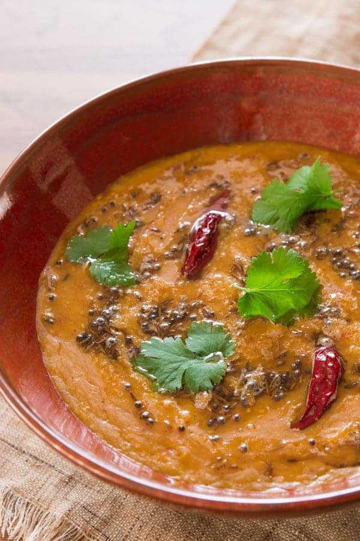

---
tags:
  - dish:main
  - protein:lentils
  - difficulty:easy
  - cuisine:indian
  - context:pressure cooker
---
# Masoor Dal with Tomatoes

- Serves: 4
{ #serves }
- Time: 30 minutes
- Date added: 2023-09-25

## Ingredients { #ingredients }

- 30 grams fresh ginger (1 inch, sliced into .25-inch coins)
- 20 grams garlic (3 large cloves)
- 1 cup masoor dal (red lentils)
- .5 teaspoon ground turmeric
- 200 grams whole stewed tomatoes (.5 small can)
- 2 fresh chili peppers (to taste, split in half)
- 1 cilantro whole plant
- 2 tablespoons ghee (or vegetable oil)
- .5 teaspoon cumin seeds
- .5 teaspoon black mustard seeds
- .5 teaspoon fennel seeds
- 2 dried chiles
- 1.5 teaspoons salt
- 1 teaspoon sugar
- .5 lemon

## Directions

1. In a broiler, or using a torch, blacken the garlic and ginger and then add them to a pressure cooker.
2. Wash the masoor dal until the water runs clear and add them to the pressure cooker along with *3*{.ingredient-num} cups of water, the turmeric, stewed tomatoes (with juices), and chiles to taste.
3. Thoroughly wash the cilantro, and cut just the bottom parts of the stems and roots off adding them to the pot ( save the leaves for garnish).
4. Cover the pressure cooker with a lid and bring up to pressure over high-heat. Turn down the heat to maintain a gentle whistle and cook the lentils for 7 minutes.
5. When the lentils are done, put the pressure cooker in the sink and run some water over the lid to quickly release the pressure. Doing this will make a loud noise and will release a lot of steam, so keep a safe distance. When the pressure has fully dropped, open the lid.
6. Remove the cilantro root, garlic and ginger.
7. Add the salt, sugar and lemon juice and adjust the seasoning to taste.
8. In a small pan, add the ghee and heat until hot. Add the cumin seeds, mustard seed, fennel seed and chili pepper and fry until very fragrant.
9. Pour this mixture onto the dal masoor and garnish with the cilantro leaves to serve.

## Source

[No Recipes](https://norecipes.com/masoor-dal/)

## Comments

- Bill Broderick, Aug 24, 2020 at 2:19 PM: Blooming the oil in the spices is called tadka and Nik Sharma has a good article about it on [serious eats](https://www.seriouseats.com/2020/06/what-is-tadka-tarka-chaunk-chhonk-baghaar.html).

- Bill Broderick, Aug 24, 2020 at 2:16 PM: I also often add extra spices at the end in addition to the listed ones: coriander, nigella, and black cumin. Whole or ground both work, but ground should be added afterwards and for a much shorter period of time because they burn quicker

- Bill Broderick, Aug 24, 2020 at 12:44 AM: I rarely blacken the ginger or garlic, doesn't seem to have much of an effect on flavor. I often skip the cilantro too.

