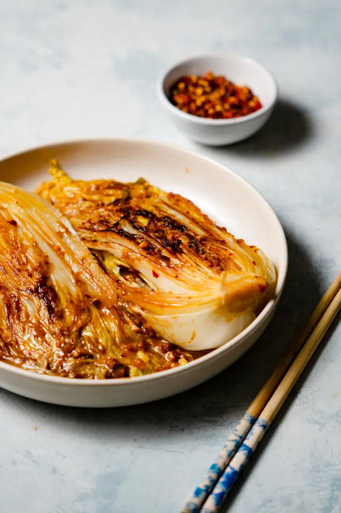

---
tags:
  - dish:sides
  - ingredient:cabbage
  - difficulty:easy
---
<!-- Tags can have colon, but no space around it -->

# Miso Garlic Butter Chinese Cabbage Recipe

<!-- Serves has to be a single number, no dashes, but text is allowed after the
number (e.g., 24 cookies) -->
- Serves: 4
{ #serves }
<!-- Time is not parsed, so anything can be input here, and additional
values can be added (e.g., "active time", "cooking time", etc) -->
- Time: 20 min
- Date added: 2025-10-26

## Description
Miso equals flavour bomb, say no more. It’s certainly not traditional, but the flavours are so alluring that you’d want to start using it on every dish! I suppose it’s a good thing then that this miso garlic butter flavour combo is very versatile. If you can’t get your hands on Chinese cabbage, you can just use regular green cabbage, sweet gem lettuce, or any other leafy greens. In terms of steps, the recipe is ridiculously easy as well. Anyone, and I do mean anyone, can whip this up effortlessly.

## Ingredients { #ingredients }

<!-- Decimals are allowed, fractions are not. For ranges, use only a single dash
and no spaces between the numbers. -->
- 1 Chinese Cabbage (around 600g) washed & cut into halves
- 4-5 tbsp Butter
- 1 tsp Red Chilli Flakes adjust accordingly to your taste
- 1 heaped tbsp Red Miso Paste
- 3 cloves Garlic
- A pinch of Salt to taste

## Directions

<!-- If you have a direction that refers to a number of some ingredient, wrap
the number in asterisks and add `{.ingredient-num}` afterwards. For example,
write `Add 2 Tbsp oil to pan` as `Add *2*{.ingredient-num} to pan`. This allows
us to properly change the number when changing the serves value. -->
1. Mix all the ingredients together, except the Chinese Cabbage, until combined.
2. Spread ⅔ of the butter mixture in between the cabbage leaves.
3. Melt the remaining ⅓ butter in the pan over medium high heat.
4. Place cabbage into the pan, cut-side down. Let cook for a few minutes.
5. Flip the cabbage and cook the other side for a few minutes.
6. Turn the heat down to medium. Flip the cabbage again so the cut-side is facing down the pan.
7. Put the lid on and let cook covered for 5 minutes until softened and lightly charred. Serve immediately.

## Source

[ET Food Voyage](https://www.etfoodvoyage.com/miso-garlic-butter-chinese-cabbage-recipe/)

## Comments

- 2025-10-26: flavors were good, but I don't like this way of making it. I'd just chop up the cabbage and cook it like normal in the miso butter. not sure how to get the char that way, but still
