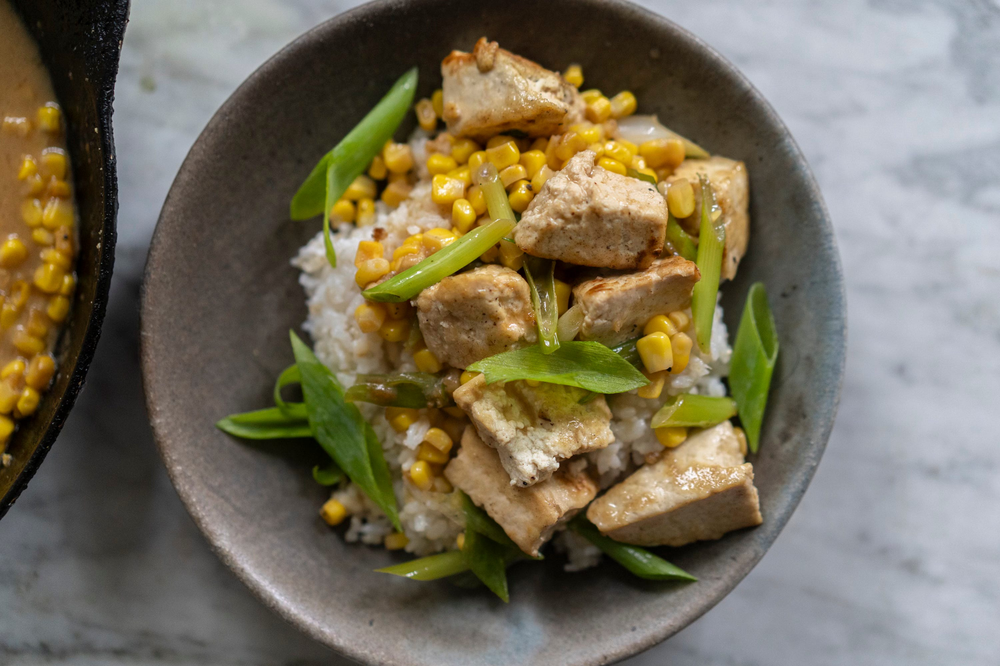

---
tags:
  - dish:main
  - protein:tofu
  - ingredient:corn
  - difficulty:easy
---
<!-- Tags can have colon, but no space around it -->

# Tofu in Miso Butter Sauce with Corn

<!-- Serves has to be a single number, no dashes, but text is allowed after the
number (e.g., 24 cookies) -->
- Serves: 4
{ #serves }
<!-- Time is not parsed, so anything can be input here, and additional
values can be added (e.g., "active time", "cooking time", etc) -->
- Time: 20 min
- Date added: 2025-10-26

## Description
Alexis’s words: Put miso paste and butter together, and I'm on board. While tofu is the protein here, the real star of the show is the sauce. Frozen corn makes this a year-round dinner contender, although you could of course use fresh if it's in season. The key here is to thin out the miso paste and butter with boiling water until glossy enough to coat each craggy piece of seared tofu. Miso and soy sauce are inherently salty, so make sure to taste the final dish before adding more.

## Ingredients { #ingredients }

<!-- Decimals are allowed, fractions are not. For ranges, use only a single dash
and no spaces between the numbers. -->
- 1 (16-ounce / 450g) package extra­ firm tofu
- 2 tablespoons extra-virgin olive oil
- 1 (12-ounce) package frozen corn, thawed and drained
- 1 cup boiling water
- 4 tablespoons (½ stick / 55g) unsalted butter
- 2 tablespoons white miso paste
- 1 tablespoon soy sauce
- 1 teaspoon freshly ground black pepper
- .5 kosher salt

## Directions

<!-- If you have a direction that refers to a number of some ingredient, wrap
the number in asterisks and add `{.ingredient-num}` afterwards. For example,
write `Add 2 Tbsp oil to pan` as `Add *2*{.ingredient-num} to pan`. This allows
us to properly change the number when changing the serves value. -->

1. To remove moisture, place the tofu blocks on paper towels, top with more paper towels, and place a weight on top, such as a rimmed baking sheet topped with a cast­ iron pan. Let stand for at least 10 minutes or up to 1 hour. Remove the weight and paper towels and use your hands to tear the tofu into bite-size pieces.
2. Heat the olive oil in a large pan over medium-high heat. When the oil begins to shimmer, add the tofu and cook, stirring every few minutes, until golden brown on all sides, 8 to 10 minutes. Transfer it to a paper towel-lined plate.
3. In the same pan, cook the corn, stirring occasionally, until lightly browned, about 3 minutes. Add the boiling water, butter, miso paste, soy sauce, pepper, and salt and stir until the mixture has slightly thickened and is smooth, about 3 minutes. Add the scallions and stir to combine, cooking for 1 minute. Add the tofu back in and stir until well coated. Serve the tofu immediately, spooned over white rice.

## Notes

NOTES: Extra-firm tofu is crucial to the success of this recipe. Softer types won't be able to stand up to the pan and will crumble instead of becoming golden brown. To quickly thaw corn, microwave it or run it under hot water, and be sure to drain it through a sieve before adding to the tofu. Leftovers can be stored in an airtight container in the refrigerator for up to 2 days.

Hetty’s words: I didn’t have time to press the tofu (and I tend to skip this step anyway) but this recipe still turned out wonderfully. The tofu was bouncy and absorbed the sauce like a dream.

## Source

[Hetty McKinnon](https://tovegetableswithlove.substack.com/p/nights-and-weekends-x-linger)

## Comments

- 2025-10-26: fine with medium tofu, I'm fine with crumbles.
