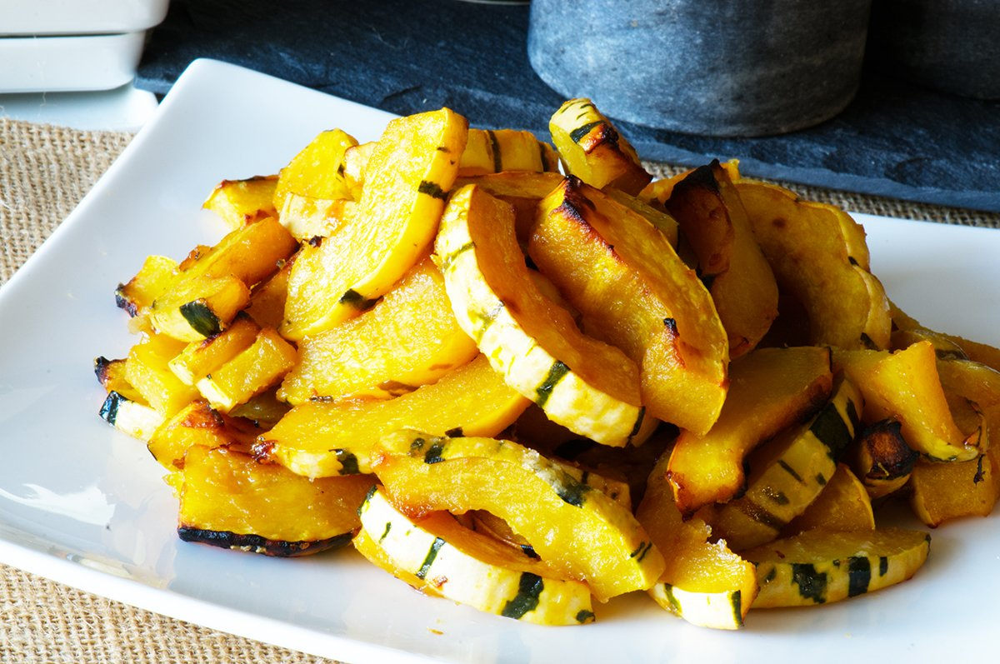

---
tags:
  - dish:sides
  - ingredient:winter squash
  - difficulty:easy
---
<!-- Tags can have colon, but no space around it -->

# Maple Miso Glazed Delicata Squash

<!-- Serves has to be a single number, no dashes, but text is allowed after the
number (e.g., 24 cookies) -->
- Serves: 4
{ #serves }
<!-- Time is not parsed, so anything can be input here, and additional
values can be added (e.g., "active time", "cooking time", etc) -->
- Time: 40 min
- Date added: 2025-11-29

## Description 
The Maple Miso glaze is my favorite part of this recipe. I use white miso for its light, delicate flavor. But if you only have red or darker on hand, that will be delicious as well. Maple syrup can be very pricey. So if I can find one rated Amber B, I get that because it is less expensive and has a very robust maple flavor that stands up to heat. To make the glaze, just whisk the oil, maple, and miso together. It’s important to use a neutral oil here because we don’t want to add a strong olive flavor. If the squash you bought are really large, add 1 tablespoon more of each glaze ingredient so all of the squash gets coated.

After the squash is coated in the yummy maple miso glaze, it needs just a quick roast.  Because the glaze is quite sticky, I like to use parchment paper for an easy cleanup. If after 20 or so minutes it isn’t browned as much as you like, you can broil it for a couple minutes. Be careful though, the high sugar content of the glaze can make it burn quickly. And do not try and flip the pieces of squash as you roast it; it gets very soft and tends to fall apart with too much handling.

## Ingredients { #ingredients }

<!-- Decimals are allowed, fractions are not. For ranges, use only a single dash
and no spaces between the numbers. -->

- 3 Tablespoons neutral oil
- 2 delicata squash
- 3 Tablespoons maple syrup
- 3 Tablespoons white miso
## Directions

<!-- If you have a direction that refers to a number of some ingredient, wrap
the number in asterisks and add `{.ingredient-num}` afterwards. For example,
write `Add 2 Tbsp oil to pan` as `Add *2*{.ingredient-num} to pan`. This allows
us to properly change the number when changing the serves value. -->
1. Preheat the oven to 425 degrees and place the oven rack in the middle.
2. Wash the squash and put a kitchen towel under the squash. This will help stabilize the squash as you cut into it.
3. Put your knife into the center of the squash and push into the squash as you draw the knife down.
4. Carefully pull the knife out and repeat on the other side, splitting the squash. Sometimes I use my fingers to help pry the halves apart. Repeat with the other squash.
5. Use a spoon and scrape out the seeds. Trim the ends of the squash halves and then cut each half lengthwise so you have 8 pieces. Slice each squash piece into ½ inch pieces and put them into a large bowl. 
6. Mix the neutral oil, maple syrup, and miso together until smooth. Then pour the mixture over the squash slices and toss to combine. (If you bought very large squash, you should use 4 tablespoons of miso, maple syrup, and oil). The slices should be evenly and generously coated with sauce.
7. Place the squash on a piece of parchment paper lined baking tray (or you can use aluminum foil too) and roast for 20-25 minutes until the squash is tender, slightly charred, and a little crusty. Do not flip the squash while roasting as it becomes delicate and you will end up breaking the pieces. 
8. If your squash looks like it needs a little more color, heat the broiler to high and broil for 2-3 minutes until you get the nice golden caramelization. Serve immediately.

## Notes

<!-- Delete section if no additional notes -->

If your squash are extra large, use 1 tablespoon more of the miso, maple syrup, and oil so you have enough glaze to generously coat the squash pieces.

## Source

[Funky Asian Kitchen](https://www.funkyasiankitchen.com/blog/maple-miso-glazed-delicata-squash/)

## Comments

- glaze works well on other roasted veggies as well, I've also just tossed it with veggies after they're done roasting.
