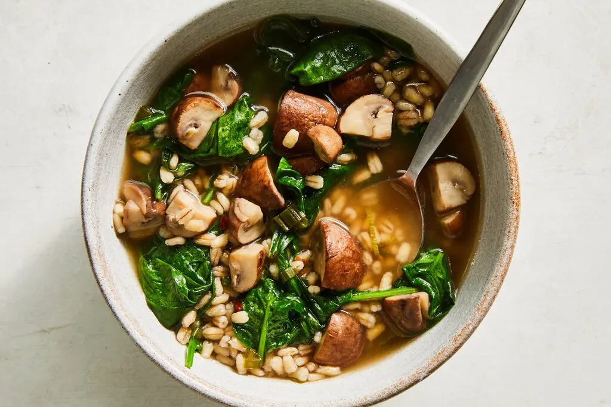

---
tags:
  - dish:main
  - ingredient:mushrooms
  - ingredient:barley
  - difficulty:easy
---
<!-- Tags can have colon, but no space around it -->

# Miso-Mushroom Barley Soup

<!-- Serves has to be a single number, no dashes, but text is allowed after the
number (e.g., 24 cookies) -->
- Serves: 4
{ #serves }
<!-- Time is not parsed, so anything can be input here, and additional
values can be added (e.g., "active time", "cooking time", etc) -->
- Time: 45 min
- Date added: 2026-02-18

## Description
This hearty vegan dish uses miso and soy to add a tremendous amount of depth and flavor to a relatively quick, one-pot mushroom barley soup. Quartering the mushrooms allows them to retain bite, but you can thinly slice them if you’d prefer everything to be soft and tender. Resist the urge to salt heavily during the bulk of the cooking, as the miso and soy — both sodium-heavy ingredients — will be added at the end to bring the soup together. This is a soup that will thicken, so add more water or broth when reheating. It’s as accommodating as it is comforting: You can empty your pantry or fridge by swapping the barley for farro and spinach for chopped bok choy or other greens.

## Ingredients { #ingredients }

<!-- Decimals are allowed, fractions are not. For ranges, use only a single dash
and no spaces between the numbers. -->
- 2 tablespoons olive oil
- 1.5 pounds cremini mushrooms, trimmed and quartered
- K osher salt and freshly ground black pepper
- 1 bunch scallions, trimmed, light green and white parts thinly sliced
- .25 to .5 teaspoon crushed red pepper, depending on heat preference
- 4 cups low-sodium vegetable broth
- 1 cup pearl barley
- 1 tablespoon plus 1 teaspoon white miso
- 1 tablespoon soy sauce (or more as needed)
- 5 ounces baby spinach (about 5 packed cups)
- 1 lime (optional), halved

## Directions

<!-- If you have a direction that refers to a number of some ingredient, wrap
the number in asterisks and add `{.ingredient-num}` afterwards. For example,
write `Add 2 Tbsp oil to pan` as `Add *2*{.ingredient-num} to pan`. This allows
us to properly change the number when changing the serves value. -->
1. In a large pot, heat the oil over medium-high until shimmering. Add the mushrooms and season lightly with salt and a few grinds of pepper. Cook, stirring occasionally, until the mushrooms shrink down and release their juices, 6 to 7 minutes.
2. Stir in the scallions and crushed red pepper and cook until softened, about 2 minutes.
3. Pour in the vegetable broth, 2 cups of water and the barley. Raise the heat to bring the liquid to a boil, then lower it to maintain a simmer. Cook, stirring occasionally, until the barley is tender, about 30 minutes.
4. During the last 5 minutes of cooking, stir in the miso and soy sauce. (Use a rubber spatula or wooden spoon to seek out any miso clumps, flattening them against the side of the pot to help dissolve.)
5. Add the spinach in batches, adding a handful and stirring in until wilted. Taste and season with more soy sauce or salt as needed. Squeeze in half a lime, if using, and cut the rest into wedges for serving. Finish with some black pepper and serve.

## Source

[NYTimes](https://cooking.nytimes.com/recipes/1025053-miso-mushroom-barley-soup)

## Comments

- 2026-02-18: delicious. to add the miso, poured a little broth in a bowl and whisked it in, then added back to pot
