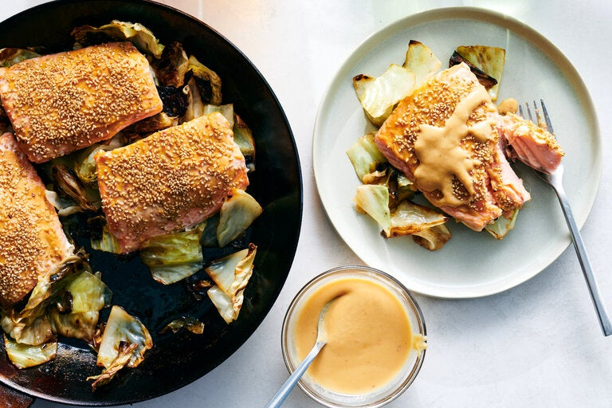

---
tags:
  - dish:main
  - protein:fish
  - ingredient:salmon
  - ingredient:cabbage
  - difficulty:easy
---
<!-- Tags can have colon, but no space around it -->

# Miso-mustard salmon

<!-- Serves has to be a single number, no dashes, but text is allowed after the
number (e.g., 24 cookies) -->
- Serves: 4
{ #serves }
<!-- Time is not parsed, so anything can be input here, and additional
values can be added (e.g., "active time", "cooking time", etc) -->
- Time: 30 minutes
- Date added: 2024-03-13

## Description

In this single-skillet recipe, miso and Dijon mustard create a one-two punch of salty and spicy to balance the sweetness of salmon and cabbage. Slather the mighty combination on the salmon fillets, sprinkle with sesame seeds for crunch, then roast on top of caramelized, crisp-tender cabbage. Serve with steamed rice or sweet potatoes if you like, then use the remaining sauce to drizzle over everything. The thinned miso mustard is also great to have around as a salad dressing for crisp lettuces, or a sauce for roasted vegetables or tofu. It will keep for up to 1 week in the refrigerator

## Ingredients { #ingredients }

<!-- Decimals are allowed, fractions are not. For ranges, use only a single dash
and no spaces between the numbers. -->

- .25 cup white miso
- 2 tablespoons Dijon mustard
- 1 teaspoon Sriracha or sambal oelek (optional)
- 4 (6-ounce) skin-on or skinless salmon fillets
- Salt
- 2 tablespoons sesame seeds (any color)
- 2 tablespoons neutral oil
- 1 pound green cabbage, cored and cut into 1-inch pieces, leaves separated

## Directions

<!-- If you have a direction that refers to a number of some ingredient, wrap
the number in asterisks and add `{.ingredient-num}` afterwards. For example,
write `Add 2 Tbsp oil to pan` as `Add *2*{.ingredient-num} to pan`. This allows
us to properly change the number when changing the serves value. -->

1. Heat the oven to 425 degrees. In a small bowl, stir together the miso, mustard and Sriracha (if using). Season the salmon all over lightly with salt, then set on a plate, skin side down. Coat the tops with about 2 tablespoons of the miso-mustard mixture (reserve the rest), then cover with the sesame seeds; set aside.
2. Heat the oil in a large, oven-safe skillet over medium-high. Add the cabbage and cook, undisturbed, until charred underneath, 3 to 4 minutes. Season with salt, stir, then spread into an even layer.
3. Add the salmon on top of the cabbage, skin side down. Roast until the salmon is cooked through, 8 to 12 minutes. (The salmon is done when a knife slides through it easily and the fish flakes, or when an instant-read thermometer reaches 120 degrees.)
4. Meanwhile, thin the remaining miso-mustard mixture with about 2 tablespoons of water until pourable. Serve the salmon and cabbage with a drizzle of the miso-mustard dressing.

## Source

[NYTimes](https://cooking.nytimes.com/recipes/1024653-miso-mustard-salmon)

## Comments

- 2024-03-12: also works well with broccoli instead of cabbage
