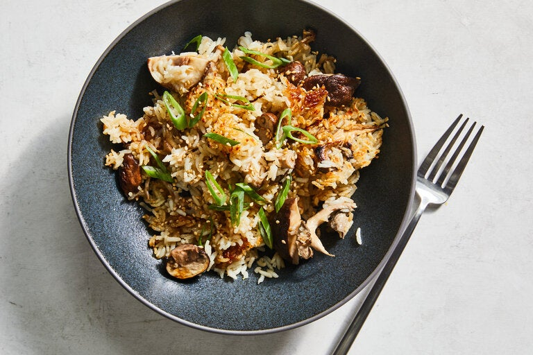

---
tags:
  - dish:sides
  - ingredient:mushrooms
  - cuisine:chinese
---
<!-- Tags can have colon, but no space around it -->

# One-pot mushroom and ginger rice

<!-- Serves has to be a single number, no dashes, but text is allowed after the
number (e.g., 24 cookies) -->
- Serves: 4
{ #serves }
<!-- Time is not parsed, so anything can be input here, and additional
values can be added (e.g., "active time", "cooking time", etc) -->
- Time: 40 minutes
- Date added: 2024-04-18

## Description

Inspired by Cantonese one-bowl rice dishes like bo zai fan and sticky rice, this mushroom and ginger rice has clean yet robust flavors. The Chinese cooking technique of velveting — dusting protein in cornstarch to keep it tender and silky during cooking — is usually reserved for meat or seafood but here, the same method is used for the mushrooms, allowing them to stay juicy and plump as they cook in the rice. Crisping the rice at the bottom of the pot is optional, but if you choose to do it, stay close, listen to the sound of the sizzle, smell the aroma; if you detect any burning scents, take it off the heat immediately. At first, the rice will seem stuck to the pot, but it will release more easily once it has cooled. A dish like this would traditionally be cooked in a clay pot, so use that if you have one, but if not, a cast-iron Dutch oven will do the job.

## Ingredients { #ingredients }

<!-- Decimals are allowed, fractions are not. For ranges, use only a single dash
and no spaces between the numbers. -->
- 1.5 cups medium-grain white rice
- 2 cups vegetable stock, store-bought or homemade
- 10 ounces mushrooms, such as shiitake, cremini, button or blue oysters (or a mix), halved or quartered
- 2 teaspoons cornstarch
- 6 to 7 teaspoons tamari soy sauce
- 2 teaspoons Shaoxing wine (optional)
- 3 teaspoons sesame oil
- Salt and white or black pepper
- 1 (1-inch) piece fresh ginger, peeled and thinly sliced
- 2 scallions, thinly sliced
- Toasted white sesame seeds (optional)

## Directions

<!-- If you have a direction that refers to a number of some ingredient, wrap
the number in asterisks and add `{.ingredient-num}` afterwards. For example,
write `Add 2 Tbsp oil to pan` as `Add *2*{.ingredient-num} to pan`. This allows
us to properly change the number when changing the serves value. -->

1. Place the rice into a Dutch oven and rinse it 3 times until the water runs almost clear. Pour the stock over the rice and leave to soak for 10 minutes while you prepare the mushrooms.
2. Place the mushrooms into a bowl and add the cornstarch and toss to coat. Add 4 teaspoons of soy sauce, the 2 teaspoons Shaoxing wine (if using), 1 teaspoon sesame oil, ½ teaspoon salt and a pinch of white or black pepper; toss to coat.
3. Place the pot with the rice over medium-high heat, add the ginger slices and bring to a boil. When bubbling, cover, reduce to low and cook for 5 minutes.
4. Uncover, add the mushrooms and, using chopsticks or a large spoon, stir the mushrooms through the rice. Cover again and cook on low until the mushrooms are cooked and rice is tender, 10 to 12 minutes.
5. Remove the lid, increase heat to medium-high and cook for 4 to 5 minutes, until you can hear it sizzling aggressively, which indicates that the bottom of the rice is becoming crispy. (Skip this step if you don’t care for the crispy rice.)
6. Turn off heat and drizzle with 2 to 3 teaspoons of soy sauce, the remaining 2 teaspoons of sesame oil and top with scallions and sesame seeds (if using).

## Source

[NYTimes](https://cooking.nytimes.com/recipes/1025018-one-pot-mushroom-and-ginger-rice?smid=ck-recipe-android-share)

## Comments

- 2024-04-16: this was delicious and pretty straightforward. I tried to get the bottom to crisp in my enameled Dutch Oven and it didn't really work: got stuck and hard to remove, though I was able to remove them after I put the lid back on (with heat off) and some of the condensation dripped back down. not perfect, could look into tahdig strategies (or try regular cast iron?) to see if I could have more success
- 2024-11-24: crisped up very nicely in the regular cast iron dutch oven.
