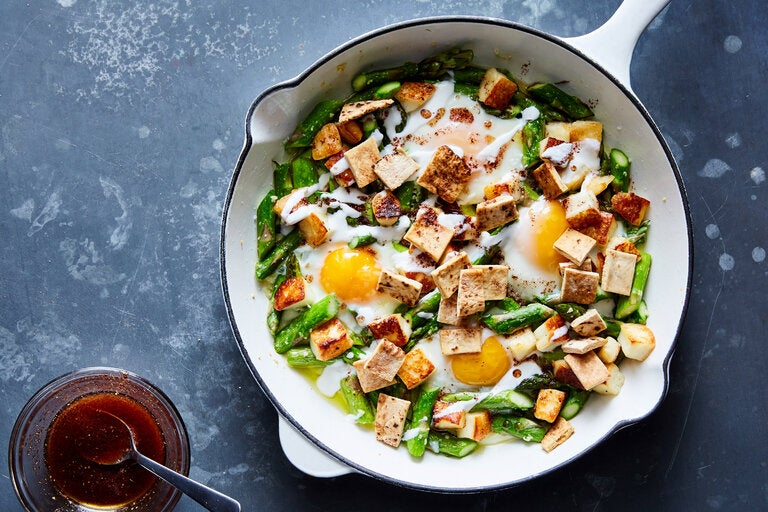

---
tags:
  - dish:main
  - protein:cheese
  - ingredient:asparagus
  - cuisine:palestinian
  - difficulty:easy
---

# Narjissiya With Asparagus, Halloumi and Sumac

)

<!-- Serves has to be a single number, no dashes, but text is allowed after the
number (e.g., 24 cookies) -->
- Serves: 2
{ #serves }
<!-- Time is not parsed, so anything can be input here, and additional
values can be added (e.g., "active time", "cooking time", etc) -->
- Time: 30 minutes
- Date added: 2023-09-25

## Description

Narjissiya refers to any of several dishes found in medieval Arab cookery books made with sunny-side-up eggs. The word itself means “like narcissus,” a name likely chosen for the dish’s vibrant white and yellow colors, just like the narcissus (daffodil) flower. The ancient variations and ingredients were endless, from meat and broad beans to chickpeas and yogurt, but the choice of ingredients here — and bright flavors — are inspired by spring, and asparagus, which grows wild in the fields of the Levant. The citrusy sumac and olive oil complement asparagus and eggs, but their flavors do stand out, so use the best you can find.

## Ingredients { #ingredients }

<!-- Decimals are allowed, fractions are not. For ranges, use only a single dash
and no spaces between the numbers. -->
### For the Pita Croutons
- 75 grams pita bread (about 1 medium pita), cut into bite-size pieces (or simply use a handful of pita chips)
### For the Sumac Oil
- 1 tablespoon good-quality sumac
- 2 tablespoons good-quality extra-virgin olive oil
### For the Yogurt
- Scant .5 cup plain yogurt
- .25 teaspoon kosher salt
### For the Eggs
- 2 teaspoons plus 1 tablespoon olive oil
- 5 to 6 ounces halloumi, cut into bite-size cubes (about 1 cup) and dried well on paper towels
- 1 (14-ounce) bunch asparagus (see Note), woody ends trimmed, chopped into 1-inch pieces (about 2 heaping cups)
- .5 teaspoon kosher salt
- 1 large or 2 small garlic cloves, crushed in a garlic press or minced
- 4 eggs
## Directions

1. Prepare the pita croutons: Heat oven to 350 degrees. Arrange the pita pieces on a baking sheet in an even layer. Bake until the squares are completely dry and crisp, and starting to darken in color, about 10 to 15 minutes. (This step can be done a couple of days in advance, and the bread stored in an airtight container or a resealable plastic bag. Or you can do it while you prep the rest of the dish. Skip this step if using the pita chips.)
2. Meanwhile, prepare the sumac oil: Combine the sumac and olive oil in a small bowl and mix well.
3. Prepare the yogurt: Mix together the yogurt and salt with *1*{.ingredient-num} to *2*{.ingredient-num} tablespoons water, just enough to get a thick drizzling consistency. Set aside.
4. In a medium cast-iron (or non-stick) frying pan, heat *2*{.ingredient-num} teaspoons olive oil over medium. Add the halloumi pieces in a single layer. Do not move them around or flip them over until any released water evaporates and pieces start to brown, about 2 minutes. Flip them over and cook for another minute until the other side is browned. Transfer to a small plate and set aside.
5. To the same pan, add the remaining *1*{.ingredient-num} tablespoon olive oil and heat over medium. Add the asparagus and salt and cook, tossing around, just until bright green and glossy, about 2 minutes. Add the garlic and continue to cook for another minute or so, just until fragrant.
6. Crack the eggs over the asparagus. Return the halloumi cheese to the pan, dispersing it evenly over the whites and the asparagus, then cover the pan and cook until your desired level of doneness, about 3 to 5 minutes.
7. To serve, scatter the pita croutons over the dish, then drizzle with the yogurt and sumac oil.

## Notes

If you do not like asparagus, you can substitute it with an equal quantity (weight) of another spring vegetable, like fava beans, green beans, English peas or even spinach.
## Source

[NYTimes](https://cooking.nytimes.com/recipes/1021984-narjissiya-with-asparagus-halloumi-and-sumac)

## Comments
