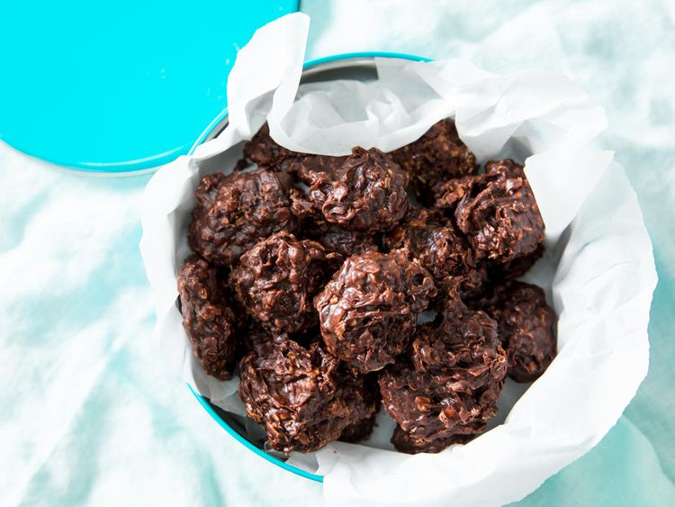

---
tags:
  - dish:dessert
  - ingredient:chocolate
  - ingredient:peanut butter
  - ingredient:oats
---
<!-- Tags can have colon, but no space around it -->

# No-Bake Cookies With Chocolate, Peanut Butter, and Chewy Oats Recipe

<!-- Serves has to be a single number, no dashes, but text is allowed after the
number (e.g., 24 cookies) -->
- Serves: 15 cookies
{ #serves }
<!-- Time is not parsed, so anything can be input here, and additional
values can be added (e.g., "active time", "cooking time", etc) -->
- Time: 50 min
- Date added: 2025-07-22

## Description
When I was growing up in Kentucky, no-bake cookies were a summer staple—a simple combination of sugar, butter, milk, and cocoa, boiled on the stove and then mixed with peanut butter and rolled oats. Dolloped into bite-size portions, the "dough" sets up all on its own, no oven required. The result is a chewy little oatmeal cookie that's salty/sweet and rich, with a flavor not unlike that of a Reese's cup. 

As simple as they sound, problems are all too common. Sometimes no-bake cookies set up as they should, but often they're a sticky mess. Sometimes they turn out crumbly and dry; on other occasions, they're creamy and soft. Most everyone chalks it up to the mystery of baking, or the weather.

Except it's not a mystery, nor is it the weather. When you get down to it, no-bake cookies are simply a type of fudge, which happens to be a wonderfully predictable beast. When fudge's final cooking temperature is too low, its consistency is runny and wet. When its final cooking temperature is too high, its texture is sandy and dry. But right in the middle, when it's cooked just so, fudge can be as soft and chewy as a chocolate cookie. 

Unfortunately, a lot of folks are intimidated by the very idea of making fudge, and no-bake cookie recipes go to extreme lengths to avoid revealing the fact that the process is exactly that. So, instead of calling for a thermometer, recipes often try to quantify the process in terms of cooking time. Given the wide range of variables that can influence the timing of a recipe, such vagueness makes success a total crapshoot. That seems completely bonkers to me, when a digital thermometer is dead easy to use and can guarantee consistent results every time. 
### Why It Works

- Using milk instead of butter gives these cookies more lactose, which develops a toasty, toffee-like flavor as it cooks.
- A blend of cocoa powder and dark chocolate amps up the flavor.
- Peanut butter gives the cookies a creamy consistency and a salty/sweet flavor.
- Combining rolled and instant oats provides a good balance of thickness and chew.

## Ingredients { #ingredients }

<!-- Decimals are allowed, fractions are not. For ranges, use only a single dash
and no spaces between the numbers. -->

- 7 ounces plain or lightly toasted sugar (about 1 cup; 200 g)
- 6 ounces milk (about 3/4 cup; 170 g); any percentage will do
- .5 ounce Dutched cocoa powder (about 2 tablespoons; 15 g), such as Cacao Barry Extra Brute
- .25 teaspoon (1 g) Diamond Crystal kosher salt; for table salt, use about half as much by volume or use the same weight
- 1 ounce dark chocolate, about 72% (about 2 tablespoons; 30 g), melted
- 4 ounces creamy peanut butter (shy 1/2 cup; 110 g); commercial styles work best
- 1 teaspoon vanilla extract
- 2 ounces instant oatmeal (shy 2/3 cup; 55 g); see notes
- 1 ounce old-fashioned rolled oats (heaping 1/4 cup); see notes

## Directions

<!-- If you have a direction that refers to a number of some ingredient, wrap
the number in asterisks and add `{.ingredient-num}` afterwards. For example,
write `Add 2 Tbsp oil to pan` as `Add *2*{.ingredient-num} to pan`. This allows
us to properly change the number when changing the serves value. -->

1. Whisk sugar, milk, cocoa, and salt together in a 3-quart stainless steel saucier. Bring to a boil over medium heat (this should take about 5 minutes), then clip-on a digital thermometer and continue cooking until mixture is bubbly, thick, and exactly 230°F (110°C), about 6 minutes longer. For best results, avoid handheld thermometers, which may not perform well due to unsteady placement during long-term projects such as candy.
2. Off heat, whisk in melted chocolate, peanut butter, and vanilla extract. Using a flexible, heat-resistant spatula, fold in both types of oats. Stir just until mixture begins to thicken, then drop onto a parchment-lined half sheet pan, using a pair of metal spoons. Cool until cookies are firm and dry to the touch, about 25 minutes, and transfer to an airtight container. Store about 2 weeks at room temperature or up to 1 month in the fridge. 
## Notes

<!-- Delete section if no additional notes -->
 I love these cookies best with a blend of instant and old-fashioned oats, but it's fine to use just one or the other. Instant oats will produce a more homogeneous, cookie-like texture, while rolled oats will give them a heartier chew. You'll still be using a total of 3 ounces (85g) either way, but the volume will differ. For instant oats, use about 3/4 cup; for old-fashioned rolled oats (not thick-cut), use about 1 cup. 
## Source

[Serious Eats](https://www.seriouseats.com/no-bake-cookie-chocolate-peanut-butter-oats-recipe)

## Comments
