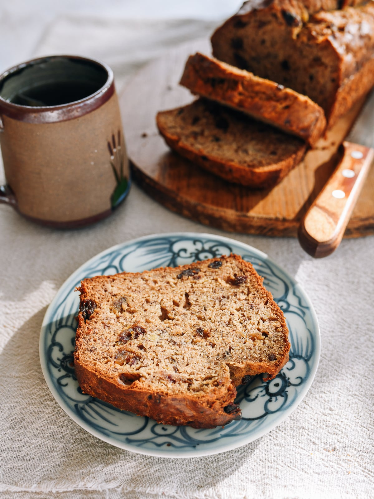

---
tags:
  - dish:baking
  - ingredient:banana
---
<!-- Tags can have colon, but no space around it -->

# No Sugar Banana Bread

<!-- Serves has to be a single number, no dashes, but text is allowed after the
number (e.g., 24 cookies) -->
- Serves: 1 bread
{ #serves }
<!-- Time is not parsed, so anything can be input here, and additional
values can be added (e.g., "active time", "cooking time", etc) -->
- Time: 2 hr
- Date added: 2026-04-20

## Description

This no-sugar banana bread is naturally sweetened with ripe bananas, medjool dates, and raisins — no cane sugar, honey, or dairy needed!

## Ingredients { #ingredients }

<!-- Decimals are allowed, fractions are not. For ranges, use only a single dash
and no spaces between the numbers. -->
- 2 cups all-purpose flour
- 1 teaspoon baking soda
- 1 teaspoon ground cinnamon
- .5 teaspoon salt
- 2 large eggs (at room temperature)
- 4 very ripe large bananas
- .66 cup olive oil (plus more to grease the loaf pan)
- 2 teaspoons vanilla extract
- .33 cup 50g raisins + 2 large (50g) medjool dates (finely chopped, or simply .5 cup/80g raisins)

## Directions

<!-- If you have a direction that refers to a number of some ingredient, wrap
the number in asterisks and add `{.ingredient-num}` afterwards. For example,
write `Add 2 Tbsp oil to pan` as `Add *2*{.ingredient-num} to pan`. This allows
us to properly change the number when changing the serves value. -->
1. Position a rack in the center of your oven, and preheat it to 325°F/160°F.
2. In a medium bowl, measure out the flour, baking soda, cinnamon, and salt. In separate a small bowl, beat the eggs for a good 2 minutes, until they are very runny and run easily off your fork or whisk.
3. In a large bowl, use a fork to mash the bananas until there are no visible chunks. Add the beaten eggs, olive oil, vanilla, and the finely chopped dried fruit. Mix until well-combined.
4. Sift the dry ingredients in the wet mixture. Use a rubber spatula to fold the dry ingredients into the batter until there are no large streaks of flour, taking care not to overmix.
5. Generously grease a 9×5-inch loaf pan with olive oil. Pour the batter into the loaf pan, using the rubber spatula to level it out. Bake for 55-60 minutes, until a toothpick inserted into the center of the loaf comes out clean, or an instant read thermometer inserted into the center of the loaf registers 200-205°F/93-96°C
6. Cool for 30 minutes before removing it from the loaf pan. Once cooled, keep it covered so that the top crust can get a little bit sticky. A cake plate with a cover or a loose covering of plastic wrap both work well. This banana bread is even better in appearance and taste the next day, so if you can wait and let it sit covered on the counter overnight, you’ll be glad you did!

## Source

[Woks of Life](https://thewoksoflife.com/no-sugar-banana-bread/)

## Comments

- 2026-04-20: really good, made it in a 8x6 instead of a 9x5, took a little bit longer than written to fully bake (closer to 80 minutes)
