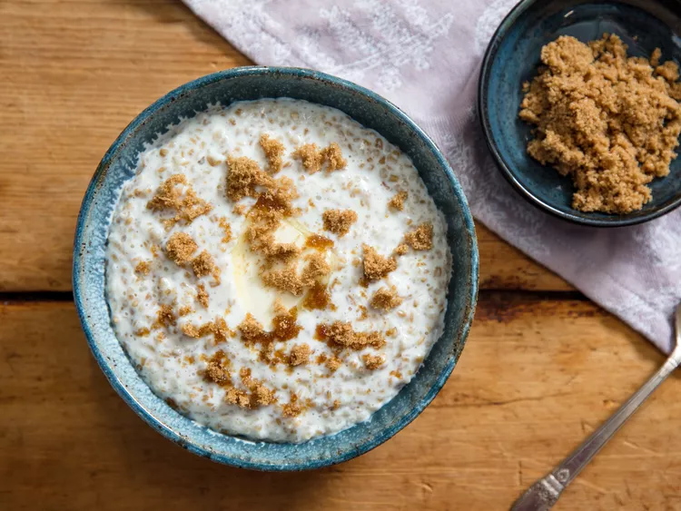

---
tags:
  - dish:breakfast
  - ingredient:oats
---
<!-- Tags can have colon, but no space around it -->

# Oatmeal

<!-- Serves has to be a single number, no dashes, but text is allowed after the
number (e.g., 24 cookies) -->
- Serves: 2
{ #serves }
<!-- Time is not parsed, so anything can be input here, and additional
values can be added (e.g., "active time", "cooking time", etc) -->
- Time: 25 min
- Date added: 2024-07-05

## Description

### Why It Works

- Optionally toasting the oats deepens their flavor.
- An optional overnight soak speeds up cooking the next day.
- Gentle, frequent stirring releases just enough starch to thicken the oatmeal without making it stodgy.

## Ingredients { #ingredients }

<!-- Decimals are allowed, fractions are not. For ranges, use only a single dash
and no spaces between the numbers. -->

- 1 cup (6 1/3 ounces; 180g) steel-cut oats (also sold as pinhead or Irish oats; see note), such as Bob's Red Mill
- 3 cups (700ml) cold water or whole milk (or some combination thereof), plus more water if needed 
- Kosher or sea salt
- Unsalted butter or cream, for serving (optional)
- Brown sugar, for serving (optional)

## Directions

<!-- If you have a direction that refers to a number of some ingredient, wrap
the number in asterisks and add `{.ingredient-num}` afterwards. For example,
write `Add 2 Tbsp oil to pan` as `Add *2*{.ingredient-num} to pan`. This allows
us to properly change the number when changing the serves value. -->

1. If you prefer a deeper, more complex flavor, dry-toast the oats in the cooking pot over high heat, stirring and tossing constantly, until lightly toasted and fragrant, then remove from heat and proceed.
2. If making overnight oats, combine oats and water/milk in a medium saucepan or 3-quart saucier and let stand, covered, overnight (if using milk, let the oats soak in the refrigerator overnight). If not making overnight oats, combine oats and water/milk in the saucepan and proceed with cooking immediately.
3. Bring oats and water/milk to a simmer over medium-high heat, seasoning lightly with a pinch of salt. Reduce heat to maintain a gentle simmer and cook uncovered, stirring frequently but slowly, until porridge is well-thickened but still flows slightly, about 5 minutes for overnight oats and 20 minutes for un-soaked oats.
4. If oats are still too firm to your taste, stir in additional water 1/4 cup (60ml) at a time, and continue cooking, until desired texture of oats is reached.
5. Scoop porridge into warmed bowls and top with a pat of butter and/or a splash of cream. Sprinkle brown sugar on top. Serve. 

## Notes

<!-- Delete section if no additional notes -->

- Most steel-cut oats work best with the overnight method as described here, but we have found some artisan brands that have a slightly more powdery texture; those do better if you pour off the soaking water, rinse the grains lightly, then add fresh water to cook them. If your overnight oatmeal is overly thick and starchy, you may want to try that soaking method instead.
- How much milk you use will determine the richness and creaminess of the final porridge.
- For a more traditional Scottish-style oatmeal, cook oats in water only and omit the brown sugar. 

## Source

[Serious Eats](https://www.seriouseats.com/creamy-irish-style-oatmeal-with-brown-sugar#toc-milk-versus-water-and-toppings-to-consider)

## Comments

