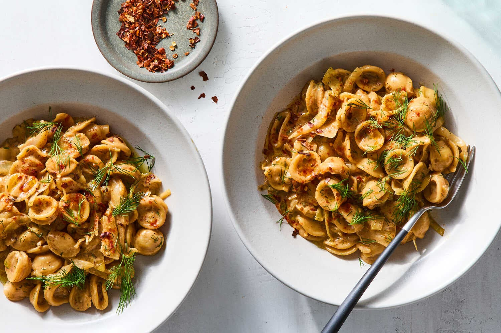

---
tags:
  - dish:main
  - ingredient:pasta
  - ingredient:cabbage
---
<!-- Tags can have colon, but no space around it -->

# One-Pot Cheesy Orecchiette With Cabbage and Paprika

<!-- Serves has to be a single number, no dashes, but text is allowed after the
number (e.g., 24 cookies) -->
- Serves: 4
{ #serves }
<!-- Time is not parsed, so anything can be input here, and additional
values can be added (e.g., "active time", "cooking time", etc) -->
- Time: 45 min
- Date added: 2026-03-22

## Description
A sweet, soft mix of cabbage and leeks forms the base of this homey one-pot dish. Using vegetable broth instead of water as the liquid in the pot deepens the flavor, which is rounded out with salty, nutty Gruyère cheese and sour cream, and finished with smoked paprika and dill (or another fresh herb). You can use any short pasta here, just keep an eye on it so it doesn’t overcook; it should be just tender without being mushy.
## Ingredients { #ingredients }

<!-- Decimals are allowed, fractions are not. For ranges, use only a single dash
and no spaces between the numbers. -->
- 3 tablespoons extra-virgin olive oil, more for serving
- 1 large leek, white and light green parts only, thinly sliced (or use 4 scallions)
- Fine sea salt and freshly ground black pepper
- 2 garlic cloves, finely grated or minced
- Pinch of red chile flakes, more for serving
- .5 small green cabbage (about 1 pound), sliced (5 cups)
- 1teaspoon cider vinegar, more to taste
- 1 pound small pasta, such as orecchiette, shells or fusilli
- 4 cups vegetable broth
- 1 cup shredded Gruyère (about 3½ ounces)
- .5 cup sour cream, crème fraîche or mascarpone
- .5 teaspoon smoked paprika, more to taste
- .25  cup chopped fresh dill or parsley, more for serving

## Directions

<!-- If you have a direction that refers to a number of some ingredient, wrap
the number in asterisks and add `{.ingredient-num}` afterwards. For example,
write `Add 2 Tbsp oil to pan` as `Add *2*{.ingredient-num} to pan`. This allows
us to properly change the number when changing the serves value. -->
1. In a large skillet, heat the oil over medium. Add leek and a pinch each of salt and pepper, and cook until tender and very lightly golden at the edges, 3 to 5 minutes. Stir in the garlic and chile flakes, and cook until fragrant, 1 minute longer. Add the cabbage and season with more salt and pepper. Cook until soft and collapsed, about 15 minutes. Stir in the vinegar, then taste and add more salt, pepper and vinegar until it’s nicely seasoned.
2. Add pasta, broth and ½ teaspoon salt to the pan. Let the liquid come to a boil, then cover the pan and cook, stirring and tossing the pasta once or twice, until it is cooked through but still al dente, 12 to 15 minutes. If the skillet dries out before the pasta is cooked through, add a little water. And if there’s a bit of water left in the pan at the end, fear not, the pasta will absorb it in the next step. Just make sure to take the pan off the heat before the pasta gets too soft.
3. Remove pan from heat and stir in Gruyère, crème fraîche and smoked paprika, and toss well. Stir in the dill. Season to taste with more salt (if you used salt-free broth, you might need to add more than you’d think) and cider vinegar if needed. Serve topped with more paprika, olive oil and dill if you like.

## Source

[NYTimes](https://cooking.nytimes.com/recipes/1027439-one-pot-cheesy-orecchiette-with-cabbage-and-paprika)

## Comments
