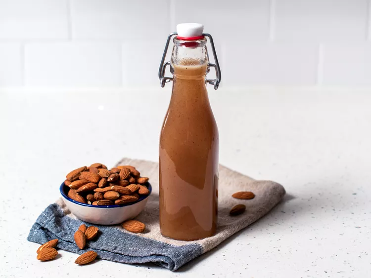

---
tags:
  - dish:drink
  - ingredient:almonds
---
<!-- Tags can have colon, but no space around it -->

# Orgeat

<!-- Serves has to be a single number, no dashes, but text is allowed after the
number (e.g., 24 cookies) -->
- Serves: 300 mL
{ #serves }
<!-- Time is not parsed, so anything can be input here, and additional
values can be added (e.g., "active time", "cooking time", etc) -->
- Active time: 15 min 
- Total time: 3.5 hours
- Date added: 2024-04-30

## Description
Orgeat (pronounced "or-zsa," like Zsa Zsa Gabor) is an almond syrup enhanced with a touch of flower water. It's an essential ingredient in Tiki drinks, because it ties together the multiple spirits and juices that are the hallmark of tropical cocktails. But orgeat's sophisticated French origins also shine through in more minimalist concoctions.

## Ingredients { #ingredients }

<!-- Decimals are allowed, fractions are not. For ranges, use only a single dash
and no spaces between the numbers. -->

- 2 cups raw almonds, sliced or chopped
- 1.5 cups sugar
- 1.25 cups water
- 1 teaspoon orange flower water (see notes)
- 1 ounce vodka

## Directions

<!-- If you have a direction that refers to a number of some ingredient, wrap
the number in asterisks and add `{.ingredient-num}` afterwards. For example,
write `Add 2 Tbsp oil to pan` as `Add *2*{.ingredient-num} to pan`. This allows
us to properly change the number when changing the serves value. -->

1. Toast almonds at 400°F (200°C) for 4 minutes, shaking after 2 minutes.
2. Cool almonds and then pulverize them with a blender or food processor.
3. In a saucepan, cook sugar and water on medium heat until sugar dissolves and the mixture starts to boil, about 3 minutes, stirring constantly.
4. Add pulverized almonds and simmer on low heat, stirring frequently. When mixture is about to boil, remove from heat and cover. Let it sit for a minimum of 3 hours and no more than 12 hours.
5. Strain steeped mixture through 3 layers of cheesecloth into a bowl, squeezing the cloth as you go.
6. Add orange flower water and vodka, then stir. Funnel into a glass jar or bottle. 

## Notes

<!-- Delete section if no additional notes -->
- Store in the refrigerator, for no more than one month.
- This orgeat is darker in color than some other recipes because the skins are left on the almonds. I like the richer color and extra almond flavor this adds. If you prefer a sweeter, milky-white orgeat, use blanched almonds. Since there are oils in almonds, the syrup will separate. Shake before each use. 

## Source

[Serious Eats](https://www.seriouseats.com/how-to-make-orgeat-recipe-almond-syrup-for-cocktails)

## Comments
