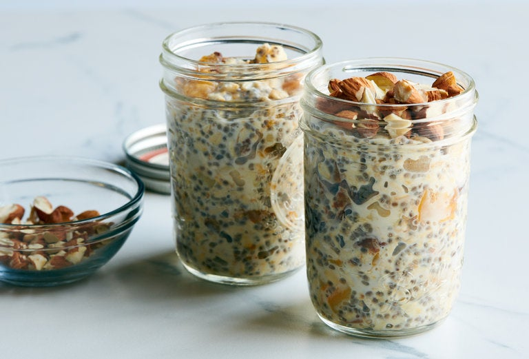

---
tags:
  - dish:breakfast
  - ingredient:oats
  - difficulty:easy
---
<!-- Tags can have colon, but no space around it -->

# Overnight oats

<!-- Serves has to be a single number, no dashes, but text is allowed after the
number (e.g., 24 cookies) -->
- Serves: 1
{ #serves }
<!-- Time is not parsed, so anything can be input here, and additional
values can be added (e.g., "active time", "cooking time", etc) -->
- Time: 4
- Date added: 2024-02-02

## Description

Overnight oats are, of course, a healthy breakfast and they’re easy to make, but they also feel like a special treat, sweet with dried fruit. Unlike oatmeal, uncooked but softened oats retain a fresh flavor and taste delicious cold. Top it with nuts just before eating for an irresistible crunch against the creamy oats.

### Keys to This Recipe

- How to Make Overnight Oats: Simply mix oats and milk in a 1 to 2 ratio and add sweeteners, salt or other add-ins, such as dried or fresh fruit, nuts or seeds, according to your tastes. For one breakfast serving of overnight oats, start with ¼ cup oats and ½ cup milk.
- The Best Oats for Overnight Oats: Old-fashioned oats, also known as rolled oats, become tender and creamy when soaked. Quick-cooking oats, which are smaller, can end up pasty and steel-cut oats, which are sturdier, stay quite firm even after soaking.
- Milk Options for Overnight Oats: Dairy and non-dairy milks work well for overnight oats. Coconut, soy and oat milk yield thicker mixtures, which you can thin with more milk before serving if you’d like. If you use sweetened non-dairy milk, taste the soaked oats before adding more sweetener.
- Sweeteners for Overnight Oats: Soaking dried fruit — use your favorite — alongside the oats sweetens the mixture nicely, but you can stir in additional sugar, maple syrup or honey to taste just before eating.

## Ingredients { #ingredients }

<!-- Decimals are allowed, fractions are not. For ranges, use only a single dash
and no spaces between the numbers. -->

- .5 cup old-fashioned oats
- .25 cup dried fruit, cut into small pieces, if needed
- 1 tablespoon chia, flax, poppy or sesame seeds
- 1 cup milk or unsweetened dairy alternative, such as almond or oat milk
- .25 teaspoon kosher salt
- Maple syrup, honey or brown sugar (optional)
- 2 tablespoons chopped or sliced nuts, toasted, if desired

## Directions

<!-- If you have a direction that refers to a number of some ingredient, wrap
the number in asterisks and add `{.ingredient-num}` afterwards. For example,
write `Add 2 Tbsp oil to pan` as `Add *2*{.ingredient-num} to pan`. This allows
us to properly change the number when changing the serves value. -->

1. Mix oats, dried fruit, seeds, milk and salt in a pint jar or 2-cup airtight resealable container. Seal tightly and refrigerate for at least 5 hours or up to 5 days.
2. Uncover, stir well, and taste. If you prefer more sweetness, stir in some sweetener. Top with the nuts just before eating.

## Source

[NYTimes](https://cooking.nytimes.com/recipes/1019516-overnight-oats)

## Comments
