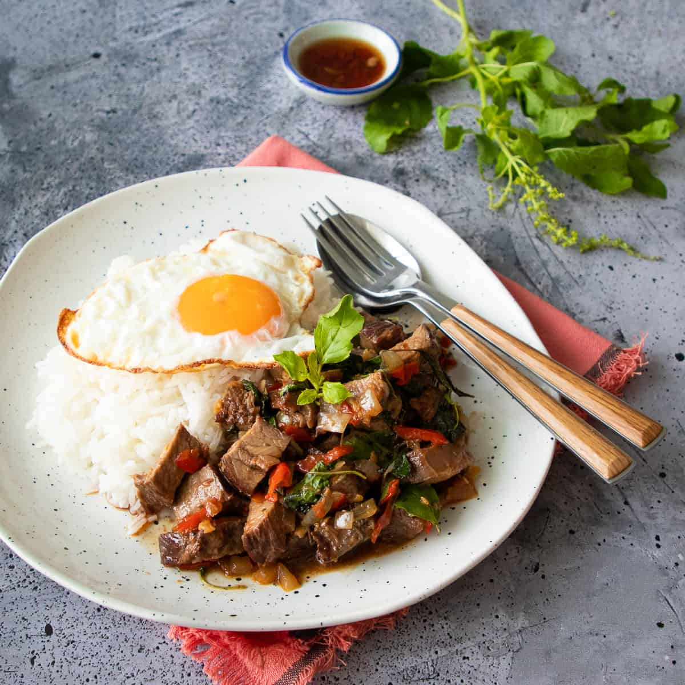

---
tags:
  - dish:main
  - protein:meat
  - ingredient:holy basil
  - cuisine:thai
  - difficulty:easy
---
<!-- Tags can have colon, but no space around it -->

# Pad Kra Pao

<!-- Serves has to be a single number, no dashes, but text is allowed after the
number (e.g., 24 cookies) -->
- Serves:
{ #serves }
<!-- Time is not parsed, so anything can be input here, and additional
values can be added (e.g., "active time", "cooking time", etc) -->
- Time: 
- Date added: 

## Description
This is one of the most useful recipes I've ever shared. It's an all-purpose formula you can use to turn any protein you have into delicious pad kra pao - Thai holy basil stir fry. Any meat, seafood, or any leftover cooked meats you might have lingering in the fridge. It's the only recipe you need to make any kind of pad kra pao you want! With this recipe, you'll have one of the most popular Thai dishes on the table in less than 30 minutes! 

(The classic version of pad kra pao uses ground or finely chopped meat, but you can make pad kra pao with any kind of protein including chicken (dark meat preferred), pork, beef, shrimp, squid or even clams. You can also make vegetarian versions using firm fried tofu. This recipe will give you a formula that works with any kind of protein, raw or cooked.)

Pad means to stir fry, and gaprao means holy basil. It is a spicy stir fry with holy basil that can be made with any kind of meat or seafood, and always served with rice. You'll see various English spellings of this dish, including pad kra pao, pad krapow, and pad gaprao, or perhaps something else, but rest assured they are all referring to the same dish.

## Ingredients { #ingredients }

<!-- Decimals are allowed, fractions are not. For ranges, use only a single dash
and no spaces between the numbers. -->
- 10.5 oz protein of your choice, raw or cooked
- 1 teaspoon fish sauce, only if using raw protein
- 1 tablespoon oyster sauce
- 1 tablespoon soy sauce
- 2 teaspoon fish sauce
- .5 Thai black soy sauce, or dark soy sauce, optional
- 2 tablespoon water
- 1.5 teaspoon sugar
- 1-3 Thai chilies, or as many as you can tolerate
- 5 cloves garlic
- .25 cup chopped mild red chilies, see note 1
- .25 medium onion, small diced
- 1.5 cup holy basil leaves or sub Italian or Thai basil leaves, loosely packed
- Vegetable oil, as needed
- 2 eggs for frying, optional (1 egg per person)
- Prik nam pla, condiment if serving fried eggs, optional
- Jasmine rice, for serving

## Directions

<!-- If you have a direction that refers to a number of some ingredient, wrap
the number in asterisks and add `{.ingredient-num}` afterwards. For example,
write `Add 2 Tbsp oil to pan` as `Add *2*{.ingredient-num} to pan`. This allows
us to properly change the number when changing the serves value. -->
1. Cut the protein into small bite-sized pieces - make them smaller than your average stir fry as pad gaprao is not good with chunky pieces. If using lean protein such as chicken breast, don’t slice them thinner than .5 of an inch so they don’t overcook too quickly.
2. If using raw meat, add 1 teaspoon of fish sauce and mix well.
3. Make the sauce by combining oyster sauce, soy sauce, fish sauce, black or dark soy sauce, sugar, and water. Stir until the sugar is completely dissolved.
4. Pound the Thai chilies into a fine paste in a mortar and pestle, then add the garlic and the mild chilies and pound into a rough paste, just until there are no more big chunks.
5. If using raw protein, heat a wok or a skillet until very hot on high heat, add just enough oil to coat the bottom and add the protein, spreading the pieces out into one layer. Let them sear until browned on the underside, then give it a toss and stir until it’s done. This should only take a few minutes in total. Remove from the pan. Note: You can skip searing the protein and just add it to the wok raw, but the browning does add a nice flavour.
6. In a wok on medium-high heat, add the chili garlic mixture and stir until the garlic starts to turn golden, about 2 minutes. Add the onions and cook it for 30 seconds to a minute to soften slightly.
7. Turn the heat up to high and add the protein and the sauce, and toss everything together just for 30 seconds or so, until the meat is well coated and heated through. If you didn’t pre-cook the protein, take your time and keep tossing until it’s cooked through.
8. Turn off the heat, add the basil, and toss just to wilt.
9. Make the fried eggs if you wish, and serve the stir fry with jasmine rice and topped with a fried egg and some prik nam pla!

## Notes

<!-- Delete section if no additional notes -->
For mild red pepper: Any kind of mild red peppers will work here. Traditionally we use spur chilies, but you can use whatever you have access to, preferably with thinner flesh, such as red anaheim peppers. Red bell pepper will also work in a pinch. (If you're adding at least 5 Thai chilies, which would make it very hot, you can skip the mild peppers.)

If you want to use tofu for pad kra pao, I have a few tips:
- The firmer the tofu the better. It will be less likely to fall apart and has a better texture for stir fries. If you can get a hold of pressed tofu (sometimes labeled as bean curd) that is the one I prefer. It is super firm and it is the kind of tofu we use for pad thai. Crumble it with your hands to make small irregular pieces, and it makes a perfect meat substitute for pad kra pao. Firm or extra firm tofu would also work.
- Pan-frying tofu first will create a chewy exterior that will improve the texture of the dish. Cut the tofu into small pieces, or crumble it into irregular pieces, then pan fry them over high heat in a nonstick skillet or wok until golden brown.
- You can also buy pre-fried tofu. Asian grocery stores will sell fried tofu that are perfect for this recipe. The exterior will already be nice and chewy! (Note: Fried tofu is not the same as tofu puffs which are also fried but are hollow inside.)

## Source

[Hot Thai Kitchen](https://hot-thai-kitchen.com/pad-kra-pao-anything/#recipe)

## Comments

- 2024-09-29: made with 1 chili and ground beef. delicious, but could've used more chilis. added eggs, Anna didn't like it with prik nam pla.
