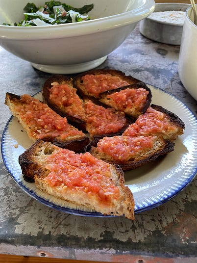

---
tags:
  - dish:sides
  - ingredient:tomato
  - cuisine:thai,chinese,etc
  - context:entertaining,holiday
  - difficulty:easy,involved
---
<!-- Tags can have colon, but no space around it -->

# Pan con Tomate (and other ways to use lots of tomatoes)

<!-- Serves has to be a single number, no dashes, but text is allowed after the
number (e.g., 24 cookies) -->
- Serves:
{ #serves }
<!-- Time is not parsed, so anything can be input here, and additional
values can be added (e.g., "active time", "cooking time", etc) -->
- Time: 
- Date added: 2025-07-08

## Description

Lots of ideas for how to use tomatoes.

## Directions

<!-- If you have a direction that refers to a number of some ingredient, wrap
the number in asterisks and add `{.ingredient-num}` afterwards. For example,
write `Add 2 Tbsp oil to pan` as `Add *2*{.ingredient-num} to pan`. This allows
us to properly change the number when changing the serves value. -->

- Pan con tomate (a.k.a. something I could happily eat every single day).
  - If just making one or two pieces, rub a peeled garlic clove on toast, then rub a halved tomato into the toast so that all of the tomato juice/seeds/flesh really gets into the bread, then drizzle with olive oil + season with salt
  - If making a bunch of pieces, I think it’s easier to make a grated tomato sauce that you then spoon on toast. To make it, cut 2 very ripe tomatoes in half and set a box grater in a bowl. Grate the open sides of each tomato half on the largest holes of the box grater (stop when you get to the skin / discard the skin). Add a large garlic clove that you’ve minced, plus a big BIG pinch of salt, a nice big glug of olive oil and a spoonful of sherry vinegar. Spoon the mixture generously on toasted or grilled bread.
- Tomato sandwiches: keep them simple— no fancy bread or garnishes needed. White bread + mayo is perfect. Slightly toasted bread + mayo is perfect. Don’t forget lots of salt!!! A piece of bacon or some lettuce is nice but totally not required.
- Simplest tomato salads made with just tomatoes + dressing, maybe some herbs, too if you’d like. Use a single type of tomato or a combination of colors and varieties. Halve cherry tomatoes, slice bigger ones into chunks or thick slices. Spread out on a plate or platter, season with lots of salt, and then dress with…ANYTHING. Top with some chopped herbs if you want. Some ideas include:
  - Caesar dressing + chopped parsley
  - Blue cheese dressing + thinly sliced scallions + chopped parsley
  - Tahini dressing + chopped mint + chopped dill
- Slightly more complicated (but still sooooo simple) tomato salads. Some ideas include:
  - Chopped or sliced tomatoes + peaches with chopped herbs (whatever!), a little bit of vinegar (sherry, red wine, whatever) and lots of olive oil
  - Chopped or sliced tomatoes + avocados with green olives, feta, and chopped pistachios / dress with olive oil, red wine vinegar, and dried oregano
  - Chopped tomatoes, watermelon, red onions, feta + chopped mint dressed with lemon juice + olive oil
  - Tomatoes + torn mozzarella, but with fresh lemon juice + zest and tons of olive oil
  - Chopped tomatoes + cucumbers with basil, mint, cilantro, roasted peanuts + fish sauce + lime juice
  - Chopped tomatoes, corn kernels (cooked, grilled, raw, whatever) + scallions dressed with rice vinegar + soy sauce + toasted sesame oil
- Fresh salsas to serve on tacos, avocado toast, hard-boiled eggs…whatever! Ideas include:
  - Halved cherry tomatoes and/or chopped larger tomatoes + minced onion or scallions, chopped cilantro, chopped fresh or pickled jalapeños, and fresh lime juice
  - Halved Sungold tomatoes + diced mango with minced fresh red chili, minced red onion, lots of lime juice, and some chopped cilantro
- Fresh chopped tomato sauce for pasta: chop fresh tomatoes, place in a big bowl, add minced garlic, tons of olive oil, and a big spoonful of vinegar or fresh lemon juice and season with lots of salt. Let this sit at the bottom of the bowl for at least the amount of time it takes to bring a pot of water to a boil and cook pasta. Once your pasta is cooked, drain it and add it to the bowl of chopped tomatoes. Mix well and season to taste with more olive oil, salt, and/or vinegar or lemon juice. Add some fresh chopped herbs (basil!!! parsley!) and/or cheese (torn fresh mozzarella, cubes of fontina or provolone, shaved Parmesean or pecorino…or a mix!) if you’d like. You could also add a few handfuls of peppery arugula.
- Spicy barely-cooked tomato sauce for pasta (or anything): chop fresh tomatoes and place in a big bowl. Heat at least 1/4 cup of olive oil for every 2 cups of chopped tomatoes in a small pot or skillet. Once warm, add minced garlic and dried red chili flakes and let those sizzle for like 30 seconds. Pour the hot, garlicky, spicy oil over the chopped tomatoes. Stir well. Season to taste with salt and a spoonful of vinegar or squeeze of lemon or lime if you’d like. Serve on pasta or with eggs, as a bed for grilled fish or shrimp…whatever you want!
  - Use a bed for roasting fish: cut a bunch of cherry tomatoes in half, coat with olive oil + salt and roast at 400ºF for about 20 minutes to get going, then lay a few thin fish fillets on top, drizzle those with olive oil, and roast until the fish is cooked (anywhere from 10 - 20 minutes depending on how thick your fish is). Great with olives mixed with the tomatoes!!
- When you have more tomatoes than you know what to do with, make Roasted Tomato Sauce (freeze it for your future self!!):
  - METHOD: get a bunch of tomatoes— lots of shapes, sizes and colors (for example, a few pints of cherry tomatoes, a couple of slices, even a few gotten-a-bit-too-ripe heirlooms). Chop the big ones, leave the little ones whole, and put them all in your largest roasted pan. Add a GENEROUS pour of olive oil and LOTS of salt. Roast at 400ºF until bubbling and extremely fragrant, about 45 minutes. Let the mixture cool and then blend (seeds, skin + all). Freeze flat in Ziplock bags or in containers. Feel accomplished.
  - USES: spaghetti, shakshuka, eggplant parm, pizza, as a dip for garlic bread, turn into tomato soup by adding some stock and/or milk

## Source

[Julia Turshen](https://juliaturshen.substack.com/p/its-tomato-time-and-september-classes)

## Comments
