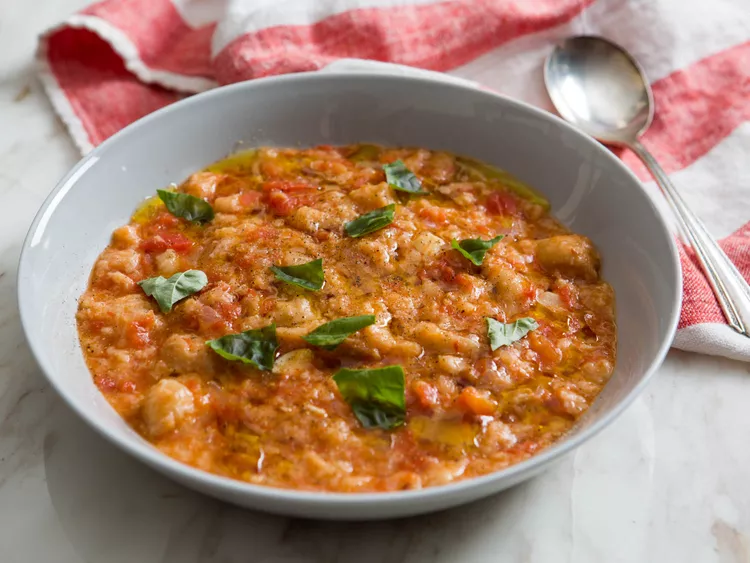

---
tags:
  - dish:soup
  - ingredient:tomato
  - cuisine:italian
  - difficulty:easy
---
<!-- Tags can have colon, but no space around it -->

# Pappa al Pomodoro

<!-- Serves has to be a single number, no dashes, but text is allowed after the
number (e.g., 24 cookies) -->
- Serves: 4
{ #serves }
<!-- Time is not parsed, so anything can be input here, and additional
values can be added (e.g., "active time", "cooking time", etc) -->
- Time: 40 min
- Date added: 2023-12-11

## Description

## Ingredients { #ingredients }

<!-- Decimals are allowed, fractions are not. For ranges, use only a single dash
and no spaces between the numbers. -->

- 2 tablespoons extra-virgin olive oil, plus more for drizzling
- Pinch red pepper flakes
- 2 medium cloves garlic, thinly sliced
- .5 medium onion, minced (about .5 cup)
- 1 (28-ounce) can whole plum tomatoes, crushed by hand, with juices
- 2 sprigs fresh basil, plus torn leaves for serving
- .33 pound (about 6 ounces) fresh or stale rustic bread, torn or cut into 1-inch chunks (see notes)
- 2 cups warm quick and easy vegetable stock, plus more as needed (see notes)
- Kosher salt and freshly ground black pepper

## Directions

<!-- If you have a direction that refers to a number of some ingredient, wrap
the number in asterisks and add `{.ingredient-num}` afterwards. For example,
write `Add 2 Tbsp oil to pan` as `Add *2*{.ingredient-num} to pan`. This allows
us to properly change the number when changing the serves value. -->

1. In a large saucepan, heat 2 tablespoons olive oil over medium heat until shimmering. Add red pepper flakes and garlic and cook, stirring, until garlic just begins to turn golden. Add onion and cook, stirring, just until softened, about 5 minutes. Add crushed tomatoes and their juices, along with basil sprigs, and bring to a simmer. 
2. Stir in bread. Ladle stock on top, stirring to combine. Simmer bread, adding more stock as needed, until bread is completely softened and custardy and soup has thickened to a porridge-like consistency, about 25 minutes. Season with salt and pepper. Discard basil sprigs. 
3. Spoon into bowls, generously drizzle with olive oil, and grind black pepper on top. Garnish with torn basil leaves and serve. 

## Notes

- Pappa al pomodoro is traditionally made with stale bread, and you can use it for this soup if you have it, but our tests have shown that this soup is just as good made with fresh bread. Plus, fresh bread softens much more quickly, making the soup faster to prepare.
- You can use store-bought low-sodium chicken stock or water in place of the vegetable stock, if desired. 

## Source

[Serious Eats](https://www.seriouseats.com/tuscan-tomato-bread-soup-pappa-al-pomodoro-recipe)

## Comments
