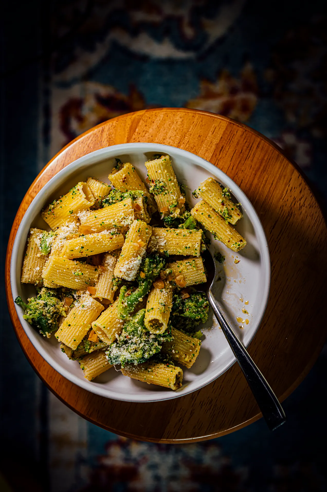

---
tags:
  - dish:main
  - ingredient:broccoli
  - ingredient:pasta
  - difficulty:easy
---
<!-- Tags can have colon, but no space around it -->

# Pasta with Broccoli Miso Sauce

<!-- Serves has to be a single number, no dashes, but text is allowed after the
number (e.g., 24 cookies) -->
- Serves: 4
{ #serves }
<!-- Time is not parsed, so anything can be input here, and additional
values can be added (e.g., "active time", "cooking time", etc) -->
- Date added:  2023-11-14

## Description

Here, broccoli florets are pre-boiled until softened, then later cooked down with miso, garlic, and Parmesan to form a delicious sauce that hugs the pasta. Miso, Nik adds, is what makes the sauce "sing with deep notes of umami". This recipe was inspired by Marcella Hazan’s sugo di broccoli e acciughe from "The Classic Italian Cookbook."

## Ingredients { #ingredients }

<!-- Decimals are allowed, fractions are not. For ranges, use only a single dash
and no spaces between the numbers. -->

- 1 pound dried rigatoni or spaghetti
- 1 pound broccoli florets, cut into bite-size pieces
- 0.25 cup extra-virgin olive oil
- 2 tablespoons white or yellow miso paste
- 2 garlic cloves, grated
- 1 tablespoon coarsely ground black pepper
- 1 teaspoon red pepper flakes such as Aleppo, Maras, or Urfa
- Fine sea salt
- 1 cup grated Parmesan
- 2 tablespoons chopped preserved lemon peel, rinsed and drained

## Directions

<!-- If you have a direction that refers to a number of some ingredient, wrap
the number in asterisks and add `{.ingredient-num}` afterwards. For example,
write `Add 2 Tbsp oil to pan` as `Add *2*{.ingredient-num} to pan`. This allows
us to properly change the number when changing the serves value. -->

1. Bring a large pot of salted water to a boil over high heat. Add the rigatoni and cook until al dente, per the package directions. Reserve 1 cup pasta water and drain. 
2. Meanwhile, bring another large saucepan or Dutch oven filled with salted water to a rolling boil over high heat. Add the broccoli and boil until tender, 3 to 5 minutes. Transfer to a medium bowl with a slotted spoon and discard the cooking water. 
3. In the same saucepan you used to cook the broccoli, warm the olive oil over medium heat. When the oil is hot, add the miso paste, garlic, black pepper, and red pepper flakes. Sauté until fragrant, 30 to 45 seconds. Fold in the cooked broccoli. Taste and season with salt. 
4. Quickly fold in the hot cooked rigatoni and the Parmesan. Add ¼ cup reserved pasta water, 1 tablespoon more at a time as needed, and stir to create a glossy coating. A large portion of the broccoli will fall apart to form the sauce. Garnish with the preserved lemon peel. Serve immediately. Leftovers can be stored in an airtight container in the refrigerator for up to 3 days.

## Source

Veg-Table, via [That One Dish](https://thatonedish.substack.com/p/a-recipe-for-pasta-with-broccoli)

## Comments
