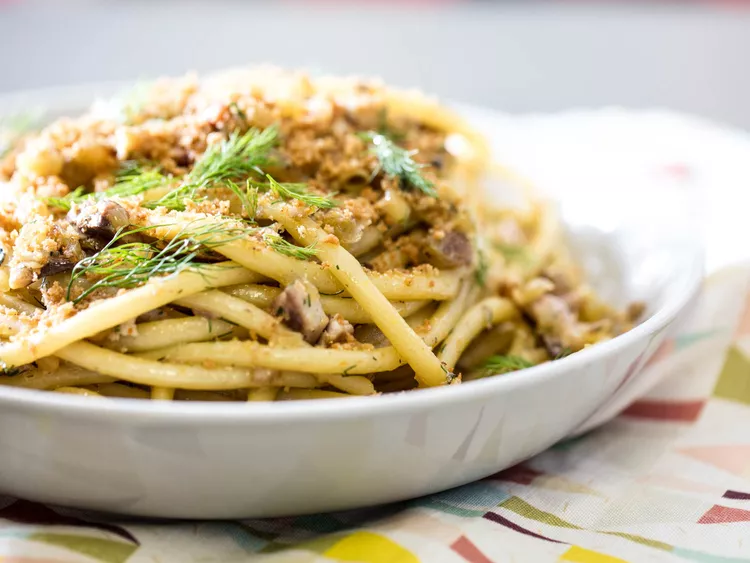

---
tags:
  - dish:main
  - protein:fish
  - ingredient:pasta
  - cuisine:italian
---
<!-- Tags can have colon, but no space around it -->

# Pasta con le sarde

<!-- Serves has to be a single number, no dashes, but text is allowed after the
number (e.g., 24 cookies) -->
- Serves: 4
{ #serves }
<!-- Time is not parsed, so anything can be input here, and additional
values can be added (e.g., "active time", "cooking time", etc) -->
- Time: 45 minutes
- Date added: 2024-09-10

## Description
There are many variations of pasta con le sarde, but they all consist of an unlikely combination of sweet and savory flavors: sweet sautéed onions, aromatic fennel and saffron, plump raisins, toasted pine nuts, salty anchovies, and oily chunks of fresh sardines. Plus pasta, of course (often bucatini, but spaghetti is a great choice, too). The pasta, sardines, fennel, and anchovies are all typical Italian ingredients, and the inclusion of raisins, saffron, and pine nuts is a textbook example of Arabic culinary influence. 
### Why It Works
- Steeping the raisins and saffron in warmed wine rehydrates and plumps the raisins, and extracts the saffron's flavor into the wine.
- Diced fennel bulb, fennel fronds, and fennel seed add layers of fennel flavor (a good substitute for the intense wild fennel used in Italy).
- Seasoned bread crumbs make an excellent grated cheese substitution.
## Ingredients { #ingredients }

<!-- Decimals are allowed, fractions are not. For ranges, use only a single dash
and no spaces between the numbers. -->

- .5 cup (120ml) dry white wine
- 1.5 ounces (45g) golden raisins (about .25 cup)
- Pinch saffron, optional
- 4.5 tablespoons (67ml) extra-virgin olive oil, divided, plus more as needed
- .5 teaspoon ground fennel seed
- 1.25 ounces (35g) panko bread crumbs (about .5 cup)
- Kosher salt and freshly ground black pepper
- 1 cup minced peeled and cored fennel bulb (about half of one large 1.5-lb fennel bulb with fronds), fronds reserved
- 1 cup minced yellow onion (about half of one large 1-pound onion)
- 4 oil-packed anchovy fillets
- 1.25 ounces (35g) pine nuts (about .25 cup), toasted
- 5 whole sardines (about .75 pound/340g total), filleted and cut into 1-inch pieces
- 1 pound (450g) bucatini or spaghetti

## Directions

<!-- If you have a direction that refers to a number of some ingredient, wrap
the number in asterisks and add `{.ingredient-num}` afterwards. For example,
write `Add 2 Tbsp oil to pan` as `Add *2*{.ingredient-num} to pan`. This allows
us to properly change the number when changing the serves value. -->

1. In a microwave-safe heatproof bowl, heat wine until steaming (alternatively, heat wine on the stovetop in a small saucepan). Add raisins and saffron, if using. Set aside.
2. In a small skillet, heat 1 1/2 tablespoons (22ml) olive oil over medium-high heat until shimmering. Add ground fennel and cook until fragrant, about 20 seconds. Add bread crumbs and cook, tossing, until lightly toasted. Transfer breadcrumbs to a bowl and season well with salt and pepper. Set aside.
3. Bring a large pot of salted water to a boil. Mince half the fennel fronds and reserve the other half (uncut).
4. In a large skillet or sauté pan, heat remaining 3 tablespoons (45ml) olive oil over medium heat until shimmering. Add diced onion and diced fennel bulb and cook, stirring, until onion and fennel are soft and tender, about 8 minutes. Add anchovy fillets and cook, stirring, until dissolved in the oil.
5. Add wine, raisins, and saffron, and cook, scraping up any browned bits from bottom of pan, until wine is almost entirely evaporated.
6. Add pine nuts and sardines and cook, stirring, until sardines are just barely cooked through, about 2 minutes. Remove from heat.
7. Meanwhile, cook the pasta until al dente, then drain, reserving at least 1 cup pasta cooking water.
8. Transfer pasta to skillet along with 1/4 cup pasta cooking water. Return skillet to medium-high heat and cook, stirring and tossing, until pasta is well-coated in sauce and any excess liquid has cooked off. Drizzle on some fresh olive oil (don't be shy) along with the minced fennel fronds, and toss well. Season with salt. Add a very small handful of bread crumbs and toss once more.
9. If at any point the pasta becomes too dry, add additional pasta cooking water in 1/4-cup increments, and toss to loosen and moisten (you can also drizzle on more olive oil as desired). The noodles should be slick and glossy with a sheen of sauce, but not sitting in a watery puddle.
10. Divide pasta into serving bowls, making sure to distribute sardines, pine nuts, and raisins evenly. Top with a more generous handful of breadcrumbs. Garnish with whole fennel fronds and serve right away. 

## Source

[Serious Eats](https://www.seriouseats.com/pasta-pasta-con-le-sarde-sicilian-pasta-with-sardines)

## Comments

- 2024-09-10: delicious. I replaced the fresh sardines with 4 drained cans of sardines, and the pine nuts with pumpkin seeds.
