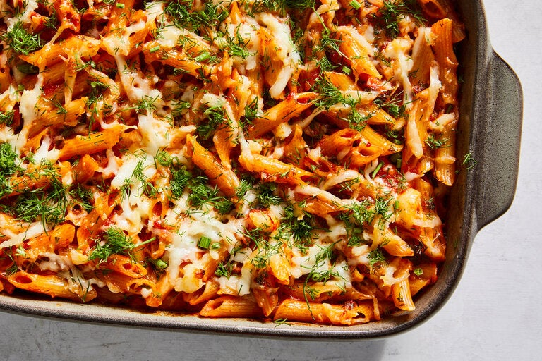

---
tags:
  - dish:main
  - protein:cheese
  - ingredient:halloumi
  - difficulty:easy
---
<!-- Tags can have colon, but no space around it -->

# Baked Tomato Pasta With Harissa and Halloumi

<!-- Serves has to be a single number, no dashes, but text is allowed after the
number (e.g., 24 cookies) -->
- Serves: 4
{ #serves }
<!-- Time is not parsed, so anything can be input here, and additional
values can be added (e.g., "active time", "cooking time", etc) -->
- Time: 45 min
- Date added: 2024-04-05

## Description

Keeping a jar of store-bought pasta sauce in your pantry pays high dividends in this five-ingredient recipe. Jarred pasta sauce is ripe for enhancement; here, a confident amount of harissa injects not only spice, but also a deep smoky, savory tang. This is a versatile and adaptable weeknight baked pasta: You can experiment with different flavors of sauce to achieve a different finish; try vodka sauce for a creamier finish or arrabbiata for something spicier. Grating the halloumi allows the firm, salty cheese to melt evenly through the pasta. A hefty amount of dill brings much needed lightness to this dish, but you could substitute parsley or chives.

## Ingredients { #ingredients }

<!-- Decimals are allowed, fractions are not. For ranges, use only a single dash
and no spaces between the numbers. -->
- Salt
- 1 pound penne, fusilli, farfalle or other shaped pasta
- 1 (24-ounce) jar marinara sauce
- 3 tablespoons harissa paste
- 8 ounces halloumi (or feta), coarsely grated
- 1 cup chopped fresh dill (leaves and stalks)
- Extra-virgin olive oil, for serving
## Directions

<!-- If you have a direction that refers to a number of some ingredient, wrap
the number in asterisks and add `{.ingredient-num}` afterwards. For example,
write `Add 2 Tbsp oil to pan` as `Add *2*{.ingredient-num} to pan`. This allows
us to properly change the number when changing the serves value. -->

1. Heat the oven to 425 degrees.
2. Bring a large pot of salted water to a boil. Add the pasta and cook for 2 minutes less than the minimum cooking time stated on the package. (For example, if the recommended cooking time is 10 to 12 minutes, cook it for 8 minutes.) Reserve 1 cup of the pasta cooking water then drain the pasta.
3. Add the marinara sauce, harissa and reserved pasta cooking water to the empty pot and stir to combine. Add the pasta, ⅔ of the halloumi and ¾ of the dill; stir to coat the pasta well. Transfer to a large, 8-by-12-inch baking dish and spread in an even layer.
4. Top with the remaining halloumi and bake until the sauce is bubbling around the sides and the cheese is melted and golden, 15 to 20 minutes.
5. To serve, drizzle with olive oil and top with the remaining dill.

## Source

[NYTimes](https://cooking.nytimes.com/recipes/1025015-baked-tomato-pasta-with-harissa-and-halloumi)

## Comments

- 2024-04-03: pretty good and very easy, Anna thought it was much better the day after
