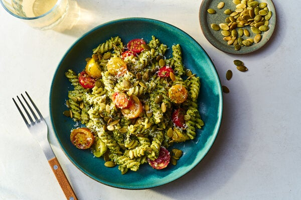

---
tags:
  - dish:main
  - ingredient:pasta
---
<!-- Tags can have colon, but no space around it -->

# Recipe title

<!-- Serves has to be a single number, no dashes, but text is allowed after the
number (e.g., 24 cookies) -->
- Serves: 4
{ #serves }
<!-- Time is not parsed, so anything can be input here, and additional
values can be added (e.g., "active time", "cooking time", etc) -->
- Time: 25 minutes
- Date added: 2024-01-10

## Description

Fragrant with basil and rich with pumpkin seeds and cheese, this is the ideal dish to make ahead of time and pack for lunch. Instead of preparing it to eat as a hot meal or a cold salad, it’s designed to be chilled and then enjoyed cold or at room temperature. Cooking the garlic quickly in the water boiled for the pasta softens its sharp edge. A splash of that same boiling water blends with the basil to keep it green. Rinsing the pasta after cooking it helps the pesto stay flavorful for days in the refrigerator. The tomatoes add a tangy freshness, but they can be skipped altogether or swapped for green beans or peas (just drop them with the pasta during the last few minutes or cooking).

## Ingredients { #ingredients }

<!-- Decimals are allowed, fractions are not. For ranges, use only a single dash
and no spaces between the numbers. -->

- Salt and pepper
- 2 garlic cloves, peeled
- 1 pound fusilli or other short, curly pasta
- .33 cup pumpkin seeds (pepitas), plus more for sprinkling
- 1 large bunch basil (4 ounces), leaves and tender stems picked (3 cups)
- .66 cup/2.5 ounces finely grated Parmesan, plus more for sprinkling
- .5 cup extra-virgin olive oil
- 1.5 cups grape or cherry tomatoes, halved (optional)

## Directions

<!-- If you have a direction that refers to a number of some ingredient, wrap
the number in asterisks and add `{.ingredient-num}` afterwards. For example,
write `Add 2 Tbsp oil to pan` as `Add *2*{.ingredient-num} to pan`. This allows
us to properly change the number when changing the serves value. -->
1. Bring a large saucepan of generously salted water to a boil. Drop the garlic cloves into the boiling water and boil for 30 seconds to temper their sharpness. Use a slotted spoon to transfer the cloves to a food processor or blender.
2. Drop the pasta into the boiling water and cook until al dente.
3. While the pasta cooks, add the pumpkin seeds and a pinch each of salt and pepper to the garlic, and process until very finely ground. Scrape the sides of the bowl and add the basil. Scoop ¼ cup water from the saucepan with the boiling pasta and pour over the basil. Process the basil until ground to a paste. Add the Parmesan and oil, and pulse just until incorporated. Taste the pesto and season with enough salt and pepper to make it punchy.
4. Drain the pasta and rinse under cool water until room temperature. Shake dry, then return to the saucepan, and add the pesto and tomatoes, if using. Stir well until everything is evenly coated. Season to taste with salt and pepper. Divide among dishes to serve right away or airtight containers to pack for lunch. Sprinkle with pumpkin seeds and Parmesan, and serve, or cover and refrigerate for up to 5 days.

## Source

[NYTimes](https://cooking.nytimes.com/recipes/1023430-pasta-with-pumpkin-seed-pesto)

## Comments
