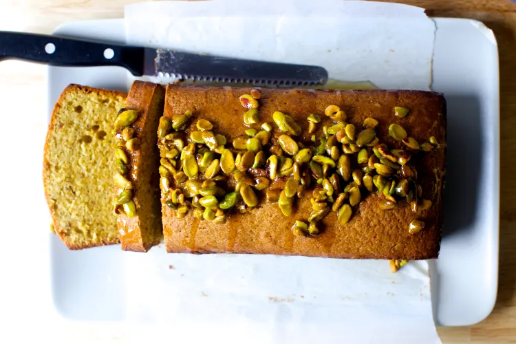

---
tags:
  - dish:desserts
  - ingredient:pistachio
  - context:holiday
---
<!-- Tags can have colon, but no space around it -->

# Pistachio cake

<!-- Serves has to be a single number, no dashes, but text is allowed after the
number (e.g., 24 cookies) -->
- Serves: 1 cake
{ #serves }
<!-- Time is not parsed, so anything can be input here, and additional
values can be added (e.g., "active time", "cooking time", etc) -->
- Time: 1 hr 30 min
- Date added: 2023-12-07

## Description

In my mind, the perfect pistachio cake would be absolutely green (my favorite color) with pistachio intensity, ideally with even more pistachios than flour but require no pistachio paste (not available everywhere and certainly not at, say, Sicilian quality), multiple bowls, or finicky steps.

## Ingredients { #ingredients }

<!-- Decimals are allowed, fractions are not. For ranges, use only a single dash
and no spaces between the numbers. -->

### Cake

- 1 cup plus 2 tablespoons (140 grams) roasted, shelled, and unsalted pistachios
- 1 cup (200 grams) granulated sugar
- .5 teaspoon fine sea salt
- 10 tablespoons (5 ounces or 145 grams) unsalted butter, cold is fine
- 3 large eggs
- .25 cup milk
- .5 teaspoon vanilla extract
- .5 teaspoon almond extract
- Slightly heaped .5 teaspoon baking powder
- .75 cup plus 2 tablespoons (115 grams) all-purpose flour

### Lemon-Pistachio Glaze (optional)

- .33 cup (40 grams) roasted, shelled, and unsalted pistachios
- .25 cup (50 grams) granulated sugar
- Finely grated zest and juice of 1 lemon

## Directions

<!-- If you have a direction that refers to a number of some ingredient, wrap
the number in asterisks and add `{.ingredient-num}` afterwards. For example,
write `Add 2 Tbsp oil to pan` as `Add *2*{.ingredient-num} to pan`. This allows
us to properly change the number when changing the serves value. -->

1. *Heat oven*: To 325 degrees F. Line the bottom and long sides of a loaf pan with a sling of parchment paper. Coat paper and exposed short sides of loaf pan with nonstick spray or butter.
2. *With a food processor*: In the work bowl of your food processor, grind pistachios, sugar and salt together until as powdery as you can get them without it turning to paste. Cut butter into small chunks and blend with pistachio mixture. It’s going to be lumpy at first, and then balled for a minute, but keep running the machine until the mixture loosens up into a frosting-like consistency, i.e. smooth and shiny. Add eggs, one at time, blending briefly between each, scraping down sides as needed. Add milk, blend to combine. Add extracts and baking powder and blend to fully combine, scraping down workbowl. Add flour and pulse just until it disappears.
3. *Without a food processor*: You’re going to want to start with 140 grams pistachio meal or flour and softened butter and can proceed as with a traditional cake. Beat butter and sugar until fluffy, then beat in eggs, one at a time. Beat in milk, then extracts until smooth. Beat in salt and baking powder until fully combined, scraping down bowl well. Add flour and mix just until it disappears.
4. *To bake*: Scrape batter into prepared pan and spread top smooth. Bake for 60 to 70 minutes (see note by way of explanation/apology). Mine took 70, but it’s safest to check sooner. Look for a toothpick inserted into the center of the cake to come out clean and then, do a second check near the top. I find with loaf cakes that the undercooked batter likes to hover right below the top crust. It often takes 10 minutes extra (built into this baking time already) just for that to set for me.
5. Let cake cool in pan on rack for 10 to 15 minutes, then run a knife around cake and transfer to cooling rack. Let cool completely.
6. To make glaze (optional): Bring pistachios, sugar, zest, and juice to a simmer in a small saucepan; simmer for 2 to 3 minutes then pour over cooled cake.
7. *To serve*: Cut into slices. Cake is great on the first day but even better on the second, as the ingredients settle. Keep at room temperature for several days, wrapped in foil, or longer in freezer.

## Notes

<!-- Delete section if no additional notes -->

- To add more flavors to the cake, feel free to rub lemon or orange zest right into the sugar for maximum flavor dispersal/release. Rosewater is also a popular addition to pistachio cakes.
- To make the cake without a food processor, you’re going to want to start with 140 grams pistachio meal or flour (vs. shelled pistachios) and softened butter and can proceed as with a traditional cake.
- Now, here is the terrible warning I must give you: My oven is acting up, not holding temperatures properly and yes I have complained endlessly to my landlord and we are maybe waiting on a new panel, I don’t even know, I don’t want to talk about it. I have two (!) brand-new oven thermometers in there and watch them like a hawk when I bake so I can adjust the temperature as needed but I want you to take the baking time listed (about 70 minutes) with a grain of salt and promise to check it at 60 minutes but also know that there’s a small chance it might take up to 80 minutes. As people report back with their baking times, I’ll narrow the range. 

## Source

[Smitten Kitchen](https://smittenkitchen.com/2017/04/pistachio-cake/)

## Comments
