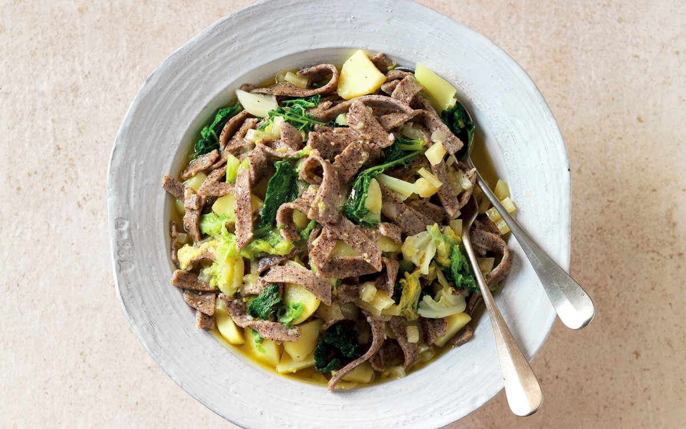

---
tags:
  - dish:main
  - ingredient:pasta
  - ingredient:cabbage
  - ingredient:potato
  - protein:cheese
  - cuisine:italian
  - context:entertaining
---
<!-- Tags can have colon, but no space around it -->

# Pizzoccheri della Valtellina

<!-- Serves has to be a single number, no dashes, but text is allowed after the
number (e.g., 24 cookies) -->
- Serves: 4
{ #serves }
<!-- Time is not parsed, so anything can be input here, and additional
values can be added (e.g., "active time", "cooking time", etc) -->
- Time: 1 hour
- Date added: 2024-09-13

## Description
Fresh pasta, potatoes, cheese, and Savoy cabbage: here’s how to make traditional Pizzoccheri della Valtellina

## Ingredients { #ingredients }

<!-- Decimals are allowed, fractions are not. For ranges, use only a single dash
and no spaces between the numbers. -->
- 500g potatoes
- 400g Savoy cabbage
- 1 Package dried pizzoccheri
- 150g butter
- 200g fontina
- 6 cloves garlic
- Sage
- Grated Grana Padano / Parmesan cheese
- Salt 
## Directions

<!-- If you have a direction that refers to a number of some ingredient, wrap
the number in asterisks and add `{.ingredient-num}` afterwards. For example,
write `Add 2 Tbsp oil to pan` as `Add *2*{.ingredient-num} to pan`. This allows
us to properly change the number when changing the serves value. -->

1. Preheat oven to 360F.
2. Prepare the vegetables: peel the potatoes and cut them into semi-circles; trim and core the cabbage, split the leaves in half and remove the ribs, then cut into 1 inch wide strips.
3. Bring salted water to a boil, then add potatoes and cook for about 10 minutes.
4. Boil pizzoccheri according to box instructions in same pot as potatoes, about 10 minutes more.
5. Peel the garlic cloves, cut them in half, and sauté them in the butter until they almost golden, then add sage and fry until sage is crispy and garlic is golden. Remove garlic and sage.
6. Add cabbage and sautee until done.
7. Cut the fontina cheese into cubes. Remove the pizzoccheri and potatoes from the water with a skimmer and transfer to a 9x13 pan. Top with the cubes of cheese, butter, and plenty of grated cheese in layers. Mix thoroughly and place in oven for several minutes, until cheese is melted and everything is warm. Serve.

## Source

This recipe is a mix of the this one from [la cucina italiana](https://www.lacucinaitaliana.com/recipe/pasta/pizzoccheri-della-valtellina-the-original-recipe) and Edoardo's suggestions, plus some of my own modifications

## Comments
