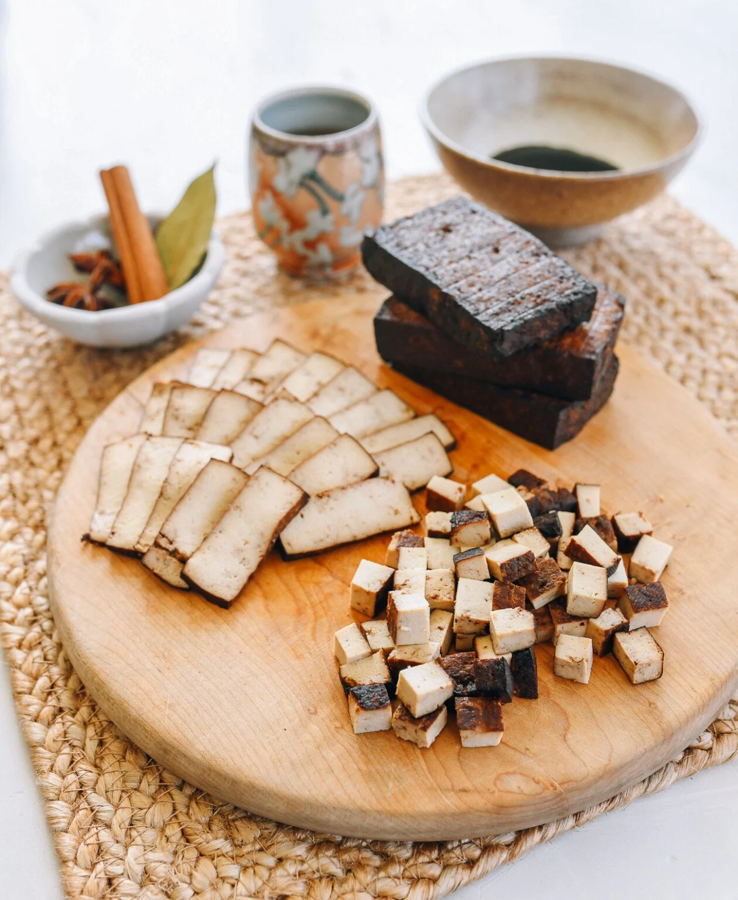

---
tags:
  - dish:pantry
  - protein:tofu
  - cuisine:thai
---
<!-- Tags can have colon, but no space around it -->

# Pressed Tofu

<!-- Serves has to be a single number, no dashes, but text is allowed after the
number (e.g., 24 cookies) -->
- Serves: 1
{ #serves }
<!-- Time is not parsed, so anything can be input here, and additional
values can be added (e.g., "active time", "cooking time", etc) -->
- Time: 12 hours
- Date added: 2026-04-08

## Description
Dòufu gān (豆腐干), or Chinese pressed firm tofu, is a key ingredient in hot and sour soup, stir-fries, and more. Learn how to make it at home!

## Ingredients { #ingredients }

<!-- Decimals are allowed, fractions are not. For ranges, use only a single dash
and no spaces between the numbers. -->
- 1 pound firm tofu
- 1-2 whole pods star anise
- 2-3 cloves
- 2 bay leaves
- 1 small piece cinnamon (about 1/2-inch by 4 inches or 1.3cm by 10 cm)
- .5 teaspoon white peppercorns
- 2 tablespoons light soy sauce
- 1 teaspoon sugar
- 1 teaspoon dark soy sauce
- .5 teaspoon salt
- 2.5 cups water

## Directions

<!-- If you have a direction that refers to a number of some ingredient, wrap
the number in asterisks and add `{.ingredient-num}` afterwards. For example,
write `Add 2 Tbsp oil to pan` as `Add *2*{.ingredient-num} to pan`. This allows
us to properly change the number when changing the serves value. -->
### Pressing

1. Cut the block of tofu into 5 equal slices. Each piece should be about ¾-inch thick (about 2cm). It’s important that all sides are as straight and even as possible, so they can be pressed evenly. A cleaver is a good tool to get straight sides.
2. Place the tofu pieces in a single layer in between two cutting boards or sheet pans, then place something heavy, like a 5-lb bag of flour or sugar, a couple of bricks, or a pot of water, on top to squeeze out the water and compress the tofu. Don’t worry—this should not damage the tofu.
3. Press the tofu for 4-6 hours in the refrigerator. (If it is wintertime and cold in your kitchen, you can get away with leaving it out on the counter.) Less time = a softer pressed tofu. More time = firmer tofu. I did this batch for 5 hours, and was able to squeeze out 5-6 tablespoons of water.

### Braising (optional)

1. In a flat-bottomed deep skillet or pot, add the star anise, cloves, bay leaves, cinnamon, white peppercorns, light soy sauce, sugar, dark soy sauce, salt, and 2½ cups of water. Stir to combine, and add the pressed tofu pieces. Do your best to handle the tofu pieces gently, as they can break easily at this stage. The goal throughout this whole process is to keep the pieces whole.
2. Bring to a boil, cover, and cook for 5 minutes over medium heat. Shut off the heat, and let the tofu marinate in the sauce for at least 6 hours or overnight. Flip them midway through (or right before you go to bed).

### Drying

1. Preheat the oven to 350°F/175°C. Remove the tofu pieces from the braising liquid. Transfer to a baking rack set on a baking sheet, so excess braising liquid can drain off.
2. Bake for 20 minutes, flip, and bake for another 20 minutes. Remove from the oven, and let cool before storing in the refrigerator in an airtight container. They’re ready to eat as is, or in stir-fries and other applications! 

## Notes

<!-- Delete section if no additional notes -->
I also tried cold drying, simply leave them on a baking rack, uncovered, in the refrigerator for 24 hours or so. You can do this instead of oven-drying. They will dry evenly this way as well, but the oven method is faster and takes up less fridge space.

## Source

[Woks of Life](https://thewoksoflife.com/how-to-make-pressed-firm-tofu/)

## Comments
